# Pipeline v2.0 — Release Notes

Formal release notes for the transition from the frozen Pipeline v1 state (tag
`thesis-freeze-2026-08-02`, commit `5a227c8f`) to Pipeline v2.0, the state all 18 scenarios in
`FINAL_DATASET.md` were generated under. This document formalizes `CHANGELOG_V2.md`'s working log
into a single release summary; `CHANGELOG_V2.md` remains the authoritative, evidence-linked
record of how each fix was found and verified.

## Pipeline v1 → Pipeline v2.0

```mermaid
flowchart TD
    subgraph V1["Pipeline v1 (frozen 2026-08-02)"]
        direction TB
        v1a["build_success coupled to install only,\nnot actual compile result"]
        v1b["dependency_verified copied from\nrescan_success (not independent)"]
        v1c["Test stage missing ng/sentry-sdk/datadog"]
        v1d["karma.conf.js accidentally .gitignore'd"]
        v1e["jws.decode() null-unsafe under drifted @types"]
        v1f["build.log / dependency-graph.log\noverwritten on retry"]
        v1g["LLM failures: sys.exit (uncatchable),\nrisking total evidence loss"]
        v1h["Attempt-1 LLM I/O overwritten by retry"]
        v1i["prioritize.py: severity filter can defeat\nan explicit TARGET_CVE, silent substitution"]
        v1j["validator.py: exact-string version match,\nfalse-negative dependency_verified"]
    end
    subgraph V2["Pipeline v2.0 (this dataset)"]
        direction TB
        v2a["Fix #1: build_success reflects tsc/build\nexit code via set -o pipefail"]
        v2b["Fix #2: verify_dependency_installed()\nindependent npm ls / pip show check"]
        v2c["Fix #3: ng/sentry-sdk/datadog installed"]
        v2d["Fix #4: karma.conf.js restored"]
        v2e["Fix #5: ?.payload null-safety (upstream fix)"]
        v2f["Fix #6/#7: logs appended, not overwritten,\nacross retry"]
        v2g["Fix #8: raise RuntimeError/ValueError\n(catchable, evidence preserved)"]
        v2h["Fix #9: attempt-1 I/O preserved\nas *-attempt1.json"]
        v2i["Fix #10: TARGET_CVE authoritative,\nfails loudly instead of substituting"]
        v2j["Fix #11: version-aware comparison,\nrange-prefix aware"]
    end
    v1a -->|"Fix #1"| v2a
    v1b -->|"Fix #2"| v2b
    v1c -->|"Fix #3"| v2c
    v1d -->|"Fix #4"| v2d
    v1e -->|"Fix #5"| v2e
    v1f -->|"Fix #6/#7"| v2f
    v1g -->|"Fix #8"| v2g
    v1h -->|"Fix #9"| v2h
    v1i -->|"Fix #10"| v2i
    v1j -->|"Fix #11"| v2j
```

## Change log, formalized

| # | Change | Why | Scientific impact | Requires regeneration? |
|---|---|---|---|---|
| 1 | `build_success` reflects the actual compile exit code, not just install | `npm run build:server` ran without `set -o pipefail`; a real `tsc` failure could never flip `build_success` to `false` | Without this, "build succeeded" could be silently wrong for every npm scenario — a construct-validity risk on the primary success metric | Yes — all 9 npm scenarios |
| 1a | Unify `grype-baseline.yml` onto the shared `check_npm_build.sh` | A second, duplicated build-check implementation existed with the same drift risk Fix #1 closed | Prevents the two workflows (LLM pipeline, deterministic baseline) from silently diverging on what "build success" means | No — verified behavior-preserving refactor |
| 2 | `dependency_verified` is now an independent check (`verify_dependency_installed()`) | The field was previously just a copy of `rescan_success`, despite implying a separate signal | Restores the study's claimed "installation, remediation, and compilation are three different properties" methodology as actually true in the data, not just in the write-up | Yes — all 18 scenarios |
| 3 | Install `ng`, `sentry-sdk`, `datadog` for the test stage | Test failures were CI-environment gaps, not remediation defects | Prevents environment gaps from being misread as remediation failures | Yes — any scenario whose `test_success` was false purely for this reason |
| 4 | Restore upstream `karma.conf.js` (accidentally `.gitignore`d) | `npm test` could not reach `test:server` at all without it | Unblocks the entire npm test stage; without this fix, npm `test_success` was structurally unmeasurable | Yes — npm scenarios |
| 5 | Upstream `jws.decode()?.payload` null-safety fix | Fresh `npm install` resolved `@types/jws` past the vendored lockfile's version, reintroducing a bug upstream had already fixed | Unblocks TypeScript compilation for `test:server`; applied verbatim from the real upstream commit, not invented | Yes — npm scenarios |
| 6/7 | Append (not overwrite) `build.log`/`dependency-graph.log` on retry | Attempt-1's failure evidence — the evidence that explains *why* a retry happened — was being silently destroyed | Preserves the causal chain between a build failure and the retry it triggered; without this, the study's own retry-mechanism claims were unverifiable from evidence alone | Yes — any retrying scenario |
| 8 | LLM failures raise catchable exceptions instead of `sys.exit` | `SystemExit` bypassed the `except Exception` handlers meant to catch exactly this, risking total silent evidence loss for a scenario | Safety-net fix for the regeneration's 18 fresh LLM calls; verified live when a real Gemini failure occurred | No — zero behavior change for the valid-response case |
| 9 | Preserve attempt-1's LLM I/O and applied patch before retry overwrites them | The pipeline's *primary research artifact* (what the LLM actually said on its first attempt) was unrecoverable for any retrying scenario | Directly protects the dataset's core evidentiary claim — what did the model actually reason, on which attempt | Yes — any retrying scenario, to obtain attempt-1 evidence retroactively |
| 10 | `TARGET_CVE` is authoritative in `prioritize.py`; no silent substitution | The severity filter, meant only for automatic discovery, could silently defeat an explicit preregistered target | **The most scientifically significant fix**: this is what let AF-06 and JS-06 silently execute against the wrong CVE with no warning, undetected until manual cross-checking against NVD. Directly affects target-selection validity for the whole dataset | Yes — AF-06, JS-06 (and by extension, every scenario needed re-verification that its target had not silently drifted) |
| 11 | Version-aware (not exact-string) comparison in `verify_dependency_installed()`, range-prefix aware | A legitimately newer, safe installed version could fail an exact-string check against the LLM's specific recommendation | Prevents Fix #2's independent check from producing its own false negatives — a correctness fix on a correctness fix, self-caught during verification | Yes — JS-08, JS-09 (both hit the exact failure signature) |

## Net effect on the dataset

- **16 of 18 scenarios** reach a clean, fully-verified remediation under Pipeline v2.0.
- **2 of 18** (JS-06, JS-07) do not, for two independently root-caused, disclosed reasons — Failure Category A (SBOM cataloging limitation) and Failure Category B (pipeline applicability limitation) respectively — neither of which Pipeline v2.0's fixes above were designed to address, and neither of which reflects an LLM reasoning failure.
- **Zero silent CVE substitutions** remain in the final dataset (`docs/CVE_MATCH_VERIFICATION.md`).
- No fix in this release changes the LLM's own reasoning, prompting, or decision logic — Fixes #1–#9 and #11 are evidence-integrity and independent-verification corrections; Fix #10 is the sole *target-selection* logic change, and it restores the preregistration's own authority rather than introducing new discretion.

See `CHANGELOG_V2.md` for the full evidence trail behind each fix, and `REGENERATION_LOG.md` for
the per-scenario dispatch history this release was validated against.
