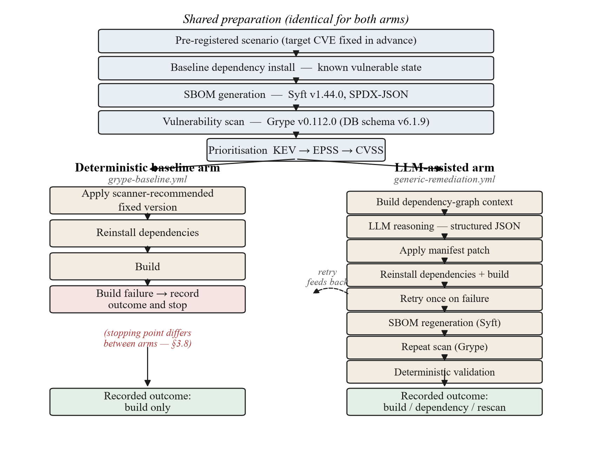
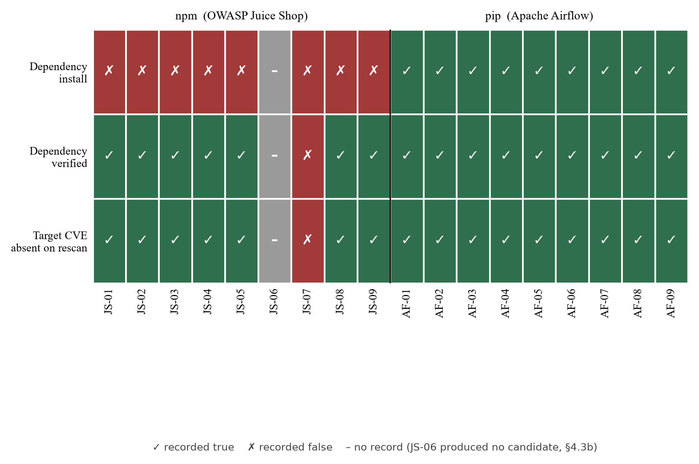
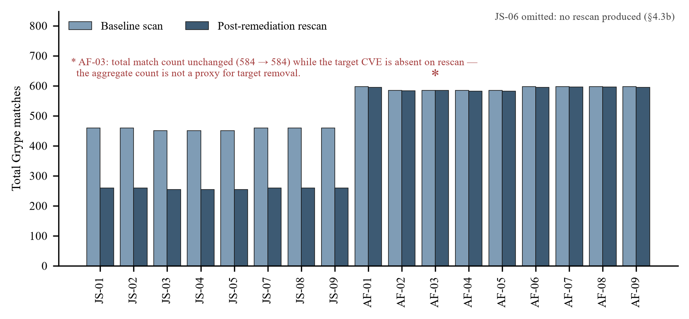
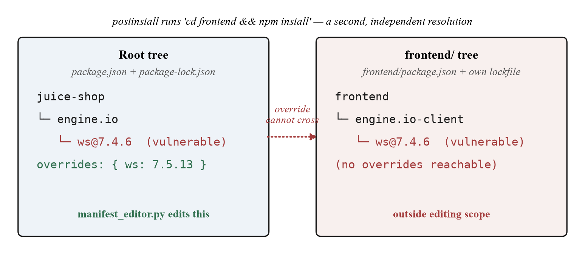
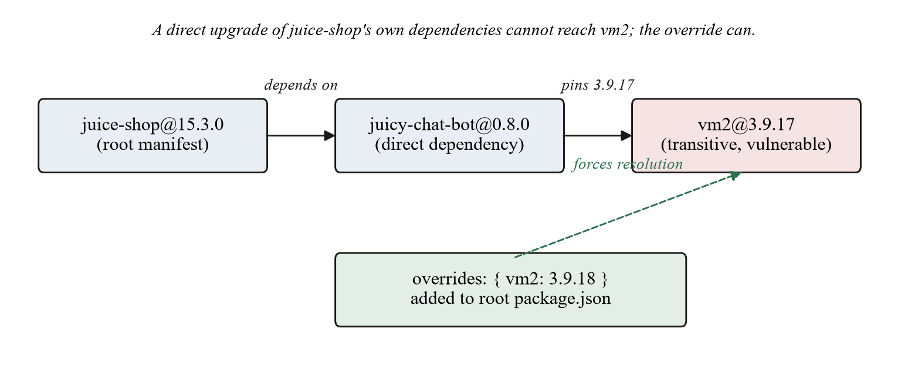

# [University name — to be provided]
## [Faculty / Department — to be provided]

# Context-Aware Dependency Remediation in SBOM-Driven CI Pipelines Using Large Language Model

A thesis submitted in partial fulfilment of the requirements for the degree of
**Master of Computer Science focused on Cybersecurity**

by **Santosh Nagaraj** — Matriculation Number: **100001670**

First Supervisor: **Prof. Dr. Vladamir Stantchev** · Second Supervisor: **Karen Marilu Lopez Cevallos**
Submission Date: **[to be provided]**

---

> **Integrity and sourcing note.** Historical freeze tag: `thesis-freeze-2026-08-02`, commit `5a227c8f`. Final regenerated dataset: produced under Pipeline v2.0, with the final per-scenario provenance recorded in `FINAL_DATASET.md`. Unless otherwise stated, all quantitative results reported in the primary evaluation originate from the frozen evidence archive (`results/execution_evidence/`, `results/reproducibility_verification/`) at the tagged submission commit, cited by path. Results reported in the explanatory hint-removal ablation study (§4.9) originate from a separate archived evidence set (`results/execution_evidence_no_hint/`) generated on a dedicated research branch, isolated from the pipeline code that produced the primary evaluation; the two datasets are analysed independently and are not combined in any reported aggregate statistic. External claims use numbered citations to sources that were verified individually for this thesis against their publisher of record; no reference, author, year, or DOI has been invented. Evidence labels keep claims traceable: **FACT** (repository evidence), **OBSERVATION** (measured result), **INTERPRETATION** (author's reasoning), **LIMITATION**, and **FUTURE WORK**.

---

## Abstract

Contemporary software depends on many transitively-pulled open-source packages, so one vulnerable package can affect many applications. Detection of vulnerable dependencies is mature; remediation is harder for transitive packages, where a fix must satisfy the whole dependency graph rather than one manifest line.

This thesis investigates whether a Large Language Model (LLM) can serve as a decision-support layer for dependency remediation inside an SBOM-driven CI pipeline. Each recommendation is treated as a hypothesis, accepted only after deterministic verification: installation, dependency-graph verification, SBOM regeneration, and a repeat vulnerability scan. Using GitHub Actions, Syft, and Grype, the study evaluates eighteen pre-registered scenarios across OWASP Juice Shop (npm) and Apache Airflow (pip), against a deterministic baseline applying the scanner's recommended version directly.

Results divide by ecosystem. For all nine pip scenarios the baseline built and removed the target vulnerability, so the LLM added no advantage. For npm, the two workflows record their outcome at different points — the baseline stops on build failure, the LLM pipeline continues to a post-remediation scan — so this is not a matched comparison; within that scope, the LLM pipeline reached a validated, vulnerability-removed state for seven of nine npm scenarios using graph-aware strategies such as transitive overrides. The remaining two failed for two disclosed, root-caused reasons — an SBOM-cataloging gap and a manifest-editing-scope limitation — with the LLM's diagnosis of the dependency graph accurate in both. Vulnerability removal is not build success: the npm applications did not fully compile, for a pre-existing, unrelated toolchain reason, in either arm.

The LLM's contribution is real but specific: it helps where a fix must satisfy dependency-graph constraints a direct upgrade cannot, bounded by what the pipeline can observe and reach. Findings and limitations, including a corrected candidate-selection defect found during the study, are reported without generalising beyond the eighteen scenarios evaluated.

*Keywords: software supply chain security; dependency remediation; SBOM; software composition analysis; large language models; DevSecOps; CI/CD.*

---

## Acknowledgements

*[To be written by the author before submission. The template allows up to one page and the section is optional; if it is not used, this page is deleted rather than left empty.]*

---

## Table of Contents

*[Generated automatically in the formatted document from the heading styles. This placeholder is replaced by the field-generated table of contents during conversion and is not part of the counted text.]*

---

## List of Figures

| Figure | Title | § |
|---|---|---|
| Figure 1 | Two-arm experimental design | §3.1 |
| Figure 2 | Recorded deterministic-gate outcomes, all eighteen scenarios | §4.1 |
| Figure 3 | Scanner match counts before and after remediation | §4.1 |
| Figure 4 | JS-07 two-tree resolution and manifest-editing scope | §4.3c |
| Figure 5 | JS-01 transitive shadowing and the override path | §4.4 |

## List of Tables

| Table | Title | § |
|---|---|---|
| Table L1 | Comparison of automated dependency-remediation approaches | §2.10 |
| Table 1 | The eighteen pre-registered scenarios | §3.2 |
| Table 2 | Pipeline stages and their purpose | §3.3 |
| Table M1 | Pinned components of the experimental environment | §3.3.1 |
| Table M2 | Per-scenario evidence artefacts and the claims they support | §3.4.1 |
| Table M3 | Outcome fields: literal meaning, writer, and misreading to avoid | §3.5.1 |
| Table 3 | Threats to validity and their treatment | §3.6 |
| Table 4 | Recorded LLM-pipeline metrics (all eighteen scenarios) | §4.1 |
| Table 5 | Deterministic baseline outcomes by ecosystem | §4.2 |
| Table 6 | Deterministic baseline versus LLM pipeline | §4.8 |
| Table 7 | Hinted baseline versus unhinted recommendation | §4.9 |
| Table E1 | Research matrix linking RQ aspects to methods, evidence, and findings | Appendix E |

---

## List of Abbreviations

| Abbr. | Meaning | Abbr. | Meaning |
|---|---|---|---|
| APR | Automated Program Repair | LLM | Large Language Model |
| CI/CD | Continuous Integration / Delivery | MSR | Mining Software Repositories |
| CoT | Chain-of-Thought | NVD | National Vulnerability Database |
| C-SCRM | Cyber Supply Chain Risk Management | RAG | Retrieval-Augmented Generation |
| CVE | Common Vulnerabilities and Exposures | RCE | Remote Code Execution |
| CVSS | Common Vulnerability Scoring System | SBOM | Software Bill of Materials |
| DIMVA | Detection of Intrusions & Malware, and Vuln. Assessment | SCA | Software Composition Analysis |
| EPSS | Exploit Prediction Scoring System | SLR | Systematic Literature Review |
| GHSA | GitHub Security Advisory | SLSA | Supply-chain Levels for Software Artifacts |
| KEV | Known Exploited Vulnerabilities | SPDX | Software Package Data Exchange |
| SSVC | Stakeholder-Specific Vulnerability Categorization | TOSEM/TSE | ACM/IEEE SE journals |

---

# Chapter 1 — Introduction

## 1.1 Background

Software today is assembled more than it is written. A developer contributes a small amount of application logic and relies on open-source packages for most functionality. Each of those packages depends on others, so a project's real dependency footprint is far larger than the short list a developer declares. Empirical measurement of the npm ecosystem by Zimmermann, Staicu, Tenny, and Pradel found that an average package implicitly trusts dozens of other packages and maintainers, and that a small set of popular packages can reach more than a hundred thousand dependents [1]. Studies of technical lag show that a large fraction of dependencies in npm are outdated at any given time [20]. In a vulnerability-management context, an outdated dependency is one whose known vulnerabilities, if any exist, remain unpatched for longer.

This structure has clear benefits and clear costs. Its benefit is speed. Its cost is that a flaw in one shared package can expose every application that depends on it, directly or transitively. Two incidents illustrate the scale. The Log4Shell vulnerability in Apache Log4j (CVE-2021-44228) enabled remote code execution through a single logging component and affected a very large number of Java systems [50]. The XZ Utils backdoor (CVE-2024-3094) placed malicious code in a core Linux compression library and threatened widely deployed infrastructure before discovery [51]. These are not isolated accidents. Ohm, Plate, Sykosch, and Meier assembled a dataset of real malicious packages distributed through npm, PyPI, and RubyGems and showed that injecting code into a dependency tree is a repeatable technique [3], and Ladisa, Plate, Martinez, and Barais later systematised the full space of such attacks into a taxonomy [18]. Related work has measured specific attack styles such as typosquatting and combosquatting in package registries [27].

The industry has responded by making dependencies visible and checkable. A Software Bill of Materials (SBOM) is a machine-readable inventory of every component in a build. National guidance, including NIST SP 800-161 Revision 1 and the software supply-chain guidance issued under United States Executive Order 14028, treats SBOMs as a foundational transparency measure [13]. Complementary integrity frameworks such as SLSA [47] and the in-toto attestation format [17] record how an artifact was built. Two open SBOM standards dominate: SPDX, a Linux Foundation and ISO/IEC standard [36], and CycloneDX, an OWASP standard with a security focus [37]. Tools such as Syft generate SBOMs [38], and scanners such as Grype match them against vulnerability data [39], drawing on sources including the NVD [40], GitHub Security Advisories, and increasingly the distributed OSV database [49].

Detection has therefore matured. What to do once a vulnerability is found has not kept pace. This gap is the subject of the thesis.

## 1.2 Problem Statement

Detecting a vulnerable dependency does not tell a developer how to remove it safely. The obvious action is to upgrade the vulnerable package to a fixed version, but whether this works depends on where the package sits and on how the ecosystem resolves versions.

For a direct dependency in a flat-resolution ecosystem such as Python's pip, a version upgrade usually propagates cleanly, because pip keeps a single installed version of each package. For a transitive dependency in a nested-resolution ecosystem such as Node.js npm, the same action often fails: the vulnerable version can remain nested beneath a parent that pins it — dependency shadowing — and forcing the update can trigger resolution errors such as npm `ERESOLVE` or `EOVERRIDE`. Even when an upgrade resolves, it can introduce breaking changes; Raemaekers, van Deursen, and Visser found that roughly one third of library releases introduce a breaking change despite semantic-versioning conventions [19], and studies of developer behaviour show that most projects leave dependencies outdated and that affected developers often do not respond promptly to security advisories [14].

Automated dependency-update tools such as Dependabot and Renovate have made routine updates far easier and are widely adopted; empirical work shows developers merge most Dependabot security updates and do so much faster than manual fixing [9], [10]. **INTERPRETATION.** These tools are strong at the common case — a direct dependency with a compatible newer version — but they apply fixed rules and do not reason about graph-level constraints when a simple bump cannot be satisfied. This leaves a decision-support gap: given a detected vulnerability and its dependency context, what remediation strategy both removes the vulnerability and respects the constraints of the whole graph? This thesis asks whether an LLM can help with that judgement, and whether its suggestions survive deterministic verification.

## 1.2a Research Gap

The gap this thesis addresses can be stated in one sentence: **there is no reproducible, baseline-controlled empirical evidence on whether an LLM, given dependency-graph context, chooses better *dependency-level* remediation strategies than a deterministic scanner recommendation, when every recommendation must pass the same deterministic verification.** Chapter 2 establishes each of the four observations that together constitute this gap and returns to it in §2.12 once the supporting literature has been reviewed; the summary here is intended only to make the motivation for the research question legible before that review.

The gap has four components. Detection, prioritisation and provenance are mature and well served by standards and tooling, so the unsolved part of the problem lies after detection rather than within it. Dependency-update automation is mature for the direct-upgrade case but applies fixed rules where a direct upgrade cannot satisfy the graph. LLMs have been studied extensively for detecting and repairing vulnerabilities in *source code*, and recently for repairing *client code* broken by an update, but far less for selecting a *manifest-level* remediation strategy. And evaluations of LLM-based security tooling frequently lack both a clean deterministic baseline and a published, per-scenario evidence archive, which makes their results difficult to reproduce or to bound.

## 1.3 Research Question

> **RQ.** Does providing contextual information to a Large Language Model improve dependency remediation success rates and CI build stability compared to applying deterministic scanner-recommended upgrades directly?

**Scope note.** The RQ names two outcome variables — remediation success rate and CI build stability — and this thesis reports them separately rather than as one combined figure, because the evidence behaves differently on each axis (§5.2). The comparison itself is conducted using the deterministic-baseline workflow described in §3.1. §3.8 states the specific respect in which the two workflows' recorded outcomes, for the npm scenarios, reflect each workflow's own stopping point in addition to the underlying fix; the Comparison analysis in §5.2 is read subject to that scope, which this RQ does not override.

**Supporting Questions.**

> **SQ1.** Does combining CVSS, EPSS, and KEV information change remediation prioritisation compared to CVSS-only approaches?
>
> **SQ2.** How often do deterministic dependency upgrades fail because of compatibility or dependency issues?
>
> **SQ3.** Can contextual LLM-assisted recommendations reduce build failures or dependency conflicts?
>
> **SQ4.** What reliability issues occur during LLM-assisted remediation, such as invalid package recommendations or inconsistent outputs?

**SQ1 scope note.** CISA KEV status was checked during preregistration and returned `FALSE` in every case checked: 14/14 Airflow candidates (`preregistration/AIRFLOW_PREREGISTRATION.md`) and the six selected Juice Shop scenario CVEs (`preregistration/JUICESHOP_PREREGISTRATION.md`; this check covered the selected scenarios, not the full Juice Shop candidate pool). KEV is therefore a constant, not a variable, everywhere it was checked, and SQ1 cannot be answered empirically from this dataset; §4.7 reports this as a disclosed limitation rather than a finding.

The RQ is analysed in three parts, corresponding to SQ2–SQ4 and the RQ's two named outcomes: **Generation** (does the LLM produce structurally valid, non-hallucinated strategies? — SQ4), **Validation** (do they pass deterministic verification, and does this reduce build failures? — SQ2, SQ3), and **Comparison** (how do success rates and build stability compare with a deterministic baseline?).

## 1.4 Hypothesis

The documentation frames each LLM recommendation as an engineering hypothesis rather than a trusted answer (`docs/03-llm-configuration.md`, `docs/04-experimental-methodology.md`). The thesis's formal null hypothesis follows:

> **H₀.** LLM-assisted version recommendations produce no measurable difference in build success rate or remediation success rate compared to deterministic Grype-based upgrade recommendations across the selected experimental scenarios.

H₀ is evaluated separately for each of its two named outcomes, because §5.2 reports that the data does not support the same conclusion on both: build success rate is identical between the two arms per ecosystem, while remediation success rate differs for the npm scenarios in a way that is attributable, per §3.8, to the two workflows' differing stopping points rather than to remediation capability in isolation. The wording is careful for the same reason the RQ's scope note is careful: it claims a measurable difference or its absence, evaluated per outcome, not an unqualified verdict of LLM superiority.

## 1.5 Objectives

The general objective is to evaluate, under controlled and reproducible conditions, whether LLM-assisted remediation improves dependency remediation success rates and CI build stability compared to deterministic scanner-recommended upgrades, and to answer SQ1–SQ4 from the same evidence. The specific objectives are: (1) to design an SBOM-driven CI pipeline that generates an SBOM, detects vulnerabilities, requests an LLM remediation strategy, applies it, and validates the result deterministically; (2) to define a deterministic baseline pipeline that applies the scanner-recommended version without an LLM; (3) to evaluate both pipelines on eighteen pre-registered scenarios across two ecosystems; (4) to record complete, verifiable evidence for every scenario; and (5) to compare the two pipelines on both named outcome variables and report findings honestly, with limitations, including where SQ1 cannot be answered from the collected data.

## 1.6 Scope and Delimitations

The study evaluates remediation after detection. Following the frozen scope (`docs/01-overview.md`), it does not evaluate detection accuracy, CVSS prediction, exploit prediction, scanner performance, or the replacement of scanners. It treats the LLM as a decision-support component that operates after deterministic detection.

Four delimitations were chosen deliberately at design time and bound every claim the thesis makes. **Ecosystems:** two package managers, npm and pip, selected because they differ on the one structural variable the dependency literature identifies as decisive — nested versus flat resolution [2], [22]. Maven, Go modules, NuGet and Cargo are out of scope. **Applications:** one application per ecosystem, so application-specific properties such as Juice Shop's two-tree build layout cannot be separated from ecosystem properties by this design alone. **Model configuration:** a single model at a single fixed configuration, so the results characterise this configuration rather than LLMs in general. **Remediation target:** the dependency manifest only. The pipeline never edits application source code, so vulnerabilities whose only fix requires a code change are outside what any arm of this study could resolve.

These are delimitations — boundaries chosen by the author — and should be read separately from the limitations in §3.7, which are constraints the study encountered rather than chose. Both are carried forward into §5.6 and §6.3 rather than being set aside.

## 1.7 Significance

**INTERPRETATION.** The study's value is not a headline success rate. It is a careful, evidence-based answer to a narrow, practical question, with three qualities that matter to an examiner. It separates properties that are usually merged — installation, vulnerability removal, and compilation. It identifies precisely where the LLM helps and where it does not, rather than claiming a general benefit. And it explicitly discloses the limitations of its evidence. Together, these practices support transparency and reproducibility.

## 1.8 Structure of the Thesis

Chapter 2 states how the literature was identified and bounded (§2.0), reviews the tools, standards, and prior research the study depends on, states the research gap (§2.12), and sets out the theoretical framework through which the later results are interpreted (§2.13). Chapter 3 describes and justifies the research design, scenarios, pipeline, and analysis method, including the pinned experimental environment (§3.3.1), the evidence schema (§3.4.1), the definitions of every recorded outcome variable (§3.5.1), and (§3.9) the method for a small supplementary ablation study. Chapter 4 presents the findings through seven detailed case studies, a summary treatment of the remaining eleven scenarios (§4.6a), a full-dataset comparison, and (§4.9) the measured results of that ablation study; it reports what was recorded and reserves interpretation for Chapter 5. Chapter 5 discusses these findings against the research question and hypothesis, sets out the threats to validity as they actually manifested (§5.6), compares the results against the reviewed literature claim by claim (§5.7), states the practical implications and the limits of transferability (§5.8), and includes (§5.9) the ablation study's interpretation, which explains rather than re-measures the primary findings. Chapter 6 concludes with contributions, direct answers to the supporting questions (§6.2a), limitations, future work, a methodological reflection (§6.6), and the study's take-home messages (§6.7).

---

# Chapter 2 — Literature Review

This chapter builds the background needed to position the study and, more importantly, to compare it with prior work. It proceeds from the general problem of supply-chain security to the specific tooling the study uses, then to the recent literature on LLMs in software engineering and security, and finally to a detailed comparison with existing automated remediation approaches and a statement of the gap. Each section compares prior work rather than merely summarising it.

## 2.0 Review Method and Scope

This is a targeted literature review conducted to support a specific engineering question, not a systematic literature review carried out to a PRISMA or equivalent protocol. No formal review protocol was pre-registered, search strings were not logged exhaustively, and no independent second reviewer screened candidate sources. This is stated plainly rather than implied by omission: several fields this chapter draws on already have their own systematic reviews, cited directly where they exist ([5]–[8], [18]), and this chapter does not attempt to reproduce that work at comparable rigour. Its purpose is narrower — adequate, not exhaustive, coverage of the background needed to evaluate this thesis's claims and locate the gap it addresses (§2.12).

Literature was identified by keyword search across IEEE Xplore, ACM Digital Library, SpringerLink, ScienceDirect, and arXiv, using the concept areas that structure the sections below: supply-chain attacks and defence; SBOM standards and adoption; SCA tool accuracy and disagreement; dependency-resolution semantics in npm and pip; vulnerability-prioritisation scoring (CVSS, EPSS, KEV); CI/CD and DevSecOps security; LLMs in software engineering generally and in vulnerability detection, repair, and code security specifically; automated program repair; and reproducibility in empirical software engineering. Each area's keyword results were supplemented by backward snowballing — checking the bibliographies of the most relevant returned papers, particularly the systematic reviews and SoK-style papers ([5]–[8], [18]), for earlier foundational work the keyword search alone did not surface.

A source was included if peer-reviewed (conference or journal), or, for standards, tools, and vulnerability records, authoritative as the maintaining organisation's own documentation — npm's `overrides` specification [43], NIST SP 800-161 [13] — or an official database entry (NVD, GHSA). arXiv preprints were included only where the work had not yet appeared in a peer-reviewed venue, or where the preprint was the most current version of an otherwise peer-reviewed line; this is disclosed rather than treated as equivalent to peer review. Vendor marketing material, unverifiable blog content, and sources judged only tangentially related to dependency-level remediation were excluded.

The reference list reflects this scope rather than exhaustive coverage of any one field: 35 academic or authoritative research entries ([1]–[35]), 14 standards/tool/organisation entries ([36]–[49]), and two background incidents ([50]–[51]) and 18 vulnerability records for the study's eighteen scenarios ([52]–[69]). The roughly two-to-one ratio of research to standards/tooling citations reflects where the study sits — at the intersection of an active research literature (LLMs, automated program repair, supply-chain security) and a small number of stable, authoritative technical references that do not themselves require broad citation.

## 2.1 Software Supply Chain Security

A software supply chain is the full set of components, tools, and processes used to build and deliver software. Its security became a distinct field once attackers shifted from targeting single applications to targeting the shared components many applications reuse. Ohm et al. reviewed real open-source supply-chain attacks and built a dataset of malicious packages across npm, PyPI, and RubyGems, showing that code injection into dependency trees is a structured, recurring technique rather than a series of isolated events [3]. Ladisa et al. extended this descriptive work into a systematisation of knowledge, producing a taxonomy of attack vectors on open-source supply chains and an accompanying risk-explorer tool [18]. Measurement studies of specific vectors, such as typosquatting and combosquatting on PyPI, quantify how easily a malicious name can be slipped into an ecosystem [27].

National and industry guidance followed the research. NIST SP 800-161 Revision 1 sets out C-SCRM practices and was substantially revised in response to Executive Order 14028 [13]. The SLSA framework, maintained by the Open Source Security Foundation and originating at Google, defines graduated levels of build integrity and provenance [47], and it builds on the in-toto attestation framework of Torres-Arias, Afzali, Kuppusamy, Curtmola, and Cappos, which cryptographically records how software was produced [17]. **INTERPRETATION.** These frameworks concern *knowing* what is in software and *trusting* how it was built. They say little about how to *fix* a vulnerable dependency once it is found, which is precisely the space this thesis occupies. Detection and provenance are necessary but not sufficient; the remediation step remains largely manual or rule-based.

## 2.2 SBOM Standards: SPDX and CycloneDX

An SBOM is the inventory that makes the rest of supply-chain security possible, because a scanner cannot check what it cannot enumerate. Two open standards dominate. SPDX is a Linux Foundation and ISO/IEC standard for describing packages and their relationships [36]; CycloneDX is an OWASP standard designed with a security emphasis [37]. This study generates SBOMs in SPDX-JSON.

Adoption remains uneven. An ICSE 2023 empirical study of SBOM practitioners, drawing on interviews and a multi-country survey, identified concrete barriers: immature generation and consumption tooling, format and standardisation gaps, and concerns about disclosing sensitive component data [11]. **INTERPRETATION.** This matters here in two ways. It confirms that generating a trustworthy SBOM is a non-trivial engineering step, which justifies using an established generator (Syft) rather than building one; and it locates the present study downstream of the barriers the ICSE work describes, since the study assumes an SBOM already exists and asks what to do with the vulnerabilities it reveals.

## 2.3 Software Composition Analysis: Tools and Their Disagreement

Software Composition Analysis (SCA) identifies components and their known vulnerabilities. In this study Syft performs the composition step by producing an SBOM [38] and Grype performs the analysis step by matching components against vulnerability data [39]. A key finding from the SCA literature is that tools disagree substantially. Imtiaz, Thorn, and Williams compared nine industry SCA tools on a single large application and found the count of reported vulnerable dependencies ranged widely across tools, with vulnerability-database accuracy and component-to-advisory mapping the main differentiators; they concluded that no single tool should be relied upon alone [30]. A later empirical study of SCA tools on Java projects reached compatible conclusions about variance in vulnerability-detection accuracy across tools [34]. **INTERPRETATION.** This disagreement is relevant because the present study fixes its detection tool (Grype) and holds it constant across both pipelines. The comparison is therefore not "which scanner is best" but "given one scanner's findings, does an LLM remediate them better than a deterministic bump." Holding the scanner constant is what makes the LLM-versus-baseline comparison fair.

## 2.4 Dependency Management and Resolution

The behaviour of a fix depends on how an ecosystem resolves versions. Decan, Mens, and Constantinou studied how vulnerabilities propagate through the npm dependency network, and later compared npm and RubyGems, showing that a large share of packages are affected transitively and that ecosystem-wide fixes are slow [2]. Alfadel, Costa, and Shihab performed the analogous study for PyPI, finding both similarities to npm and divergences attributable to Python-specific policies [22]. **FACT.** npm uses a nested model and provides an `overrides` mechanism to force a transitive version [43]; pip uses a mostly flat model in which one version of a package is installed. This structural difference is examined directly in Chapter 4 and turns out to be the decisive variable in the results. Work on technical lag [20] and on breaking changes [19] further explains why a naive "always upgrade" policy is unsafe: upgrades can be behind, or can break clients, so a remediation must be chosen with care rather than applied blindly.

## 2.5 Vulnerability Prioritisation: CVSS, EPSS, KEV

Not every vulnerability deserves equal urgency. CVSS provides a severity score from a vulnerability's characteristics [42]. EPSS, introduced by Jacobs, Romanosky, Edwards, Roytman, and Adjerid, estimates the probability of exploitation in the near term and was the first open, data-driven model of its kind [4]. The CISA KEV catalog lists vulnerabilities known to be actively exploited [41]. CVSS is widely criticised as a risk proxy; Spring, Householder, Hatleback, and colleagues argued that the CVSS formula is not well justified and that using the base score directly as a risk score is a mistake, proposing the decision-tree-based SSVC as an alternative [26]. **FACT.** The study's pipeline ranks candidates by KEV, then EPSS, then CVSS in descending order (`scripts/remediation/prioritize.py`). **INTERPRETATION.** This ordering is defensible in light of the literature: it places confirmed active exploitation first (KEV), then likelihood (EPSS), and uses CVSS only as a final tie-breaker rather than as a standalone risk score, which is consistent with the critiques of CVSS-as-risk [26] and with the intent of EPSS and KEV [4].

**Why a strict lexicographic ordering rather than a weighted score.** A KEV-then-EPSS-then-CVSS *ordering* and a weighted combination of the same three signals (for example, a single numeric score summing normalised KEV, EPSS, and CVSS with fixed weights) are not the same design, and the choice between them is not neutral. A weighted score can let a high CVSS value compensate for a low EPSS value, producing a combined ranking in which a severe-but-unlikely-to-be-exploited vulnerability outranks a less severe but actively-exploited one, depending on the weights chosen — exactly the kind of formula SSVC's authors argue is not well justified when the inputs are heterogeneous scoring systems designed for different purposes [26]. A strict lexicographic ordering avoids this compensation entirely: KEV status is checked first and decides the ranking outright wherever it distinguishes two candidates, and EPSS and CVSS are consulted only to break ties among candidates KEV cannot already separate. **LIMITATION.** This design choice was never tested against the alternative in this study — no weighted-scoring variant of `prioritize.py` was implemented or compared — so the claim here is limited to why the lexicographic design is defensible on its face, given what KEV, EPSS, and CVSS are each intended to measure, not that it was shown empirically to select better targets than a weighted alternative would have. §1.3's disclosure that KEV was constant (`FALSE`) across every scenario checked (§1.3) means this specific dataset could not have distinguished the two designs in practice even had both been implemented, since the first, decisive term in the lexicographic ordering never varied.

## 2.6 CI/CD Security and DevSecOps

Continuous Integration and Delivery pipelines are now part of the attack surface. An empirical study of workflows and security policies in popular GitHub repositories found that adoption remains far from universal — only 37% of widely-used repositories have any CI workflow enabled, 7% have a documented security policy, and fewer than 14% of eligible repositories enable automated static-analysis scanning (CodeQL) [12]. DevSecOps — integrating security into DevOps — is the broader movement in which such pipelines sit; Rajapakse, Zahedi, Babar, and Shen systematised its adoption challenges and reported solutions across dozens of studies [25]. **INTERPRETATION.** This literature motivates two choices in the present study. It supports running the experiment inside a controlled CI environment with isolated runners, both for realism and for reproducibility. It also reminds the study that the pipeline itself, including any secrets it uses, must be treated as security-sensitive. The evidence archive was therefore checked for leaked credentials before publication.

## 2.7 LLMs in Software Engineering

LLMs have been applied across software-engineering tasks. Hou, Zhao, Liu, Yang, Wang, Li, Luo, Lo, Grundy, and Wang conducted a systematic literature review of several hundred studies and mapped how LLMs are used from code generation to program repair [5]. The capabilities rest on general foundation-model research; Bommasani, Hudson, Liang and colleagues named and characterised "foundation models" and catalogued both their opportunities and their risks, including reliability and security concerns [29]. Techniques that shape LLM behaviour without retraining are central to applied use: chain-of-thought prompting, introduced by Wei, Wang, and colleagues, elicits intermediate reasoning steps and improves performance on complex tasks [21], and prompt engineering more broadly has been surveyed systematically by Sahoo, Singh, Saha, and colleagues [24]. Retrieval-augmented generation, introduced by Lewis, Perez, Piktus and colleagues, grounds generation in retrieved evidence and is a natural route to reducing hallucination [23]. **INTERPRETATION.** Two themes from this literature shape the present study. First, LLM output is fluent but not reliable on its own, which is why the study validates every recommendation deterministically. Second, the study's structured prompt and strict schema are a modest, defensible application of prompt engineering [24]; it does not use chain-of-thought or RAG, which are noted as future work.

## 2.8 LLMs in Cybersecurity and Vulnerability Repair

A more specific literature examines LLMs for security. Pearce, Ahmad, Tan, Dolan-Gavitt, and Karri showed that GitHub Copilot produced insecure code in roughly forty percent of security-relevant scenarios, a caution about trusting LLM output in security contexts [15]. The same group then examined zero-shot vulnerability *repair* with LLMs and documented both promise and the difficulty of prompt design for reliable fixes [16]. Systematic reviews by Zhou, Cao, Sun, and Lo [6] and by others [8] survey LLMs for vulnerability detection and repair and consistently report promise tempered by a need for careful evaluation. A distinct and directly relevant risk is package hallucination: measurement studies find that code-generating LLMs reference non-existent packages at non-trivial rates — one large-scale study found 19.7% of recommended packages were hallucinated across 2.23 million generated samples — and that a majority of these hallucinations are repeatable, recurring in more than half of repeated queries with the same prompt rather than occurring as one-off errors, which the study identifies as a supply-chain risk [35]. **INTERPRETATION.** Most of this work concerns detecting or repairing vulnerabilities *in source code*. The present study is different: it does not ask the LLM to rewrite application code, but to choose a *dependency-level* remediation strategy that a package manager then enforces, and it explicitly guards against package hallucination by validating that the recommended version resolves and by instructing the model not to invent versions (`results/execution_evidence/AF-01/llm-request.json`). This narrower, verifiable task is part of the study's contribution.

## 2.9 Automated Program Repair

Automated Program Repair (APR) aims to fix defects automatically, and LLMs have become a leading APR technique; a systematic review documents rapid growth and a range of design paradigms [7]. Pre-LLM and early-LLM APR for vulnerabilities is exemplified by Fu, Tantithamthavorn, Le, Nguyen, and Phung's VulRepair, a T5-based model that repairs vulnerable code and reports high "perfect prediction" for short fixes but degrading accuracy for longer ones [28]. **INTERPRETATION.** Classical and code-level APR generate a candidate fix and validate it against a test suite. The present study borrows this generate-and-validate core but relocates it: it fixes dependency *manifests* rather than code, and validates against deterministic supply-chain checks rather than a functional test suite. The VulRepair finding that accuracy falls as fixes grow more complex [28] has a parallel here: the LLM does best on simple, well-bounded dependency changes and struggles where a fix would require deeper application changes, which is exactly what the JS-01 case study in Chapter 4 shows.

## 2.10 Existing Automated Remediation Tools — A Detailed Comparison

The tools closest to this study are automated dependency updaters and, more recently, LLM-based dependency-fix systems. Table L1 compares them with the present approach.

**Table L1. Comparison of automated dependency-remediation approaches.**

| Approach | Mechanism | Transitive handling | Reasoning about constraints | Validation | Evidence in literature |
|---|---|---|---|---|---|
| Dependabot | Rule-based PRs for outdated/vulnerable deps | Limited; direct-focused | No | CI tests (project-defined) | High adoption; most security PRs merged quickly [9], [10] |
| Renovate | Rule-based, highly configurable PRs | Limited; direct-focused | No | CI tests | Widely used; configurable schedules/policies [48] |
| Snyk / commercial SCA | Detection + suggested fix PRs; reachability | Partial | Rule/heuristic | Vendor checks | Larger, actively-maintained vulnerability databases (vendor-reported; not independently benchmarked in this thesis) |
| OWASP Dependency-Check | Detection only (CPE matching) | N/A (detection) | No | N/A | High false-positive rate noted [49] |
| VulRepair (code-level APR) | T5 model rewrites vulnerable code | N/A (code, not deps) | Learned | Perfect-prediction metric | Strong on short fixes, weaker on long [28] |
| Byam and related LLM breaking-update fixers | LLM repairs client code broken by an update | N/A (client code) | Yes (contextual) | Build/compile | LLM fixes a share of broken builds; best with error context [31], [32] |
| **This study** | LLM chooses a *dependency-level* remediation strategy | **Yes (overrides, reconciliation)** | **Yes (graph + downstream)** | **Deterministic supply-chain gates** | This thesis |

**INTERPRETATION.** The comparison clarifies the study's position. Dependabot and Renovate excel at the direct-upgrade case that the pip scenarios represent, and the study's pip results are consistent with that, showing no LLM advantage there [9], [10]. Commercial SCA adds reachability and larger databases but still recommends versions rather than reasoning about graph constraints [30]. Recent LLM systems such as Byam repair the *client code* broken by an update, using build context in the prompt, and report fixing a meaningful share of broken builds [31], [32]; this is close in spirit to the present study but targets a different artifact — client code rather than the dependency manifest — and a different failure — breaking changes rather than transitive shadowing. The present study occupies the specific niche of choosing a graph-aware *manifest* strategy (for example a transitive override) and validating it with supply-chain checks. It does not claim to outperform any of these tools in general; it identifies the narrow region where an LLM's flexible reasoning is visible against a deterministic baseline.

## 2.11 Reproducibility in Empirical Software Engineering

The study's credibility depends on reproducibility, which is a known challenge in empirical software engineering. Reproducibility of repository-mining studies is undermined when artifacts and scripts are not fully published [33], and reproducibility of studies that use commercial LLMs is an emerging concern, since model behaviour can change over time. **INTERPRETATION.** These concerns directly shaped the present study's design: it pins tool versions, fixes the model configuration and seed, publishes a complete evidence archive per scenario, and — as Chapter 3 describes — its reproducibility was independently verified. It also inherits the LLM-reproducibility limitation the literature warns of, which is disclosed rather than hidden.

## 2.12 Research Gap

The literature supports four observations. First, detection, prioritisation, and provenance are well served by tools and standards [4], [13]–[18], [26]. Second, dependency-update automation is mature for the direct-upgrade case [9], [10] but not for constrained transitive cases. Third, LLMs are widely studied for detecting and repairing vulnerabilities in *code*, and recently for fixing *client code* broken by updates, but far less for choosing *dependency-level* remediation strategies verified by deterministic supply-chain checks [5]–[8], [28], [31], [32]. Fourth, evaluations of LLM security tools frequently lack a clean deterministic baseline and a reproducible evidence archive.

**The gap this thesis addresses:** an empirical, reproducible evaluation of whether LLM-generated dependency-remediation strategies, verified by deterministic gates, improve remediation success rate and CI build stability compared against a deterministic baseline (§1.3).

## 2.13 Theoretical Framework

The sections above compare individual strands of literature against this study's design choices as each is introduced. This section draws three of those strands together into the framework Chapters 4 and 5 use to interpret the results, so that what would count as confirming or disconfirming evidence is stated before the findings are reported, not fitted to them afterwards.

**Generate-and-validate, relocated from code to manifests.** Automated program repair treats a candidate fix as a hypothesis, not a trusted output: a model proposes a patch, and a test suite — or, in VulRepair's case, a "perfect prediction" comparison against a reference fix — decides whether it is kept [7], [28]. This thesis relocates both halves of that structure. The artefact under repair is a dependency manifest, not source code, and the check is a deterministic supply-chain gate — installation, dependency-graph verification, SBOM regeneration, repeat scan (§3.3) — rather than a functional test suite. Read as a framework, this generates a specific expectation for Chapter 4: if the relocation holds, outcomes should track problem structure rather than being uniform, echoing VulRepair's finding that accuracy degrades as the required change grows more complex [28]. Naming one resolvable version for a direct dependency should succeed with little visible reasoning in the record; constructing a constraint the manifest format itself must express — a transitive override — should require, and show, more of it. The case studies test this: AF-01 and JS-09 (direct, §4.3, §4.5) succeed without a visible graph-reasoning trace, while JS-01 (transitive, §4.4) succeeds only via an override built from a diagnosed dependency path.

**Ecosystem resolution semantics as the decisive structural variable.** The npm/pip literature establishes that how an ecosystem resolves versions, not merely whether a fixed version exists, determines whether an upgrade propagates cleanly [2], [22]. npm's nested resolution model, with the `overrides` mechanism it provides to force a transitive version [43], allows a vulnerable package to remain shadowed beneath a parent that pins it; pip's largely flat model does not permit the same shadowing to persist. Treated as a framework, this generates the expectation that any observable LLM contribution should concentrate specifically in the ecosystem where resolution semantics create a constraint a direct upgrade cannot satisfy, and should be largely indistinguishable from a deterministic bump where they do not — the expectation the ecosystem split in Chapter 4 and the interpretation in §5.1, §5.5 test. The study finds no LLM advantage on pip, where a direct bump already resolves the constraint, and finds the LLM's distinguishable contribution concentrated in the npm transitive-override cases: the pattern this framework predicts, not an incidental finding.

**Verification-bounded trust.** The literature on LLM code security gives reason not to trust a generator's output directly: Copilot produced insecure code in a substantial share of security-relevant completions [15], zero-shot vulnerability repair is documented as promising but unreliable without careful evaluation [16], and code-generating LLMs reference non-existent packages at a measured, often-repeatable rate [35]. Taken alone, these findings would argue against an LLM in any security-relevant remediation role. The position this thesis adopts instead is that an unreliable generator remains usable provided every output passes a deterministic gate before being trusted, so reliability becomes a property of throughput rather than of safety: an incorrect or hallucinated recommendation is rejected by the gate rather than applied. This yields a falsifiable expectation for Chapter 4: any hallucinated or non-existent version the generator produces should appear in raw responses but not in validated outcomes, and any structurally invalid response should surface as a recorded failure rather than a silently applied fix. §4.7's count of structurally valid responses and §6.2a's reliability observations are read against this expectation — not as a claim that the model is accurate, but as a claim about whether the gate did the work this framework assigns to it.

Together these three concepts commit, in advance of the findings, to what pattern of results each would produce if the borrowed analogy (automated program repair), the identified structural variable (ecosystem resolution semantics), and the adopted trust model (verification-bounded trust) hold at the dependency level rather than only in the code-level and client-code-repair settings studied so far. Chapters 4 and 5 test each expectation against the eighteen scenarios' recorded evidence.

---

# Chapter 3 — Methodology

This chapter explains the research design and justifies each major decision, because for an empirical study the design choices are as consequential as the results.

## 3.1 Research Design

The study is a controlled, comparative experiment. Two pipelines run on the same eighteen scenarios: a deterministic baseline that applies the scanner-recommended version bump (`.github/workflows/grype-baseline.yml`), and an LLM-assisted pipeline that requests a strategy and then validates it (`.github/workflows/generic-remediation.yml`). Everything upstream of the point where the two arms diverge — scenario, application state, SBOM generator, scanner, and prioritisation rule — is held constant, so that the recorded difference between the arms is attributable to the remediation step rather than to the environment. Figure 1 shows the full design, including the point at which the two arms separate and the different points at which each stops recording.



**Figure 1.** Two-arm experimental design. Both arms share an identical preparation sequence and diverge only at the remediation step; note that the baseline arm stops at a build failure while the LLM arm continues to rescan and validation, which is the asymmetry §3.8 qualifies. *Hand-authored schematic; labels transcribed from and checked against `.github/workflows/generic-remediation.yml`, `.github/workflows/grype-baseline.yml`, and `preregistration/tool_versions.md` (see Appendix D).*

**Why a comparative design with a deterministic baseline.** **INTERPRETATION.** Without a baseline, any LLM success could be attributed to the ecosystem, the scanner, or the scenario rather than to the LLM. The baseline is intended to answer, per scenario, whether a plain scanner-recommended upgrade already works; §3.8 states the specific respect in which the two workflows' implementations reach that answer differently for the npm scenarios. This is the design choice underlying the ecosystem-split observation in Chapter 4, read within the scope stated in §3.8, and it addresses the literature's observation that LLM-tool evaluations often lack a clean baseline [Section 2.12].

**Why pre-registration.** Each scenario's target vulnerability is fixed in advance (`results/scenarios/`, `preregistration/`). **INTERPRETATION.** Pre-registration prevents results from depending on scanner ordering or on the post-hoc selection of favourable cases, a known threat to validity in security-tool evaluation.

## 3.2 Scenario Selection

The study evaluates eighteen scenarios across two applications and two ecosystems: OWASP Juice Shop on npm and Apache Airflow on pip. Nine scenarios (JS-01–JS-09) target npm packages; nine (AF-01–AF-09) target pip packages.

**Why Juice Shop and Airflow.** **INTERPRETATION.** OWASP Juice Shop [44] is a widely used, deliberately vulnerable training application, which makes it appropriate and ethical for security experimentation. Apache Airflow [45] is a large, real, widely deployed Python application that provides a realistic pip dependency graph. Choosing one npm and one pip application lets the study compare a nested-resolution ecosystem with a flat-resolution one — the variable the dependency-management literature identifies as decisive [2], [22]. Using two ecosystems is a deliberate design choice to test whether any LLM benefit is ecosystem-dependent.

**Why these vulnerabilities.** Each scenario targets one known vulnerability with a published fixed version, prioritised by KEV, then EPSS, then CVSS. Table 1 lists all eighteen. **FACT.** Seventeen rows are quoted from `results/execution_evidence/<ID>/selected-candidate.json`, which contains an explicit `severity` field for each. No such file exists for JS-06 (`results/scenarios/final_18_scenarios.json` §4.3b). JS-06's Package, CVE, and Vulnerable→Fixed columns are quoted from `results/scenarios/final_18_scenarios.json`. The severity classification shown in Table 1 for JS-06 is derived from the reported CVSS score because the preregistration record does not contain a severity field. Each vulnerability is a real advisory recorded in the NVD/GHSA (references [50]–[67]).

**Table 1. The eighteen pre-registered scenarios.**

| ID | App | Eco | Package | CVE | Sev | CVSS | Vulnerable → Fixed |
|---|---|---|---|---|---|---|---|
| JS-01 | Juice Shop | npm | vm2 | CVE-2023-32314 | critical | 9.8 | 3.9.17 → 3.9.18 |
| JS-02 | Juice Shop | npm | handlebars | CVE-2026-33937 | critical | 9.8 | 4.7.7 → 4.7.9 |
| JS-03 | Juice Shop | npm | form-data | CVE-2025-7783 | critical | 9.4 | 2.3.3 → 2.5.4 |
| JS-04 | Juice Shop | npm | crypto-js | CVE-2023-46233 | critical | 9.1 | 3.3.0 → 4.2.0 |
| JS-05 | Juice Shop | npm | jsonwebtoken | CVE-2015-9235 | critical | 0.0* | 0.1.0 → 4.2.2 |
| JS-06 | Juice Shop | npm | flatted | CVE-2026-33228 | high | 8.9 | 3.2.9 → 3.4.2 |
| JS-07 | Juice Shop | npm | ws | CVE-2024-37890 | high | 7.5 | 7.4.6 → 7.5.10 |
| JS-08 | Juice Shop | npm | body-parser | CVE-2024-45590 | high | 7.5 | 1.20.1 → 1.20.3 |
| JS-09 | Juice Shop | npm | multer | CVE-2026-3520 | high | 8.7 | 1.4.5-lts.1 → 2.1.1 |
| AF-01 | Airflow | pip | redshift-connector | CVE-2026-8838 | critical | 9.8 | 2.1.1 → 2.1.14 |
| AF-02 | Airflow | pip | h11 | CVE-2025-43859 | critical | 9.1 | 0.14.0 → 0.16.0 |
| AF-03 | Airflow | pip | cryptography | CVE-2023-50782 | high | 7.5 | 41.0.7 → 42.0.0 |
| AF-04 | Airflow | pip | mako | CVE-2026-44307 | high | 8.7 | 1.3.5 → 1.3.12 |
| AF-05 | Airflow | pip | protobuf | CVE-2026-0994 | high | 8.2 | 4.25.3 → 5.29.6 |
| AF-06 | Airflow | pip | jinja2 | CVE-2024-56326 | medium\* | 7.8\* | 3.1.4 → 3.1.5 |
| AF-07 | Airflow | pip | mysql-connector-python | CVE-2024-21272 | high | 7.5 | 8.4.0 → 9.1.0 |
| AF-08 | Airflow | pip | google-cloud-aiplatform | CVE-2026-2473 | high | 7.7 | 1.53.0 → 1.133.0 |
| AF-09 | Airflow | pip | werkzeug | CVE-2024-34069 | high | 7.5 | 2.2.3 → 3.0.3 |

*\*JS-05's evidence file (`results/execution_evidence/JS-05/selected-candidate.json`) records `severity: "critical"` and `cvss: 0.0` as two independently-populated fields from the scanner's own output; no CVSS score was recorded for this advisory even though a qualitative severity label was. This is not further characterized in this thesis. \*AF-06's severity/CVSS are reported here as GitHub's own v4.0-derived `"medium"` label alongside the v3.1 numeric score (7.8) the scenario was originally recorded against — the same advisory carries both, and they disagree on qualitative severity; see §4.3a. **LIMITATION.** AF-06 and JS-06 are the two scenarios affected by the target-selection threat described in §3.7: the vulnerability recorded against each was `werkzeug`/CVE-2024-34069 (AF-06, AF-09's own genuinely preregistered target) and `lodash`/CVE-2021-23337 (JS-06) respectively, rather than each scenario's true preregistered target (`jinja2`/CVE-2024-56326 and `flatted`/CVE-2026-33228). The target-selection threat responsible for this substitution, and the policy under which the evaluation reported in this thesis was conducted, are described in §3.7.*

## 3.3 Pipeline Design and Justification

The LLM pipeline follows a fixed twelve-stage sequence. Table 2 lists the stages and the reason each exists, sourced directly from the implemented workflow (`.github/workflows/generic-remediation.yml`) rather than from planning documentation. **LIMITATION.** An earlier planning document, `docs/04-experimental-methodology.md`, also describes a twelve-stage breakdown of the same pipeline, but under different stage names and a different internal structure, and retains illustrative commands that predate and do not match the implemented workflow. It is retained in the repository as historical design documentation, not as a second, independently-confirming description of Table 2; Table 2 itself is verified directly against the workflow definition and is not affected by this discrepancy.

**Table 2. Pipeline stages and their purpose.**

| Stage | Action | Why it is needed |
|---|---|---|
| Baseline install | Install pinned dependencies | Create a known vulnerable starting point |
| SBOM generation | Run Syft (SPDX-JSON) | Produce a standards-conformant component inventory [36], [38]; its completeness is itself a finding (§4.3b) |
| Vulnerability scan | Run Grype | Detect vulnerabilities against known data [39] |
| Prioritisation | Rank by KEV → EPSS → CVSS | Select the pre-registered target objectively [4], [26] |
| Context building | Collect the dependency subgraph | Give the LLM the graph facts it needs |
| LLM reasoning | Request a structured strategy | Generate the remediation hypothesis |
| Apply fix | Edit the manifest | Enact the recommendation |
| Retry (once) | Refine on failure | Allow a single improved attempt |
| Rebuild | Reinstall dependencies | Realise the change |
| SBOM regeneration | Run Syft again | Inventory the remediated state |
| Repeat scan | Run Grype again | Check whether the target is gone |
| Validation | Run `validator.py` | Confirm the target's absence deterministically |

Each design decision is justified below.

**Why GitHub Actions.** Each run uses a fresh, isolated runner, which removes cross-run contamination, and it reflects a realistic deployment target since dependency checks increasingly run in CI [12].

**Why Syft and Grype, and why SPDX-JSON.** They are established, actively maintained SCA tools with a clean separation between SBOM generation and scanning [38], [39]; SPDX is a widely recognised, standardised format [36]; and the JSON encoding is straightforward to process. Because the SCA literature shows tools disagree [30], holding a single scanner constant across both pipelines is what makes the comparison fair.

**Why an LLM, and why Gemini.** The task requires flexible reasoning over a dependency subgraph and a natural-language justification of trade-offs, which suits an LLM [5], [29]. **FACT.** The study uses Google Gemini [46] (primary model `gemini-3.6-flash`, with a documented fallback list) configured with `temperature 0.0, topP 1.0, topK 1, seed 42` and a strict JSON response schema (`results/execution_evidence/AF-01/llm-request.json`; `scripts/remediation/llm_reasoner.py`). **INTERPRETATION.** Zero temperature and a fixed seed make the model as deterministic as the API allows. The strict schema forces machine-usable fields — `reasoning`, `strategy`, `remediation_type`, `recommended_package_version`, `manifest_patch` — which is what allows deterministic application of the model's advice, and the instruction not to invent versions is a direct guard against package hallucination, a documented risk in LLM code generation [35].

**LIMITATION — a commercial, externally-hosted model is a specific reproducibility risk this study accepts rather than eliminates.** Zero temperature and a fixed seed bound *within-provider* non-determinism as far as the API surface allows, but they do not guarantee that a request sent to `gemini-3.6-flash` today returns the same response it would have returned when this thesis's evidence was generated: the model itself is hosted and versioned by a third party, can be updated, deprecated, or have its underlying weights changed without the study's knowledge or control, and the documented fallback list (§3.3.1) exists specifically because the primary model was not always available. This is the same category of concern the reproducibility literature raises for studies that depend on external, evolving infrastructure [33], applied here to the model rather than to the vulnerability database (§3.3.1 discloses the equivalent risk for Grype's database). The study's own evidence archive is the practical mitigation: `results/execution_evidence/<ID>/llm-response-full.json` preserves the complete API response, including the responding model's exact identifier and the provider's own `modelVersion` field, for every scenario, so a reader can confirm exactly which model version produced each recorded result even if the live API no longer reproduces it. This is a record-and-disclose mitigation, not a solution — it makes the dependency visible and auditable, but it does not make the study reproducible against a future API call in the way that pinning an open-weight model or a locally-hosted deployment would.

**Why a strict one-retry policy.** **FACT.** At most one retry is allowed (`.agents/AGENTS.md` rule 5; `scripts/remediation/retry_remediation.py`). The retry prompt is intended to carry the prior failure forward, echoing the context-in-prompt approach that LLM breaking-update fixers find effective [31]. **LIMITATION — the failure context was not always transmitted.** `retry_remediation.py` locates the prior failure log by the recorded `failure_stage`, reading `{failure_stage}.log`. In the six npm scenarios whose first attempt failed at `failure_stage = "build"` (JS-01, JS-02, JS-03, JS-04, JS-07, JS-09) the block was populated with the TypeScript compile output. In the two whose first attempt failed at `failure_stage = "apply_fix"` (JS-05, JS-08) no `apply_fix.log` exists — the npm error text was written to `build.log` — so both the primary path and its fallback yielded nothing and the retry prompt's failure block was empty. This was identified during the present analysis by reading the archived retry prompts directly, and it is disclosed rather than corrected, because correcting it would require re-running scenarios and would break comparability with the frozen dataset. Its consequences for the JS-05 interpretation are stated in §4.6 and §5.4. **INTERPRETATION.** One retry keeps the experiment bounded and comparable; unlimited retries would shift the question from "can the model reason to a fix" toward "can iteration reach a fix," which is left to future work.

**Why deterministic validation gates.** **FACT.** The validator confirms only whether the target vulnerability is present in the regenerated scan and records the result in `metrics.json`; build status is recorded separately (`scripts/remediation/validator.py`). **INTERPRETATION.** Keeping the validator narrow prevents it from masking build failures behind a vulnerability-removal success, a construct-validity risk that the separation of `build_success` and `rescan_success` in the pipeline's metrics is designed to avoid.

### 3.3.1 Experimental Environment and Version Pinning

**FACT.** Table M1 lists every component whose version could be confirmed from the repository, with the file each value was read from.

**Table M1. Pinned components of the experimental environment.**

| Component | Pinned value | Source |
|---|---|---|
| Syft | v1.44.0 | `preregistration/tool_versions.md`; binary fetched by exact release tag in `.github/workflows/generic-remediation.yml` |
| Grype | v0.112.0 (build 2026-05-01T18:57:12Z, commit `244f2a10a5668078fcf771454bbd832b3a5b9e8a`, go1.26.2, linux/amd64) | `results/execution_evidence/AF-01/grype-db-metadata.json` |
| Grype DB schema | v6.1.9, built 2026-08-04T07:02:51Z (downloaded from the `grype.anchore.io` v6 feed at scan time) | `results/execution_evidence/AF-01/grype-db-metadata.json` |
| CI runner | Workflow specifies the floating label `ubuntu-latest`; the image actually resolved at dispatch time is captured per run as `ubuntu-24.04` | `.github/workflows/generic-remediation.yml` (`runs-on:`); `results/execution_evidence/AF-01/experiment_manifest.json` (`"runner": "ubuntu-24.04"`) |
| Node.js | `18.x` (major version only; exact minor/patch is whatever `actions/setup-node@v4.0.3` resolves at dispatch time) | `.github/workflows/generic-remediation.yml` |
| npm | Not independently pinned or recorded anywhere in the evidence | — (absent; see below) |
| Python | `3.12.x`, recorded per scenario | `results/execution_evidence/AF-01/experiment_manifest.json` (`"python": "3.12.x"`); consistent with the interpreter path (`/home/runner/.local/lib/python3.12/site-packages`) visible in `results/execution_evidence/AF-01/build.log` |
| pip | Not independently pinned or recorded anywhere in the evidence | — (absent; see below) |
| LLM model (primary) | `gemini-3.6-flash` | `scripts/remediation/llm_reasoner.py`; `results/execution_evidence/AF-01/experiment_manifest.json` |
| LLM fallback chain | `gemini-2.5-flash` → `gemini-2.0-flash` → `gemini-1.5-flash`, attempted in order on an HTTP error or exception from the preceding model | `scripts/remediation/llm_reasoner.py` |
| Generation parameters | `temperature 0.0`, `topP 1.0`, `topK 1`, `seed 42`, `responseMimeType: application/json`, strict `responseSchema` | `scripts/remediation/llm_reasoner.py`; `results/execution_evidence/AF-01/llm-request.json` |
| Prompt version | v1.2 | `scripts/remediation/llm_reasoner.py` (`user_prompt` literal); `results/execution_evidence/AF-01/llm-request.json` |
| Pipeline version | v2.0 | `results/execution_evidence/AF-01/experiment_manifest.json` |

**FACT.** What is pinned to an exact release is the tooling itself: Syft and Grype are downloaded by explicit version tag in both workflow files, and the Grype binary's own version-info output is captured into `grype-db-metadata.json` on every run. **FACT.** What is not pinned is the Grype vulnerability database: both workflows invoke `grype db status` with `GRYPE_DB_VALIDATE_AGE=false`, which suppresses Grype's own staleness check rather than fixing the database to a named snapshot, so each run scans against whatever database Grype downloads live at that moment. The database's schema version and build timestamp are recorded after the fact rather than pinned in advance of the run. **LIMITATION.** Combined with the floating `ubuntu-latest` runner label and the unpinned Node minor/patch version, this means an independent researcher re-running the pipeline today would use the same Syft/Grype binaries and the same LLM configuration, but a different live advisory database and, potentially, a different runner image and Node patch release than the one recorded in any given `experiment_manifest.json`. This is the same class of threat the reproducibility-of-repository-mining literature identifies for studies that depend on live, externally-hosted data sources rather than a frozen snapshot [33]; exact scanner match counts are consequently not expected to reproduce bit-for-bit, even though the qualitative outcome fields (§3.5.1) are. No explicit npm or pip version print step exists in either workflow, and no evidence file records either value; both are therefore reported here as absent rather than inferred.

### 3.3.2 Prompt Construction and Response Schema

**FACT.** The prompt sent to the model on every attempt is assembled in `scripts/remediation/llm_reasoner.py` from two parts. The system prompt is fixed and identical across every scenario and both prompt versions: it assigns the model a "Senior DevSecOps AI Agent" role, instructs it to evaluate the dependency subgraph and to weigh five named strategies (Direct Upgrade, Transitive Override, Dependency Resolution, Replacement, Manual Review), and closes with an explicit instruction not to invent package versions. The user prompt is built per scenario and carries the scenario ID, the prompt version string, and a `### Vulnerability Intelligence` block populated from the selected candidate's own fields — target package, vulnerable version, CVE ID, CVSS score, EPSS probability, KEV status, an intelligence-retrieved-on date sourced from the pinned EPSS snapshot's own metadata, and the scanner-reported fixed versions — followed by a `### Dependency Context` block containing the collected dependency-subgraph JSON. On a retry, a `### Previous Attempt Failure Logs` block is appended before the closing instruction. Appendix F reproduces both prompt versions in full; it is not repeated here.

**FACT.** The response is constrained by a strict JSON schema (`responseSchema`, `responseMimeType: application/json`) rather than requested as free text. The schema requires five top-level fields — `reasoning`, `strategy`, `remediation_type`, `recommended_package_version`, `manifest_patch` — and within `manifest_patch` requires `operation`, `package`, and `constraint`. Three fields are enum-constrained rather than free-text: `strategy` and `manifest_patch.operation` each to one of five machine-readable literals (`direct_upgrade`, `transitive_override`, `dependency_resolution`, `replacement`, `manual_review` for the former; `add_override`, `transitive_override`, `replace`, `bump`, `direct_upgrade` for the latter), and `remediation_type` to the corresponding five human-readable twins. **INTERPRETATION.** This is what allows the pipeline to apply the model's advice programmatically and deterministically: a downstream manifest-editing step can branch on a fixed, closed vocabulary instead of parsing free text, which is a documented technique for constraining LLM output into a machine-actionable form [24]. The instruction not to hallucinate a version is a direct, prompt-level guard against a documented failure mode in LLM code generation, where a model recommends a package or version that does not exist [35]; §4.7 reports that no scenario in the primary evaluation reached rescan with a hallucinated version.

**FACT.** The enum constraint on `strategy`, `remediation_type`, and `manifest_patch.operation` was introduced in prompt version v1.2; in v1.1, the same three fields were unconstrained strings, and compliance with their prose description in the schema was advisory only (`scripts/remediation/prompts/PROMPT_CHANGELOG.md`). **FACT.** The changelog records the concrete defect this closed: the manifest-editing code's own handling logic showed that the model had produced at least five distinct literal `operation` strings across historical runs under the unconstrained schema, a vocabulary-drift gap rather than a hypothetical risk. The change is classified in the changelog as a pure engineering constraint that does not alter what the model is asked to decide, on the reasoning that a fixed, closed vocabulary is a precondition for deterministic downstream application, not a change to the underlying task.

## 3.4 Data Collection

Each scenario produces a complete evidence folder at `results/execution_evidence/<ID>/`. **FACT.** A folder contains the baseline SBOM and scan, the candidate ranking, the LLM request and response, the before/after manifests, the build and test logs, the regenerated scan, the metrics, and an experiment manifest with SHA-256 artifact hashes and provenance (repository commit, CI run identifier). **LIMITATION.** For nine of the eighteen scenarios, the provenance recorded in the experiment manifest is a repository commit verified against the run history rather than a hash generated at the time each artifact was written. Provenance for these scenarios is therefore established at run granularity and does not constitute per-file cryptographic proof of the artifacts' state at generation time (`THESIS_LIMITATIONS.md`).

### 3.4.1 Evidence Schema and Provenance

**FACT.** Table M2 lists every artefact captured per scenario in `results/execution_evidence/<ID>/`, what it records, and the claim in this thesis it is used to support.

**Table M2. Per-scenario evidence artefacts and the claims they support.**

| File | What it records | What claim it supports |
|---|---|---|
| `baseline-sbom.json` | SPDX-JSON component inventory before remediation | The pre-remediation dependency graph |
| `baseline-grype.json` | Grype scan of the baseline SBOM | Target vulnerability present at baseline |
| `candidate-ranking.json` | Full KEV→EPSS→CVSS-ranked candidate list | Why the selected target was chosen over other matches |
| `selected-candidate.json` | The chosen candidate's intelligence fields | The exact vulnerability intelligence fed to the prompt |
| `dependency-graph.log` | `npm ls`/`pip list` output | Resolved dependency tree at capture time; basis for the validator's independent `dependency_verified` check |
| `llm-request.json` | The exact API payload sent (prompts, schema, generation config) | What the model was actually asked |
| `llm-response.json` | Parsed JSON text returned by the model | The structured recommendation acted on |
| `llm-response-full.json` | Complete raw API response, including `usageMetadata` and `modelVersion` | Which model in the fallback chain actually responded |
| `package-before.json` / `package-after.json` | Manifest snapshots pre/post edit | The literal patch applied |
| `build.log` | Install/build console output | Basis for `build_success` and the npm toolchain evidence |
| `test.log` | Test-run console output | Basis for `test_success` |
| `rescan.json` | Post-remediation Grype scan | Basis for `rescan_success` |
| `metrics.json` | Recorded outcome fields | The per-scenario outcome record itself |
| `grype-db-metadata.json` | Scan timestamp, Grype version info, DB schema and build timestamp | Environment/version-pinning evidence at scan time |
| `experiment_manifest.json` | SHA-256 artefact hashes and provenance metadata | Chain-of-custody for the artefacts above |
| `*-attempt1.json` variants | First-attempt copies preserved before a retry overwrites the canonical files | Attempt-1 evidence for the eight scenarios that retried |

**FACT.** `experiment_manifest.json` records, per scenario: a `schema_version`, the scenario ID, `repository_commit`, `workflow_run_id` and `workflow_url`, `pipeline_version`, the resolved `runner` label, the `python` version, a `generated_at` timestamp, the LLM configuration block, dated and SHA-256-hashed EPSS/KEV intelligence snapshots, the `syft`/`grype` tool versions, and an `artifact_hashes` object giving a SHA-256 hash for each evidence file listed in Table M2. **LIMITATION.** The scope and consequence of this provenance record for nine of the eighteen scenarios is stated in §3.4 and is not repeated here.

## 3.5 Data Analysis

The analysis uses the deterministic outcomes in each `metrics.json`: `build_success` (installation completed), `dependency_verified` (the intended version resolved), and `rescan_success` (the target vulnerability absent after remediation). **FACT.** The baseline workflow (`results/reproducibility_verification/`) writes fields with the same names but a different computation: `build_success`/`test_success`/`validation_success` are initialised `true` in the workflow definition and set `false` only by an explicit failure-handling step. At the commit that produced the archived baseline evidence (`cbdd1de1`, predating the thesis's freeze tag), `dependency_verified` (present only in the 9 pip records) was set in the same code branch as `rescan_success`, rather than by a separate check — this is the computation that produced every `dependency_verified` value reported in this thesis, and those archived values are unaffected by any later code change. **LIMITATION.** A subsequent commit (`f258993c`, one day after the freeze tag) rewrote `validator.py` to compute `dependency_verified` as an independent installation check for both arms, and updated `grype-baseline.yml`'s call site accordingly; current repository HEAD therefore no longer reproduces the coupled computation described above; a fresh run of the baseline arm today would compute this field differently from how the archived evidence was computed, though the archived values themselves remain what they were when generated. A `vulnerability_removed` field is present in every baseline record, initialised `false` in the workflow definition. No subsequent assignment to this field occurs within the baseline workflow, in either the archived or the current version of the validation code. Baseline outcomes reported in Table 5 are cross-checked in this thesis directly against `baseline-grype.json`/`rescan.json` target-CVE presence, in addition to the fields above. **INTERPRETATION.** The primary signal for the LLM pipeline is `rescan_success`, read together with `build_success` and the build logs, so that "vulnerability removed" is never confused with "application compiles." This pairing is the single most important interpretive rule in the study.

### 3.5.1 Outcome Definitions and Success Criteria

**FACT.** Table M3 defines every outcome field this thesis relies on, drawn from `scripts/remediation/validator.py`, `scripts/remediation/generic_remediation.py`, `scripts/remediation/retry_remediation.py`, `.github/workflows/generic-remediation.yml`, and the writer/reader audit in `docs/METRIC_FIELD_OWNERSHIP.md`.

**Table M3. Outcome fields: literal meaning, writer, and misreading to avoid.**

| Field | What it literally measures | Written by | Must NOT be read as |
|---|---|---|---|
| `build_success` | Exit code of the ecosystem install command (`npm install` / `pip install --no-deps`) under `set -o pipefail` | `.github/workflows/generic-remediation.yml` (inline `jq`), at five mutually-exclusive write sites spanning the first attempt and the retry path (attempt-1 success, attempt-1 failure, apply-fix failure, retry success, retry failure — `docs/METRIC_FIELD_OWNERSHIP.md`), plus a sixth site, `scripts/ci/check_npm_build.sh`'s non-fatal branch, which is what actually sets it `false` for the npm scenarios; never written by `validator.py` | Application compilation, or a single write path. All npm scenarios record `build_success = false` because of a pre-existing, unrelated TypeScript error, despite dependency installation succeeding. |
| `test_success` | Exit code of the ecosystem test command, only where a test script exists at all | Same workflow, inline `jq`; recorded `null` (not run) on the retry path | "No tests were relevant" (a missing test script is not distinguished by this field) or a retry-attempt result (it is never re-run on retry). |
| `dependency_verified` | Whether the package manager's own resolution (`npm ls --json --all` / `pip show`) independently confirms the target package resolved to at least the recommended version | `validator.py`, `verify_dependency_installed()` | A duplicate of `rescan_success`, or confirmation that the CVE itself is gone — it checks the installed version, not the scan result. |
| `rescan_success` | Whether the target CVE ID (or a related ID) is absent from the post-remediation Grype scan's `matches` | `validator.py`, `validate_remediation()` | Confirmation the application still builds or runs; nor should it be inferred from an aggregate match-count change (AF-03's evidence records an unchanged total of 584 matches before and after while the target CVE is nonetheless absent afterward — an aggregate count is not a proxy for target removal). |
| `llm_response_valid` | Whether the model returned structurally parseable JSON and, on application, whether the patch could be applied | `generic_remediation.py` (attempt 1); `retry_remediation.py` (retry) | Confirmation that the recommendation was correct — only that it was schema-conformant and applicable. |
| `retry_count` | `0` or `1`, incremented once by `retry_remediation.py` under the one-retry policy | `generic_remediation.py` (init `0`); `retry_remediation.py` (set `1`) | A count of LLM calls beyond the single permitted retry, or elapsed time. |
| `failure_stage` | The name of the pipeline stage a failure most recently occurred at, or `"none"` on eventual success | Four separate writers, one per stage (`generic_remediation.py` init; workflow `jq` at build/apply-fix failure; `retry_remediation.py`; `validator.py`) | A single authoritative post-mortem code — each subsequent stage overwrites it, so it always reflects only the most recent failure point, which is the field whose absence of a corresponding `apply_fix.log` affects the JS-05/JS-08 retry context described in §3.3. |
| `strategy` | The enum-constrained category the model's parsed response declared for that attempt | `generic_remediation.py` (attempt 1); `retry_remediation.py` (retry, overwrites with "latest attempt" semantics) | An independently verified pipeline decision — it is a direct pass-through of the model's own declared field, not cross-checked against the `manifest_patch` actually applied. |

**INTERPRETATION.** Throughout this thesis, a scenario is reported as a **validated remediation** only where `dependency_verified = true` and `rescan_success = true` together — for example, the "sixteen of eighteen" figure in §4.1 and §4.7. `build_success` and `test_success` are deliberately excluded from this composite; §3.3's "why deterministic validation gates" paragraph states the reason, which is not repeated here. `llm_response_valid` is a precondition for a scenario reaching the composite at all (a scenario with no valid response, such as JS-06, cannot reach `dependency_verified`/`rescan_success`), but is not itself part of the composite, since a structurally valid response can still fail validation.

### 3.5.2 Analytical Approach

**FACT.** This thesis reports descriptive per-scenario outcomes throughout Chapter 4 and does not apply inferential statistics — no significance test, p-value, effect size, or confidence interval is computed anywhere in the analysis. **INTERPRETATION.** The reason is that the dataset does not meet the preconditions such tests require. The study evaluates eighteen pre-registered scenarios; each produces one deterministic outcome under a single fixed pipeline configuration (`temperature 0.0`, `seed 42`) rather than a distribution of repeated draws, so there is no sampling variability within a scenario for a test to characterise. The eighteen scenarios themselves were not randomly sampled from a population of vulnerabilities or packages — they were purposively selected by the severity-first prioritisation described in §3.2 — so a p-value computed across them would not carry its usual interpretation. The design spans two ecosystems and one LLM configuration, which is enough to describe a pattern but not enough to power a hypothesis test with any stated confidence level.

**INTERPRETATION.** What is claimed on this basis is limited to three things: the exact per-scenario outcome recorded for each of the eighteen scenarios (Table 4), the exact counts derived from them (for example, "seven of nine npm scenarios reached a validated state"), and the ecosystem-level pattern those counts describe, read within the scope stated in §3.8. What is not claimed is any generalisation beyond these eighteen scenarios — to a different sample of vulnerabilities, a different pair of applications, or a different LLM configuration — and no claim of statistical significance is made for the difference observed between the pip and npm outcomes, because the study was not designed or powered to support one. This is stated directly here so that the descriptive figures in Chapter 4 and the interpretive discussion in Chapter 5 are read as an account of what happened in these eighteen scenarios, not as an inferential claim about LLM-assisted remediation in general.

## 3.6 Reliability, Validity, Ethics

**Reliability.** Version-pinned tools, fixed model configuration, and pinned intelligence snapshots (`docs/05-results-and-discussion.md`). **FACT.** All eighteen scenarios of the final regenerated dataset were independently re-dispatched under unchanged pipeline code and compared field-by-field (ten fields per scenario) against the committed evidence; all eighteen matched with zero field mismatches (`REGENERATION_LOG.md`, "Reproducibility Verification"). **LIMITATION.** An earlier reproducibility pass reporting only the target-detection signal, recorded in `THESIS_LIMITATIONS.md`, refers to the pre-regeneration dataset and does not describe the final regenerated dataset; the field-by-field verification above supersedes it for the final dataset. Exact scanner counts are not expected to reproduce bit-for-bit because Grype uses a live database; a database-pinning clause was specified but not implemented (`docs/06-reproducibility.md`), a limitation the reproducibility literature would flag [33].

**FACT — a worked example of this drift, outside the primary dataset.** The mechanism above is not only asserted; it was observed directly during the explanatory ablation study (§3.9). JS-05 was dispatched twice under otherwise-unchanged pipeline code, three days apart: the hinted run (2026-08-04) recorded a baseline total of 450 Grype matches, and the unhinted run (2026-08-07) recorded 461, for the identical application state and package. The only variable that changed between the two dispatches was the live Grype advisory database's contents at the time each scan ran (`results/execution_evidence_no_hint/EXPERIMENT_MANIFEST.yaml`). This is presented here as an illustration of the mechanism the reproducibility literature anticipates for studies built on evolving external data [33], not as a finding requiring further investigation — the ablation study's own analysis explicitly treats the three-day drift as expected rather than anomalous, and does not pursue it further, since resolving it would require the database-pinning capability disclosed above as unimplemented. **INTERPRETATION.** The distinction this drives home is the one §3.5 and §5.5 return to repeatedly: a raw match count is a property of the scanner's database at the moment it runs, not a stable property of the application. Every claim in this thesis that a specific target advisory is present or absent is checked against the advisory's own identifier in the match list for that specific scan, never inferred from a total that a database update could shift for reasons unrelated to remediation.

**Validity.** Threats and their treatment are summarised in Table 3.

**Table 3. Threats to validity and their treatment.**

| Type | Threat | Treatment |
|---|---|---|
| Internal | Environmental variation could explain differences | Version pinning, fixed configuration, baseline restoration, isolated runners |
| Internal | The two workflows record their outcome at different points in the remediation sequence (baseline stops on build failure; LLM pipeline continues to rescan) — §3.8 | Comparison scoped to workflow behaviour, not remediation capability in isolation; disclosed rather than treated as a matched comparison |
| Construct | "Success" misread as full functionality | Success = vulnerability removal + installation + graph verification, reported separately from compilation |
| External | Two applications and two ecosystems | Findings not generalised beyond the eighteen scenarios |
| Conclusion | Live scanner database affects counts | All eighteen scenarios verified field-by-field reproducible (§3.6); exact scanner counts disclosed as non-reproducible |

**Ethics.** Two open-source applications; no human participants; no personal data; already-public, already-fixed vulnerabilities; a defensive purpose. Juice Shop is intended for security experimentation. Runtime secrets are handled via repository secrets and are not in the published evidence; the evidence archive was checked for leaked credentials before publication.

## 3.7 Methodology Limitations

**LIMITATION.** A single LLM configuration; two applications and two ecosystems; a strict one-retry policy; a live scanner database preventing exact count reproduction; and a pre-existing npm compilation failure that constrains what "success" can mean for the npm scenarios. These are carried into Chapters 4 and 5 rather than set aside.

**LIMITATION — target-selection integrity.** Candidate selection applies a severity threshold intended to guide *automatic* discovery when no target is specified. Applying that same threshold to explicit, preregistered `TARGET_CVE` requests introduces a failure mode observed in two scenarios of this study: where a preregistered target's scanner-reported severity fell below the threshold (AF-06), or the target was absent from the generated SBOM entirely (JS-06), selection fell through to a different, unrelated vulnerability and the run proceeded without warning. The substitution produced internally consistent evidence and was therefore not detectable from the pipeline's own outputs; it was identified only through independent verification against authoritative external vulnerability records. This illustrates a construct-validity threat that can arise when threshold-gated discovery logic is combined with preregistered target selection: a filter designed for discovery can override a deliberate experimental choice, and the resulting evidence carries no indication that it has done so. The evaluation reported in this thesis was conducted using a configuration in which an explicit `TARGET_CVE` is matched against the full structurally-valid candidate pool irrespective of severity, and a target that cannot be found terminates the run rather than being substituted; the dataset analysed in this thesis reflects this target-selection policy. §4.3a–c report the outcomes for AF-06, JS-06 and JS-07, together with the further independent findings each case exposed.

## 3.8 Scope of Comparative Claims

This section states what the pip/npm comparison in Chapter 4 does and does not establish, so that the individual **INTERPRETATION** statements in Chapter 5 are read within a stated scope rather than as an unqualified claim of LLM superiority.

**The two workflows record their outcome at different points in the remediation sequence.** `.github/workflows/grype-baseline.yml` applies its patch and, on a build failure, records the outcome and stops; `.github/workflows/generic-remediation.yml` applies its patch and, on a build failure, continues to SBOM regeneration, rescan, and validation regardless. Table 5's npm row — *"not validated (build halted before rescan)"* — reports this stopping point as a fact about the workflow, not as a statement that the underlying fix would or would not have passed a rescan.

**Both workflows install Python dependencies with `pip install --no-deps`.** This flag is present in `grype-baseline.yml` and in both the first-attempt and retry paths of `generic-remediation.yml`. `--no-deps` instructs pip to install the named package without resolving its dependency tree. Any claim in this thesis about pip's dependency-resolution behaviour applies to installation performed with this flag, not to an unconstrained `pip install`.

**In seven of the nine comparable npm scenarios, the deterministic baseline and the LLM pipeline recorded the same final target version.** JS-06 is excluded from this count because the LLM pipeline produced no candidate to compare (§4.3b); the comparable set is therefore the remaining 8, of which 7 (JS-01, JS-02, JS-03, JS-04, JS-05, JS-08, JS-09) match exactly between `results/reproducibility_verification/*/baseline-patch.json` and `results/execution_evidence/*/llm-response.json`, and 1 (JS-07) uses the same `override`/`transitive_override` mechanism but a different specific version (`7.5.10` vs. `7.5.13`, both above the recorded fix threshold). The mechanism recorded for the baseline (`application_method` in `baseline-patch.json`: `override_added` or `direct_replacement`) matches the strategy category recorded for the LLM pipeline (`transitive_override` or `direct_upgrade` respectively) in each of the 7 matching scenarios.

**Scope statement.** Within the evaluated workflows, a difference in recorded outcome between the two arms reflects, at minimum, the difference in stopping point described above. It should not be read as a general claim that an LLM-generated strategy is superior to a deterministic scanner-recommended one, independent of this thesis's specific workflow implementations. Conclusions in Chapter 5 and Chapter 6 are limited to the two pipelines as implemented in this repository. Accordingly, comparisons in the npm scenarios are interpreted as comparisons of end-to-end workflow behaviour rather than isolated remediation capability.

## 3.9 Explanatory Ablation Study — Methodology

**Motivation.** In the primary evaluation, every LLM prompt includes the vulnerability scanner's own recorded fixed version as an explicit field (`Fixed Versions: [...]`; `scripts/remediation/llm_reasoner.py`). A validated remediation in Chapter 4 therefore does not, on its own, distinguish between two different capabilities: the LLM correctly applying a version it was given, versus the LLM independently identifying a correct version. **INTERPRETATION.** This distinction bears on SQ4 (reliability issues such as invalid package recommendations) and on how much of the strategy-selection behaviour observed in Chapter 4 is attributable to the model's own knowledge rather than to information supplied by the deterministic scanner.

**Research objective.** This study isolates one variable — presence or absence of the fixed-version hint — while holding the model, temperature, response schema, retry mechanism, and validation gate unchanged, in order to explain, not re-measure, the behaviour already observed in the primary evaluation. It does not replace or extend the primary eighteen-scenario evaluation and is reported as a supplementary explanatory analysis, not a second independent evaluation.

**Experimental design.** **FACT.** The study was conducted on an isolated branch (`research/hint-removal-ablation`) that was never merged into the branch that produced the primary evaluation's evidence, so the primary dataset's provenance is unaffected by anything reported in this section. The only functional pipeline change was removal of the `Fixed Versions` line from the prompt template; Appendix F reproduces both prompt versions in full. Every other pipeline mechanic — model (`gemini-3.6-flash`), temperature (0.0), response schema, one-retry policy, and the deterministic validator — was held unchanged from the primary evaluation.

**Scenario selection.** **LIMITATION.** Four scenarios (JS-01, JS-05, JS-09, AF-01) were selected using purposive sampling rather than random sampling. The objective was to maximise diversity across ecosystem, dependency type, and vulnerability recency while keeping the exploratory experiment small enough that each result could be analysed qualitatively against the primary evaluation. The set spans both ecosystems (one pip, three npm), both dependency types (direct and transitive), and a CVE-age range from 2015 to 2026. JS-07 was considered and excluded, since its primary-evaluation outcome is already dominated by a pipeline-scope limitation (§4.3c) unrelated to version knowledge.

**Evaluation protocol.** **FACT.** Each scenario was dispatched independently, and evidence was captured with the same per-scenario archive structure as the primary evaluation (`results/execution_evidence_no_hint/<ID>/`). Outcomes are reported at two points per scenario — the first LLM attempt and, where a retry occurred, the final attempt — because the pipeline's retry mechanism can recover from an incorrect first attempt independently of whether the hint is present; collapsing these into a single final-outcome label would conflate unaided reasoning with pipeline-driven recovery. A recommended version is classified as correct only if it is independently verified to exist on the package registry (not inferred from the pipeline's own install-success signal alone) *and* confirmed by the deterministic rescan to resolve the target CVE; a version that exists but does not resolve the CVE is classified separately from a version that does not exist at all, since these are different failure modes.

**Reasoning coding.** Each recommendation's reasoning text was manually coded by the author into one of five descriptive categories — vulnerability-specific, version-boundary reasoning, dependency-graph reasoning, generic upgrade recommendation, and uncertainty/manual review — to support qualitative comparison against the hinted baseline. **LIMITATION.** With four scenarios, this coding is descriptive rather than a statistically validated taxonomy, and the categories were defined from the patterns present in the collected reasoning texts rather than fixed before the texts were read.

**Methodological correction during execution.** **LIMITATION.** An implementation defect was found and corrected during this study: the pipeline's retry-context construction independently reported the scanner's fixed version through a code path unrelated to the hint removed from the initial prompt, which would have reintroduced the independent variable on any retry that reached this path. This was detected before analysis by inspecting the affected scenario's actual retry prompt text, confirmed, and fixed; the one affected dispatch was discarded and the scenario re-run under the corrected code. Only the corrected results are reported in §4.9.

---

# Chapter 4 — Findings

This chapter reports only measured results, each drawn from repository files and labelled, and discusses limitations alongside positive findings.

## 4.1 Recorded LLM-Pipeline Outcomes

**FACT.** Table 4 shows the recorded deterministic-gate outcomes for the LLM pipeline for all eighteen scenarios in the regenerated evaluation dataset analysed in this thesis, from `results/execution_evidence/<ID>/metrics.json` — see Appendix C for the corresponding preregistered-vs-executed CVE confirmation for all eighteen.

**Table 4. Recorded LLM-pipeline metrics (all eighteen scenarios).**

| ID | Strategy | Retry | build_success | dependency_verified | rescan_success | failure_stage |
|---|---|---|---|---|---|---|
| JS-01 | transitive_override | 1 | false | true | true | none |
| JS-02 | transitive_override | 1 | false | true | true | none |
| JS-03 | transitive_override | 1 | false | true | true | none |
| JS-04 | transitive_override | 1 | false | true | true | none |
| JS-05 | direct_upgrade | 1 | false | true | true | none |
| JS-06 | *(none — no candidate matched)* | — | — | — | — | *N/A — Failure Category A, §4.3b* |
| JS-07 | transitive_override | 1 | false | **false** | **false** | *validator — Failure Category B, §4.3c* |
| JS-08 | direct_upgrade | 1 | false | true | true | none |
| JS-09 | direct_upgrade | 1 | false | true | true | none |
| AF-01…AF-09 | direct_upgrade | 0 | true | true | true | none |

**OBSERVATION.** Sixteen of eighteen scenarios show `dependency_verified = true` and `rescan_success = true`; the nine pip scenarios succeeded on the first attempt, the eight npm scenarios that produced valid evidence each required one retry. **LIMITATION.** `build_success = true` records that dependency *installation* completed, not that the application *compiled* — the eight npm scenarios that reached this field (all except JS-06, which has none) record `build_success = false`, reflecting a genuine, pre-existing, unrelated `TS1005` TypeScript compilation issue in third-party `@types` packages (§3.7), not a remediation defect; each of those scenarios' `dependency_verified`/`rescan_success` are computed independently of this and are unaffected by it. `failure_stage` reads `"none"` for every scenario whose retry ultimately succeeded, consistent with Table 4.

Figure 2 presents the same three gates for all eighteen scenarios in a single view, making the ecosystem split and the two exceptions visible at a glance.



**Figure 2.** Recorded deterministic-gate outcomes for all eighteen scenarios. The uniform red band across the npm `build_success` row reflects the pre-existing TypeScript compilation issue described above, not remediation failure; JS-06 and JS-07 are the only scenarios whose later gates depart from the pattern. *Source: `results/execution_evidence/<ID>/metrics.json`, read programmatically.*

**OBSERVATION — aggregate scanner counts.** Figure 3 shows the total Grype match count before and after remediation for the seventeen scenarios that produced a rescan. The npm scenarios show a large reduction (for example 459 to 259) that reflects wholesale changes to the resolved dependency tree rather than the target advisory alone, while the pip scenarios change by at most two matches. AF-03 is the clearest caution: its total is identical before and after (584 to 584) even though the target advisory is confirmed absent from the rescan. The aggregate count is therefore not a measure of whether the target was removed, and is not used as one anywhere in this thesis; target presence is always read directly from the match records.



**Figure 3.** Total Grype match counts before and after remediation, per scenario. The AF-03 case marked with an asterisk shows why the aggregate count cannot substitute for a direct check of the target advisory. *Source: `results/execution_evidence/<ID>/baseline-grype.json` and `rescan.json`.*

**Two scenarios did not reach a clean result, each belonging to a distinct, independently root-caused failure category — neither is a remediation defect, and the two are deliberately not conflated:**

**Failure Category A — SBOM cataloging limitation (JS-06).** The scanning stage never gives the pipeline a candidate to work with in the first place: the preregistered package, `flatted`, is absent from the SBOM Syft generates for this project, before Grype or the remediation logic are ever involved. The pipeline's `TARGET_CVE`-authoritative logic correctly refused to substitute a different vulnerability rather than silently proceeding against the wrong target. This category is about what the pipeline can *see*. See §4.3b and `docs/FINDING_CVE_DETECTION_GAPS.md`.

**Failure Category B — pipeline applicability limitation (JS-07).** The pipeline sees the vulnerability, correctly diagnoses it, and attempts a fix — but cannot fully apply that fix, because the application's build layout (a two-`package.json` monorepo) places a copy of the vulnerable package outside the manifest editor's reach. `dependency_verified`/`rescan_success` are both `false` as a result. This category is about what the pipeline can *reach*, not what it can see — Category A and Category B are different failure modes with different fixes (SBOM cataloger configuration vs. manifest-editing scope) and are reported separately for that reason. See §3.7 and §4.3c.

## 4.2 Deterministic Baseline Outcomes

**FACT.** Table 5 shows the deterministic baseline results, from `results/reproducibility_verification/`.

**Table 5. Deterministic baseline outcomes by ecosystem.**

| Ecosystem | Scenarios | Baseline build | Target vulnerability |
|---|---|---|---|
| pip (AF-01…AF-09) | 9 | built successfully (9/9) | removed (9/9) |
| npm (JS-01…JS-09) | 9 | build did not complete (9/9) | not validated (build halted before rescan) |

**OBSERVATION.** For all nine pip scenarios the deterministic baseline both built and removed the target vulnerability; for all nine npm scenarios it recorded `build_success = false` and, per the workflow design stated in §3.8, stopped before reaching rescan.

## 4.3 Case Study — AF-01 (redshift-connector, CVE-2026-8838)

AF-01 is the clean reference case; `redshift-connector` is a direct pip dependency of `apache-airflow-providers-amazon`. **FACT.** The LLM recommended a direct upgrade from `2.1.1` to `2.1.14`, reasoning: *"redshift-connector is explicitly declared as a direct dependency in requirements.txt, performing a Direct Upgrade to version 2.1.14 directly resolves the security vulnerability while preserving compatibility with apache-airflow-providers-amazon. Alternative strategies such as manual review, replacement, or transitive override are unnecessary"* (`results/execution_evidence/AF-01/llm-response.json`). The before/after manifests show a clean one-line delta (`redshift-connector==2.1.1` → `2.1.14`). **OBSERVATION.** The target advisory (`GHSA-29h4-r29x-hchv`) was present in the baseline scan and confirmed absent from the regenerated scan; total matches moved from 597 to 595; the scenario succeeded on the first attempt with an internally consistent metrics record. These aggregate scanner-count changes reflect the overall dependency graph after remediation and should not be interpreted as measuring the effect of the target vulnerability alone — the same caveat applies to the aggregate counts reported in the remaining case studies.

**FACT — the deterministic baseline's own record for the same scenario.** The comparison this thesis draws throughout Chapter 4 depends on the baseline arm as much as the LLM arm, so its own evidence artefact is shown here once, in full:

```json
{"package": "redshift-connector", "original_version": "2.1.1", "new_version": "2.1.14",
 "manifest_file": "requirements.txt", "application_method": "direct_replacement"}
```
*Source: `results/reproducibility_verification/AF-01/baseline-patch.json`.*

The baseline reaches the identical target version by a fixed, non-adaptive rule (§4.9's Table 6 reports this pattern holds for 7 of 8 comparable npm scenarios as well), which is precisely why AF-01 shows no LLM advantage: a rule-based bump already reaches the same answer here.

**FACT — what "confirmed absent from the regenerated scan" means as a raw artefact.** This phrase recurs throughout this chapter, and §4.1's OBSERVATION and §4.6a's vignette both discuss AF-03 as the clearest case where the aggregate match count cannot substitute for it; shown here once, concretely, is the underlying artefact those observations rest on — the target advisory's full match entry as it appears in AF-03's baseline scan:

```json
{"vulnerability": {"id": "GHSA-3ww4-gg4f-jr7f", "severity": "High",
  "description": "Python Cryptography package vulnerable to Bleichenbacher timing oracle attack",
  "cvss": [{"version": "3.1", "vector": "CVSS:3.1/AV:N/AC:L/PR:N/UI:N/S:U/C:H/I:N/A:N"}]}}
```
*Source: `results/execution_evidence/AF-03/baseline-grype.json`.* The identical `id` was independently confirmed absent from `results/execution_evidence/AF-03/rescan.json`'s `matches` array — not merely inferred from the aggregate count, which (§4.1, §4.6a) is unchanged for this specific scenario.

## 4.3a Case Study — AF-06 (jinja2, CVE-2024-56326): CVSS version disagreement

**FACT.** `jinja2@3.1.4` is a direct pip dependency, pinned in `requirements.txt`. The LLM recommended a direct upgrade to `3.1.5`, reasoning: *"Because Jinja2 is explicitly pinned in requirements.txt as a direct dependency ('Jinja2==3.1.4'), the most effective and safest remediation strategy is a direct upgrade to version 3.1.5… while preserving full backwards compatibility across dependent framework packages like Apache Airflow and Flask"* (`results/execution_evidence/AF-06/llm-response.json`). The remediation succeeded cleanly on the first attempt (`build_success`, `test_success`, `dependency_verified`, `rescan_success` all `true`).

**LIMITATION — severity labelling under competing scoring standards.** AF-06 is one of the two scenarios affected by the target-selection threat described in §3.7; the vulnerability recorded against it was `werkzeug`/CVE-2024-34069 rather than its preregistered target, `jinja2`/CVE-2024-56326 — see Table 1's footnote. Independent of the target-selection threat, this scenario illustrates a second methodological observation: **the advisory GHSA-q2x7-8rv6-6q7h carries two different CVSS scores under two different scoring standards for the same vulnerability**:

```text
severity: medium
cvss_v3: {vector: 'CVSS:3.1/AV:L/AC:L/PR:L/UI:N/S:U/C:H/I:H/A:H', score: 7.8}
cvss_v4: {vector: 'CVSS:4.0/AV:L/AC:L/AT:P/PR:L/UI:P/VC:H/VI:H/VA:H/SC:N/SI:N/SA:N', score: 5.4}
```
*Source: `results/execution_evidence/AF-06/baseline-grype.json`, which independently records the identical dual-CVSS advisory data from GitHub's advisory API for `GHSA-q2x7-8rv6-6q7h`; the v3.1 figure independently matches `results/execution_evidence/AF-06/selected-candidate.json`'s recorded `cvss: 7.8`.*

7.8 under CVSS v3.1 is conventionally "High" (7.0–8.9); 5.4 under CVSS v4.0 is conventionally "Medium" (4.0–6.9). GitHub's own `severity` field — which the scanner ingests and which a threshold-gated discovery filter reads — is derived from the v4.0 score, not the v3.1 score. The evaluation reported in this thesis matched explicit preregistered `TARGET_CVE` requests against the full structurally-valid candidate pool irrespective of severity, since a discovery filter is not intended to override a deliberate experimental selection (§3.7).

## 4.3b Case Study — JS-06 (flatted, CVE-2026-33228): Failure Category A — SBOM cataloging limitation

**LIMITATION.** JS-06 produced no remediation evidence. The preregistered target, `flatted@3.2.9` (`CVE-2026-33228`, `GHSA-rf6f-7fwh-wjgh`), is a real, current, GitHub-reviewed advisory (published 2026-03-19, NVD-indexed 2026-03-20, not withdrawn) — but `flatted` never appears in the SBOM Syft generates for this project, in either the live CI run or an independent local reproduction using the identical Syft/Grype binary versions. A hand-constructed SBOM containing only `flatted@3.2.9` was, by contrast, correctly matched by Grype:

```text
$ grype sbom:minimal-flatted-sbom.json
GHSA-rf6f-7fwh-wjgh | severity: High | related: [CVE-2026-33228] | fix: 3.4.2  (MATCH)
```
*Source: manual verification (reproduced above); the underlying absence of `flatted` from Syft's generated SBOM is independently confirmed in `results/execution_evidence/JS-06/baseline-sbom.json`, which contains zero `flatted` entries.* This isolates the fault to Syft's package-cataloging stage — before Grype, and before the remediation pipeline itself, are ever involved.

**LIMITATION — the precise mechanism is not fully characterized.** `flatted` is pulled in only via `flat-cache` (itself only used internally by ESLint's cache, `"dev": true` in the lockfile), which is directionally consistent with Syft's own documented default of excluding npm dev-only dependencies from its SBOM output ([anchore/syft PR #5065](https://github.com/anchore/syft/pull/5065)). However, this default does not, by itself, fully explain the observed behavior: of 373 top-level `"dev": true` packages in this project's `node_modules`, Syft's SBOM includes 131 and omits 242, and neither a production-dependency-reachability graph nor a comparison of lockfile `dev`/`optional`/`peer`/`bin` flags cleanly separates the included group from the excluded one. Syft v1.44.0 consistently omitted `flatted` from the generated SBOM under the evaluated project configuration. Since a manually-constructed SBOM containing the identical package was correctly matched by Grype, the detection gap originates during package cataloguing rather than vulnerability matching. No general rule predicting which dev-only packages are catalogued or omitted could be established from this evidence.

## 4.3c Case Study — JS-07 (ws, CVE-2024-37890): Failure Category B — pipeline applicability limitation

**FACT.** `ws@7.4.6` (transitive, via `engine.io`/`engine.io-client`) was correctly identified (`GHSA-3h5v-q93c-6h6q`, `CVE-2024-37890` — matching the preregistered target exactly). The LLM applied a `transitive_override` on both the first attempt (to `7.5.10`) and the retry (to `7.5.13`); both attempts correctly diagnosed the transitive nature of the dependency, reasoning on the retry: *"The target package 'ws' is a transitive dependency introduced through multiple chains including 'jest' (via 'jsdom'), 'socket.io-client', 'socket.io', 'web3', and 'ethers'… The safest strategy to eliminate the vulnerability while preserving 7.x API compatibility for engine.io and jsdom is a targeted transitive override forcing 'ws' to version 7.5.13"* (`results/execution_evidence/JS-07/llm-response.json`). `dependency_verified` and `rescan_success` were nonetheless both `false` after both attempts.



**Figure 4.** JS-07's two independently-resolved package trees. The override the pipeline applied to the root manifest is structurally unable to reach the second copy of `ws` resolved inside `frontend/`, which is why both attempts recorded `rescan_success = false`. *Hand-authored schematic; labels transcribed from and checked against `results/execution_evidence/JS-07/baseline-sbom.json` (see Appendix D).*

**LIMITATION, root-caused.** OWASP Juice Shop is a two-`package.json` monorepo: a root `npm install` and a separately, independently-installed `frontend/` tree (triggered via a `postinstall` script running `cd frontend && npm install --legacy-peer-deps`). `manifest_editor.py`, the pipeline's manifest-editing component, only ever reads and writes the root `package.json`. Confirmed directly: `frontend/package-lock.json` carries its own independent copy of the vulnerable package (`node_modules/engine.io-client/node_modules/ws@7.4.6`), with no `overrides` mechanism reachable from the root manifest — so neither attempt's override could ever have reached it. Confirmed this is not a universal problem: the packages targeted by JS-03, JS-04, and JS-05 (`form-data`, `crypto-js`, `jsonwebtoken`) are entirely absent from `frontend/package-lock.json`, which is exactly why those scenarios' root-only overrides succeeded cleanly. JS-07 is simply the first scenario in this dataset whose vulnerable package happens to also be resolved independently inside `frontend/`.

## 4.4 Case Study — JS-01 (vm2, CVE-2023-32314)

JS-01 is a transitive-dependency case; `vm2` is transitive via `juice-shop → juicy-chat-bot → vm2` and carried a critical sandbox-escape vulnerability at `3.9.17`. **FACT.** Both the first attempt and the retry recommended a `transitive_override` to `3.9.18`. The retry's reasoning: *"The target vulnerable package vm2 (version 3.9.17) is a transitive dependency introduced via juicy-chat-bot (version 0.8.0). Because juicy-chat-bot explicitly references version 3.9.17, direct upgrade of juice-shop's direct dependencies is insufficient and causes npm validation errors. To safely upgrade vm2 to 3.9.18 … a transitive override must be enforced via the manifest overrides block"* (`results/execution_evidence/JS-01/llm-response.json`). **FACT.** The applied change is a single addition to the root manifest, recorded in the before/after pair (`package-before.json` → `package-after.json`):

```json
"overrides": { "vm2": "3.9.18" }
```

Figure 5 shows why this addition, rather than a version bump of any package Juice Shop declares directly, is what reaches `vm2`.



**Figure 5.** JS-01's dependency path and the override that reaches it. `vm2` is pinned by an intermediate package, so it is not addressable by changing any of the root manifest's own declared versions. *Hand-authored schematic; labels transcribed from and checked against `results/execution_evidence/JS-01/llm-request.json` (recorded dependency context) and `package-after.json` (see Appendix D).*

**OBSERVATION.** After the override, the target advisory (`GHSA-whpj-8f3w-67p5`) was confirmed absent from the regenerated scan; total matches moved from 459 to 259, a change that reflects the re-resolved tree as a whole rather than the target alone (§4.1). **LIMITATION.** The server did not compile (`build_success = false`, the pre-existing `TS1005` type-definition issue unrelated to this remediation, §3.7). The compilation error is in third-party type definitions, not in application or dependency code touched by the remediation:

```text
node_modules/@types/babel__traverse/index.d.ts(1467,40): error TS1005: '?' expected.
node_modules/@types/lodash/common/common.d.ts(266,65): error TS1005: '?' expected.
```
*Source: `results/execution_evidence/JS-01/build.log`, lines 90–92.*

## 4.5 Case Study — JS-09 (multer, CVE-2026-3520)

JS-09 shows a direct-dependency npm case. `multer` is a direct npm dependency declared as `^1.4.5-lts.1`. **FACT.** Both attempts recommended the same direct upgrade to `2.1.1`; the retry's reasoning: *"'multer' version 1.4.5-lts.1 is a direct dependency in package.json ('^1.4.5-lts.1') and is affected by vulnerability GHSA-5528-5vmv-3xc2. The previous remediation failed to update package.json, causing scanner re-detection of version 1.4.5-lts.1. Direct upgrade of 'multer' to fixed version '^2.1.1' directly addresses the security flaw in the root manifest"* (`results/execution_evidence/JS-09/llm-response.json`). **OBSERVATION.** The target advisory (`GHSA-5528-5vmv-3xc2`) was confirmed absent from the regenerated scan; total matches moved from 459 to 259. Attempt 1 correctly identified the same fix but `dependency_verified` was `false` on that attempt (`metrics-attempt1.json`) — the pipeline's fallback lockfile regeneration step then produced a clean install on retry, and the retry re-confirmed the identical LLM recommendation rather than changing strategy.

## 4.6 Case Study — JS-05 (jsonwebtoken, CVE-2015-9235): package-manager constraint adaptation

JS-05 is the clearest recorded example of the LLM adapting to a package-manager constraint, and it directly evidences the constraint-aware retry loop that the methodology describes. `jsonwebtoken` is declared as a **direct** dependency of Juice Shop.

**FACT.** The first attempt reasoned: *"The vulnerability GHSA-c7hr-j4mj-j2w6 affects jsonwebtoken@0.1.0, which is pulled in transitively by express-jwt@0.1.3… Using npm overrides to force jsonwebtoken to version 4.2.2 ensures the vulnerable transitive package is remediated across the entire dependency graph"* and applied an `overrides` entry (`results/execution_evidence/JS-05/llm-response-attempt1.json`). Because `jsonwebtoken` is *also* declared as a direct dependency (`0.4.0`) alongside the copy `express-jwt` pulls in transitively, npm rejected the override:

```text
npm error code EOVERRIDE
npm error Override for jsonwebtoken@0.4.0 conflicts with direct dependency
```
*Source: `results/execution_evidence/JS-05/build.log`, lines 1–2.*

**FACT — what the retry did and did not receive.** The `EOVERRIDE` text above appears in `build.log` but **not** in the retry prompt. The retry's `### Previous Attempt Failure Logs` block is empty (`results/execution_evidence/JS-05/llm-request.json`). What did change between the two prompts is the *dependency context*. On the first attempt the context contained the resolved tree, showing both copies of the package:

```json
"npm_ls": { "name": "juice-shop", "dependencies": {
    "express-jwt": { "version": "0.1.3", "dependencies": {
        "jsonwebtoken": { "version": "0.1.0" } } },
    "jsonwebtoken": { "version": "0.4.0" } } }
```

On the retry, the failed install left no resolvable tree, so the same context fields collapsed to:

```json
"npm_ls": { "version": "15.3.0", "name": "juice-shop" },
"npm_explain": "Command '['npm', 'explain', 'jsonwebtoken', '--json']' returned non-zero exit status 1.",
"package_json": { "dependencies": { "jsonwebtoken": "0.4.0" } }
```
*Source: `results/execution_evidence/JS-05/llm-request-attempt1.json` and `llm-request.json`.*

**FACT.** On the retry the LLM reasoned: *"jsonwebtoken is declared as a direct dependency in package.json at version 0.4.0… Direct Upgrade is the optimal strategy because the package is directly defined in package.json dependencies"* — switching strategy to a **direct upgrade** to `4.2.2` (`results/execution_evidence/JS-05/llm-response.json`; `metrics.json`: `strategy = direct_upgrade`, `retry_count = 1`). The retry's stated reason corresponds to the only dependency evidence the retry prompt still contained.

**OBSERVATION.** The remediation reached a validated state: the target advisory (`GHSA-c7hr-j4mj-j2w6`) was confirmed absent after remediation, with total scanner matches moving from 450 to 254 (`results/execution_evidence/JS-05/`, `rescan_success = true`, `dependency_verified = true`).

**LIMITATION.** For this specific scenario, `results/reproducibility_verification/JS-05/baseline-patch.json` records that the deterministic baseline applied a `direct_replacement` to `4.2.2` directly, without an intervening override attempt — the same endpoint the LLM pipeline reached, in one step rather than two (§3.8). The retry-recovery mechanism described above is real and evidenced within the LLM pipeline's own attempts; it is not evidence that the deterministic baseline lacks this mechanism, since the baseline's fixed rule did not encounter the `EOVERRIDE` condition in this scenario.

## 4.6a Remaining Scenarios — Analytical Summary

**FACT.** Eleven of the eighteen pre-registered scenarios — JS-02, JS-03, JS-04, JS-08, AF-02, AF-03, AF-04, AF-05, AF-07, AF-08, AF-09 — are not given individual case studies elsewhere in this chapter because their records are, individually, unremarkable: each reached the same clean deterministic-gate outcome pattern already illustrated at length in §4.3–§4.6, without a distinct failure mode, retry-recovery event, or scoring anomaly of its own. They are reported here so that the eighteen-scenario dataset is presented in full rather than selectively — omitting them entirely would leave open the question of whether the scenarios chosen for full treatment were representative or hand-picked. Each vignette below states the package, its dependency type, the advisory and its recorded vulnerable-to-fixed version range, the strategy the model selected together with a short verbatim extract of its stated reasoning, the manifest change actually applied, and the recorded gate outcomes and match counts; no causal or interpretive claim is made about why the model selected a given strategy.

**npm scenarios (JS-02, JS-03, JS-04, JS-08).**

**JS-02 (handlebars, GHSA-2w6w-674q-4c4q / CVE-2026-33937).** **FACT.** `handlebars` is recorded as a **transitive** dependency of OWASP Juice Shop, pulled in via the direct dependency `hbs`; `selected-candidate.json` records `vulnerable_version: "4.7.7"`, `fixed_versions: ["4.7.9"]`, severity `critical`, CVSS `9.8`, EPSS `0.02254` (`results/execution_evidence/JS-02/selected-candidate.json`). This scenario required one retry. The retry's response selected strategy `transitive_override` to version `4.7.9`, reasoning: *"The vulnerability GHSA-2w6w-674q-4c4q affects handlebars version 4.7.7. Handlebars is brought in transitively by the direct dependency hbs. The previous attempt failed because handlebars 4.7.7 remained resolved in the dependency tree. Implementing a transitive override in package.json forcing handlebars to version 4.7.9 guarantees that all transitive dependencies use the patched release without introducing breaking typescript definition changes or altering direct dependencies"* (`results/execution_evidence/JS-02/llm-response.json`) — an explicit reference to the prior failed attempt, unlike most other retried scenarios in this group. The manifest change adds an `overrides` block, `{"handlebars": "4.7.9"}`, to `package.json`; no pre-existing dependency line is altered (`results/execution_evidence/JS-02/package-before.json` vs. `package-after.json`). **OBSERVATION.** `metrics.json` records `build_success=false`, `dependency_verified=true`, `rescan_success=true`, `retry_count=1`, `failure_stage="none"`; baseline-to-rescan total matches moved 459→259, with the target advisory present in the baseline scan and absent on rescan. **Notable.** The discarded first-attempt response's `manifest_patch.operation` field reads `"add_override"` while its `strategy` field reads `"transitive_override"` (`results/execution_evidence/JS-02/llm-response-attempt1.json`); the retry's response resolves the disagreement, with both fields reading `"transitive_override"` (`llm-response.json`).

**JS-03 (form-data, GHSA-fjxv-7rqg-78g4 / CVE-2025-7783).** **FACT.** `form-data` is recorded as a **transitive** dependency, pulled in by `request` and `@cypress/request` under a `~2.3.2` constraint; `selected-candidate.json` records `vulnerable_version: "2.3.3"`, `fixed_versions: ["2.5.4"]`, severity `critical`, CVSS `9.4`, EPSS `0.01735` (`results/execution_evidence/JS-03/selected-candidate.json`). This scenario required one retry. The retry's response selected strategy `transitive_override` to version `2.5.4`, reasoning: *"The target package 'form-data' version 2.3.3 is a transitive dependency pulled in by 'request' and '@cypress/request' through tight version constraints… Because 'form-data' is not a direct dependency in package.json, a direct upgrade cannot be performed. A transitive override forcing 'form-data' to version '2.5.4' resolves the vulnerability across all nested dependencies while keeping full 2.x API backward compatibility and preventing build/type compilation issues"* (`results/execution_evidence/JS-03/llm-response.json`). The manifest change adds `"overrides": {"form-data": "2.5.4"}` to `package.json`, with no other dependency line altered. **OBSERVATION.** `metrics.json` records `build_success=false`, `dependency_verified=true`, `rescan_success=true`, `retry_count=1`, `failure_stage="none"`; baseline-to-rescan total matches moved 450→254, with the target advisory present in the baseline scan and absent on rescan. **Notable — schema-consistency observation relevant to SQ4.** In this scenario's *final*, acted-on response, `manifest_patch.operation` reads `"add_override"` while the top-level `strategy` field reads `"transitive_override"` — the two fields disagree in the record that governed the applied fix, not only in a discarded earlier attempt (`results/execution_evidence/JS-03/llm-response.json`).

**JS-04 (crypto-js, GHSA-xwcq-pm8m-c4vf / CVE-2023-46233).** **FACT.** `crypto-js` is recorded as a **transitive** dependency, introduced via `pdfkit@0.11.0`'s `^3.1.9-1` constraint; `selected-candidate.json` records `vulnerable_version: "3.3.0"`, `fixed_versions: ["4.2.0"]`, severity `critical`, CVSS `9.1`, EPSS `0.00635` (`results/execution_evidence/JS-04/selected-candidate.json`). This scenario required one retry. The retry's response selected strategy `transitive_override` to version `4.2.0`, reasoning: *"The vulnerability GHSA-xwcq-pm8m-c4vf exists because pdfkit@0.11.0 depends transitively on vulnerable versions of crypto-js (^3.1.9-1), resolving to 3.3.0. Direct upgrade is not feasible as crypto-js is not a top-level dependency. A transitive override forcing crypto-js to version 4.2.0 in package.json overrides ensures npm resolves all instances of crypto-js to the secure 4.2.0 release across the dependency graph"* (`results/execution_evidence/JS-04/llm-response.json`). The manifest change adds `"overrides": {"crypto-js": "4.2.0"}`; here `manifest_patch.operation` and `strategy` both read `"transitive_override"`, consistent with each other, and the response's `remediation_type` field reads `"Transitive Override"`, matching `strategy` (`results/execution_evidence/JS-04/llm-response.json`). **OBSERVATION.** `metrics.json` records `build_success=false`, `dependency_verified=true`, `rescan_success=true`, `retry_count=1`, `failure_stage="none"`, `dependency_type="transitive"`, `candidate_count=134`, `llm_iteration=2`, `validation_stage_reached="validator"`; baseline-to-rescan total matches moved 450→254, with the target advisory present in the baseline scan and absent on rescan. The response's `recommended_package_version` field reads `"4.2.0"`, matching the advisory's `fixed_versions` entry exactly (`llm-response.json`; `selected-candidate.json`). **Notable.** Unlike JS-02's discarded first attempt and JS-03's final response, JS-04's response is internally consistent on both scored fields throughout: `manifest_patch.operation` and `strategy` agree in both the first attempt and the retry (`results/execution_evidence/JS-04/llm-response-attempt1.json`, `llm-response.json`).

**JS-08 (body-parser, GHSA-qwcr-r2fm-qrc7 / CVE-2024-45590).** **FACT.** `body-parser` is recorded as a **direct** dependency, declared `"^1.20.2"`; `selected-candidate.json` records `vulnerable_version: "1.20.1"`, `fixed_versions: ["1.20.3"]`, severity `high`, CVSS `7.5`, EPSS `0.00824` (`results/execution_evidence/JS-08/selected-candidate.json`). This scenario required one retry. The retry's response selected strategy `direct_upgrade`, reasoning: *"The package body-parser is specified as a direct dependency in package.json with version ^1.20.2. Vulnerability GHSA-qwcr-r2fm-qrc7 is fixed in version 1.20.3. Because body-parser is a direct dependency and 1.20.3 is a minor/patch increment within the 1.x release line, performing a Direct Upgrade to ^1.20.3 is the most effective and safe strategy. Transitive overrides or manual reviews are unnecessary since direct manifest updating resolves the vulnerability while preserving semver compatibility"* (`results/execution_evidence/JS-08/llm-response.json`). The manifest change edits the existing dependency line in place: `"body-parser": "^1.20.2"` → `"^1.20.3"` (`package-before.json`, `package-after.json`); the emitted and applied constraint retains the caret-range operator, `^1.20.3`, in contrast with the bare fixed-version strings emitted for most of the pip scenarios below. **OBSERVATION.** `metrics.json` records `build_success=false`, `dependency_verified=true`, `rescan_success=true`, `retry_count=1`, `failure_stage="none"`, `lockfile_regenerated=true`; baseline-to-rescan total matches moved 459→259, with the target advisory present in the baseline scan and absent on rescan. **Notable.** JS-08 is the only scenario among these eleven for which `metrics.json` records `lockfile_regenerated=true`; the other ten all record `lockfile_regenerated=false`.

**pip scenarios (AF-02–AF-05, AF-07–AF-09).**

**AF-02 (h11, GHSA-vqfr-h8mv-ghfj / CVE-2025-43859).** **FACT.** `h11` is recorded as a **direct** pip dependency, pinned in `requirements.txt` at `0.14.0`; `selected-candidate.json` records `fixed_versions: ["0.16.0"]`, severity `critical`, CVSS `9.1`, EPSS `0.00581` (`results/execution_evidence/AF-02/selected-candidate.json`). No retry was recorded. The response selected strategy `direct_upgrade`, reasoning: *"The target package h11 is vulnerable to CVE GHSA-vqfr-h8mv-ghfj (CVSS 9.1). The package is explicitly defined as a direct dependency in requirements.txt at version 0.14.0. Upgrading h11 directly to the fixed version 0.16.0 in requirements.txt resolves the critical security vulnerability cleanly"* (`results/execution_evidence/AF-02/llm-response.json`). The `manifest_patch.constraint` field in the response reads the bare string `"0.16.0"`, with no comparison operator; the applied manifest line reads `h11==0.14.0` → `h11==0.16.0` (`package-before.json`, `package-after.json`) — the pipeline's manifest editor supplies the `==` operator in the applied file regardless of the form returned in the response. The response's `remediation_type` field reads `"Direct Upgrade"` and `recommended_package_version` reads `"0.16.0"`, matching the advisory's `fixed_versions` entry exactly (`llm-response.json`; `selected-candidate.json`). **OBSERVATION.** `metrics.json` records `build_success=true`, `test_success=true`, `dependency_verified=true`, `rescan_success=true`, `retry_count=0`, `dependency_type="direct"`, `candidate_count=63`, `llm_iteration=1`, `execution_time_seconds=10`, `validation_stage_reached="validator"`, `lockfile_regenerated=false`; baseline-to-rescan total matches moved 584→583, with the target advisory present in the baseline scan and absent on rescan. Its `candidate_count` of 63 matches the value recorded for AF-03, AF-04, and AF-05, while AF-07, AF-08, and AF-09 each record `candidate_count=65`, a difference consistent with each scenario's SBOM being generated independently rather than shared across scenarios (`results/execution_evidence/AF-02/metrics.json` and equivalents).

**AF-03 (cryptography, GHSA-3ww4-gg4f-jr7f / CVE-2023-50782).** **FACT.** `cryptography` is recorded as a **direct** pip dependency, pinned at `41.0.7`; `selected-candidate.json` records `fixed_versions: ["42.0.0"]`, severity `high`, CVSS `7.5`, EPSS `0.01118` (`results/execution_evidence/AF-03/selected-candidate.json`). No retry was recorded. The response selected strategy `direct_upgrade`, reasoning: *"The target package 'cryptography' at version 41.0.7 is affected by high-severity vulnerability GHSA-3ww4-gg4f-jr7f. The package is directly declared in requirements.txt (cryptography==41.0.7). Upgrading the direct dependency specification to fixed version 42.0.0 is the most effective and safest remediation strategy, directly eliminating the vulnerability while preserving compatibility across dependent components like pyOpenSSL, paramiko, and apache-airflow"* (`results/execution_evidence/AF-03/llm-response.json`). The `manifest_patch.constraint` field reads the bare string `"42.0.0"`; the applied manifest line reads `cryptography==41.0.7` → `cryptography==42.0.0`. The response's `remediation_type` field reads `"Direct Upgrade"` and `recommended_package_version` reads `"42.0.0"`, matching the advisory's `fixed_versions` entry exactly (`llm-response.json`; `selected-candidate.json`). **OBSERVATION.** `metrics.json` records `build_success=true`, `test_success=true`, `dependency_verified=true`, `rescan_success=true`, `retry_count=0`, `dependency_type="direct"`, `candidate_count=63`, `llm_iteration=1`, `execution_time_seconds=11`. **Notable — measurement-validity point.** The baseline-to-rescan total match count is *unchanged*, 584→584, while the target advisory is confirmed present in the baseline scan and absent from the rescan. AF-03 is the clearest record in this dataset that the aggregate scanner match count is not, by itself, a reliable proxy for whether a specific targeted vulnerability was removed: here the total is static across the two scans while the targeted removal is separately confirmed to have occurred.

**AF-04 (Mako, GHSA-2h4p-vjrc-8xpq / CVE-2026-44307).** **FACT.** `Mako` is recorded as a **direct** pip dependency, pinned at `1.3.5` in `requirements.txt`; `selected-candidate.json` records `fixed_versions: ["1.3.12"]`, severity `high`, CVSS `8.7`, EPSS `0.00609`, with the scanner recording the package name in lower case, `"mako"` (`results/execution_evidence/AF-04/selected-candidate.json`). No retry was recorded. The response selected strategy `direct_upgrade`, reasoning: *"Mako 1.3.5 is explicitly declared as a direct dependency in requirements.txt and is vulnerable to GHSA-2h4p-vjrc-8xpq (CVSS 8.7). Upgrading Mako to version 1.3.12 directly in requirements.txt resolves the security vulnerability. This direct upgrade is fully compatible with alembic 1.13.1 and MarkupSafe 2.1.5. Alternative strategies such as transitive overrides or package replacements are unnecessary because Mako is directly declared and a patch release is available"* (`results/execution_evidence/AF-04/llm-response.json`). The `manifest_patch.package` field reads `"Mako"` (capitalised) and `manifest_patch.constraint` reads the bare string `"1.3.12"`; the applied manifest line reads `Mako==1.3.5` → `Mako==1.3.12`. **Notable — package-name casing.** `requirements.txt` already declared the package as `Mako==1.3.5` (capitalised) before remediation (`package-before.json`); the response's `manifest_patch.package` field matches this pre-existing manifest casing exactly, diverging from the scanner's own lower-case `"mako"` recorded in `selected-candidate.json`. The response's `remediation_type` field reads `"Direct Upgrade"` and `recommended_package_version` reads `"1.3.12"`, matching the advisory's `fixed_versions` entry exactly. **OBSERVATION.** `metrics.json` records `build_success=true`, `test_success=true`, `dependency_verified=true`, `rescan_success=true`, `retry_count=0`, `dependency_type="direct"`, `candidate_count=63`, `llm_iteration=1`, `execution_time_seconds=13`; baseline-to-rescan total matches moved 584→582, with the target advisory present in the baseline scan and absent on rescan.

**AF-05 (protobuf, GHSA-7gcm-g887-7qv7 / CVE-2026-0994).** **FACT.** `protobuf` is recorded as a **direct** pip dependency, pinned at `4.25.3`; `selected-candidate.json` records `fixed_versions: ["5.29.6"]`, severity `high`, CVSS `8.2`, EPSS `0.00662` (`results/execution_evidence/AF-05/selected-candidate.json`). No retry was recorded. The response selected strategy `direct_upgrade`, reasoning: *"The target package 'protobuf' is explicitly listed as a direct dependency in requirements.txt (version 4.25.3). Upgrading 'protobuf' directly to the safe version 5.29.6 addresses CVE GHSA-7gcm-g887-7qv7. Because 'protobuf' is declared directly in the requirements file, performing a Direct Upgrade is the cleanest and most reliable strategy, eliminating the vulnerability without requiring transitive overrides or package replacements"* (`results/execution_evidence/AF-05/llm-response.json`). The `manifest_patch.constraint` field reads `"==5.29.6"`, carrying the comparison operator — unlike AF-02, AF-03, AF-04, and AF-07, whose `constraint` fields all read a bare version string with no operator. The applied manifest line reads `protobuf==4.25.3` → `protobuf==5.29.6`. The response's `remediation_type` field reads `"Direct Upgrade"` and `recommended_package_version` reads `"5.29.6"`, matching the advisory's `fixed_versions` entry exactly. **OBSERVATION.** `metrics.json` records `build_success=true`, `test_success=true`, `dependency_verified=true`, `rescan_success=true`, `retry_count=0`, `dependency_type="direct"`, `candidate_count=63`, `llm_iteration=1`, `execution_time_seconds=9`, `validation_stage_reached="validator"`, `lockfile_regenerated=false`; baseline-to-rescan total matches moved 584→582, with the target advisory present in the baseline scan and absent on rescan. AF-05 shares this 584→582 baseline-to-rescan delta with AF-04, though the two scenarios' target advisories are distinct and unrelated (`GHSA-2h4p-vjrc-8xpq` for AF-04 versus `GHSA-7gcm-g887-7qv7` here).

**AF-07 (mysql-connector-python, GHSA-hgjp-83m4-h4fj / CVE-2024-21272).** **FACT.** `mysql-connector-python` is recorded as a **direct** pip dependency, pinned at `8.4.0`; `selected-candidate.json` records `fixed_versions: ["9.1.0"]`, severity `high`, CVSS `7.5`, EPSS `0.00513` (`results/execution_evidence/AF-07/selected-candidate.json`). No retry was recorded. The response selected strategy `direct_upgrade`, reasoning: *"mysql-connector-python version 8.4.0 is vulnerable to CVE GHSA-hgjp-83m4-h4fj (CVSS 7.5). Since mysql-connector-python is explicitly pinned in requirements.txt as a direct dependency, a Direct Upgrade to version 9.1.0 is the safest and most effective remediation strategy. Alternative strategies like transitive overrides are unnecessary because the package is directly defined in the manifest"* (`results/execution_evidence/AF-07/llm-response.json`). The `manifest_patch.constraint` field reads the bare string `"9.1.0"`; the applied manifest line reads `mysql-connector-python==8.4.0` → `mysql-connector-python==9.1.0`. The response's `remediation_type` field reads `"Direct Upgrade"` and `recommended_package_version` reads `"9.1.0"`, matching the advisory's `fixed_versions` entry exactly. **OBSERVATION.** `metrics.json` records `build_success=true`, `test_success=true`, `dependency_verified=true`, `rescan_success=true`, `retry_count=0`, `dependency_type="direct"`, `candidate_count=65`, `llm_iteration=1`, `validation_stage_reached="validator"`, `lockfile_regenerated=false`, `execution_time_seconds=26` — jointly the longest recorded execution time among these eleven scenarios, tied with JS-04 and roughly three times AF-05's `9` seconds; CI wall-clock timings were not a controlled measurement in this study and are reported only as recorded values; baseline-to-rescan total matches moved 597→596, with the target advisory present in the baseline scan and absent on rescan. As in AF-05's and AF-08's reasoning text, the response here refers to the GHSA advisory identifier under the label "CVE" (*"vulnerable to CVE GHSA-hgjp-83m4-h4fj"*); the structured JSON fields elsewhere in the record correctly distinguish `cve_id` (the GHSA identifier) from `api_cve_id` (the CVE identifier), so the loose usage is confined to the free-text reasoning field.

**AF-08 (google-cloud-aiplatform, GHSA-wh2j-26j7-9728 / CVE-2026-2473).** **FACT.** `google-cloud-aiplatform` is recorded as a **direct** pip dependency, pinned at `1.53.0`; `selected-candidate.json` records `fixed_versions: ["1.133.0"]`, severity `high`, CVSS `7.7`, EPSS `0.00438` (`results/execution_evidence/AF-08/selected-candidate.json`). No retry was recorded. The response selected strategy `direct_upgrade`, reasoning: *"The package google-cloud-aiplatform version 1.53.0 is vulnerable to CVE GHSA-wh2j-26j7-9728 with a CVSS score of 7.7. The package is directly specified in requirements.txt. Performing a direct upgrade to fixed version 1.133.0 resolves the vulnerability directly at the manifest level. Transitive overrides and dependency replacements are unnecessary and rejected as google-cloud-aiplatform is a direct dependency"* (`results/execution_evidence/AF-08/llm-response.json`). The `manifest_patch.constraint` field reads `"==1.133.0"`, carrying the comparison operator, matching AF-05's format rather than AF-02/AF-03/AF-04/AF-07's bare-version format. The applied manifest line reads `google-cloud-aiplatform==1.53.0` → `google-cloud-aiplatform==1.133.0`. The response's `remediation_type` field reads `"Direct Upgrade"` and `recommended_package_version` reads `"1.133.0"`, matching the advisory's `fixed_versions` entry exactly. **OBSERVATION.** `metrics.json` records `build_success=true`, `test_success=true`, `dependency_verified=true`, `rescan_success=true`, `retry_count=0`, `dependency_type="direct"`, `candidate_count=65`, `llm_iteration=1`, `execution_time_seconds=23`, `validation_stage_reached="validator"`, `lockfile_regenerated=false`; baseline-to-rescan total matches moved 597→596, with the target advisory present in the baseline scan and absent on rescan, the same 597→596 delta recorded for AF-07 despite the two scenarios targeting unrelated advisories. As with AF-01's reasoning recorded elsewhere in this chapter (§4.3), the reasoning here explicitly names the strategies it did not select — *"Transitive overrides and dependency replacements are unnecessary and rejected"* — rather than only stating the strategy chosen; the same pattern appears in AF-03's, AF-04's, AF-05's, and AF-07's reasoning above, while AF-02's and AF-09's reasoning gives a rationale for the chosen strategy without naming a rejected alternative.

**AF-09 (Werkzeug, GHSA-2g68-c3qc-8985 / CVE-2024-34069).** **FACT.** `Werkzeug` is recorded as a **direct** pip dependency, pinned at `2.2.3`; `selected-candidate.json` records `fixed_versions: ["3.0.3"]`, severity `high`, CVSS `7.5`, EPSS `0.03397`, with the scanner recording the package name in lower case, `"werkzeug"` (`results/execution_evidence/AF-09/selected-candidate.json`). No retry was recorded. The response selected strategy `direct_upgrade`, reasoning: *"The target package Werkzeug (version 2.2.3) is vulnerable to GHSA-2g68-c3qc-8985, a high-severity vulnerability with a CVSS score of 7.5. The vulnerability is fixed in version 3.0.3. Since Werkzeug is explicitly pinned as a direct dependency in requirements.txt ('Werkzeug==2.2.3'), a direct upgrade of the constraint to '==3.0.3' is the simplest and safest strategy to remediate the vulnerability while ensuring deterministic dependency installation"* (`results/execution_evidence/AF-09/llm-response.json`). The `manifest_patch.package` field reads `"Werkzeug"` (capitalised, matching the pre-existing manifest casing rather than the scanner's lower-case record) and `manifest_patch.constraint` reads `"==3.0.3"`, with the operator. The applied manifest line reads `Werkzeug==2.2.3` → `Werkzeug==3.0.3`. The response's `remediation_type` field reads `"Direct Upgrade"` and `recommended_package_version` reads `"3.0.3"`, matching the advisory's `fixed_versions` entry exactly. **OBSERVATION.** `metrics.json` records `build_success=true`, `test_success=true`, `dependency_verified=true`, `rescan_success=true`, `retry_count=0`, `dependency_type="direct"`, `candidate_count=65`, `llm_iteration=1`, `execution_time_seconds=17`, `validation_stage_reached="validator"`, `lockfile_regenerated=false`; baseline-to-rescan total matches moved 597→595, with the target advisory present in the baseline scan and absent on rescan — a reduction of 2, larger than the reduction of 1 recorded for AF-07 and AF-08, though all three share the same 597 baseline total.

**Cross-scenario regularities.** **OBSERVATION.** All eleven scenarios recorded `dependency_verified=true` and `rescan_success=true`. Within this group, all four npm scenarios record `build_success=false` (an installation-stage figure, not application compilation — the pre-existing, unrelated TypeScript issue discussed in §4.1) against `retry_count=1`, while all seven pip scenarios record `build_success=true`, `test_success=true`, and `retry_count=0` — the same ecosystem-level split already reported for the full eighteen-scenario dataset in Table 4. Strategy selection tracked the recorded dependency type exactly within this group: all three transitive-dependency npm packages (`handlebars`, `form-data`, `crypto-js`) received `transitive_override`, and all eight direct-dependency packages in this group (`body-parser` and the seven pip packages) received `direct_upgrade`. The `manifest_patch.constraint` field's formatting was not uniform across the seven pip scenarios: AF-02, AF-03, AF-04, and AF-07 emit a bare version string, while AF-05, AF-08, and AF-09 emit the same value prefixed with `==`; the applied `requirements.txt` line is `==`-prefixed in every case regardless of which form the model returned, so this variation is confined to the response's JSON field and did not propagate into the manifest actually committed. Two further field-level irregularities were confined to the response JSON rather than the applied manifest: the `manifest_patch.operation`/`strategy` disagreement recorded for JS-03's final response (also present, transiently, in JS-02's discarded first attempt), and the package-name casing difference between the scanner's lower-case records (`"mako"`, `"werkzeug"`) and the manifest's own capitalised spellings (`Mako`, `Werkzeug`), which the response's `manifest_patch.package` field matched in both AF-04 and AF-09.

## 4.7 Research Question Analysis

**Generation.** **OBSERVATION.** Seventeen of eighteen candidate-selection attempts produced a structurally valid LLM response (`llm_response_valid = true`); the eighteenth (JS-06) never reached the LLM step at all, because no candidate matched the preregistered target (§4.3b). Across the case studies the model recommended the correct fixed version without inventing one — a meaningful result given the package-hallucination risk in the literature [35]. **Validation.** **OBSERVATION.** Sixteen of eighteen scenarios reached `dependency_verified = true` and `rescan_success = true`. The two that did not — JS-06 (Failure Category A: no candidate found, an SBOM cataloging limitation) and JS-07 (Failure Category B: candidate found and remediation attempted, but the vulnerable copy lived in a package tree the manifest editor cannot reach — a pipeline applicability limitation) — are both independently root-caused, belong to different failure categories with different fixes, and neither reflects the LLM reasoning incorrectly; in both cases the model's own diagnosis of the dependency graph was accurate. **LIMITATION.** For npm this co-exists with a non-compiling application (§3.7), so validation holds for *vulnerability removal and graph verification*, not full compilation. **Comparison.** **OBSERVATION.** The deterministic baseline completed and removed the target for all nine pip scenarios; for the nine npm scenarios, it stopped before rescan in each case, for the reasons stated in §3.8. The LLM pipeline reached a validated vulnerability-removed state on seven of nine npm scenarios.

**SQ1, SQ2, SQ4.** SQ1 is addressed in §1.3, where it is reported as not answerable from this dataset because KEV was constant across all 18 scenarios. SQ2 is addressed above in §4.2 (Table 5: 9/9 npm baselines and 0/9 pip baselines fail to build). SQ4 is addressed above in this section's Generation and Validation paragraphs.

## 4.8 Comparison Summary

**Table 6. Deterministic baseline versus LLM pipeline.**

| Aspect | Deterministic baseline | LLM pipeline |
|---|---|---|
| pip scenarios (9) | Built and removed target (9/9) | Removed target (9/9); no comparative advantage claimed |
| npm scenarios (9)\* | Build did not complete; workflow stopped before rescan (9/9) | Reached validated vulnerability-removed state (7/9); 1/9 no candidate found (JS-06); 1/9 attempted, blocked by manifest-editing scope (JS-07) |
| Strategy variety | Version bump to the scanner's recommended fix, applied as `override_added` in 6/9 npm scenarios and `direct_replacement` in the other 3, by a fixed, non-adaptive rule (`results/reproducibility_verification/*/baseline-patch.json`); identical target version to the LLM pipeline in seven of the nine comparable npm scenarios (§3.8) | Direct upgrade or transitive override, selected by the model per scenario (`manual_review` was recommended for JS-01 under an earlier prompt formulation — see §5.4) |
| npm application compiles | No | No (pre-existing toolchain failure) |

*\*The two workflows record their npm outcome at different points in the remediation sequence (§3.8); this row does not represent a matched comparison of remediation capability.*

## 4.9 Explanatory Ablation Study: Results

The motivation, experimental design, scenario selection, and evaluation protocol for this explanatory ablation are described in §3.9; this section reports the measured results, to explain the strategy-selection behaviour observed in the primary evaluation rather than to establish new performance figures.

**Table 7. Hinted baseline versus unhinted (fixed-version-hint-removed) recommendation, all four scenarios.**

| Scenario | Hinted version | Unhinted version (final) | First attempt (unhinted) | Retry | Final reasoning code |
|---|---|---|---|---|---|
| JS-05 | 4.2.2 | 9.0.2 (see §5.9) | Incorrect (wrong dependency-type diagnosis) | Yes | Vulnerability-specific |
| JS-01 | 3.9.18 | 3.9.19 | Incorrect (pipeline-level, see §5.9) | Yes | Dependency-graph reasoning |
| JS-09 | 2.1.1 | 1.4.5-lts.1 (see §5.9) | Manual review (version-boundary reasoning) | Yes | Generic upgrade recommendation |
| AF-01 | 2.1.14 | 2.1.2 | Correct | No | Dependency-graph reasoning |

**OBSERVATION.** Strategy selection (direct upgrade or transitive override) matched the hinted baseline in all four scenarios. The specific recommended version differed from the hinted baseline in all four scenarios, from an adjacent patch release (JS-01: 3.9.19 vs. 3.9.18) to a different release line entirely (JS-09: 1.4.5-lts.1 vs. 2.1.1). Every unhinted version was independently confirmed to exist on its registry and to resolve the target CVE on rescan; for JS-05 and JS-09, the version that reached validation differs from the version stated in the model's response, for reasons discussed in §5.9.

## 4.10 Findings Summary

**OBSERVATION.** For the pip scenarios, the deterministic baseline reached a validated result; for the npm scenarios, its workflow stopped before rescan in every case (§3.8), and the LLM pipeline reached a validated vulnerability-removed state on seven of nine, with the remaining two independently diagnosed as limits of the pipeline's SBOM-cataloging and manifest-editing reach rather than of the model's reasoning. **LIMITATION.** For npm, "vulnerability removed" is not "application compiles."

**FACT — preregistration metadata quality.** Read across all eighteen records in `results/scenarios/final_18_scenarios.json`, the preregistered `package.is_direct_dependency` field is `true` for every single scenario, both ecosystems, with no exception — including six npm scenarios (JS-01, JS-02, JS-03, JS-04, JS-06, JS-07) whose dependency type, computed live and independently against the current `package.json`, is transitive rather than direct (§6.3). §5.6 interprets this pattern.

---

# Chapter 5 — Discussion of Findings

## 5.1 Summary and Interpretation

**INTERPRETATION.** Within the evaluated pipeline, the LLM's contribution is observable specifically where a fix must satisfy a dependency-graph constraint (§5.5), bounded by what the surrounding pipeline can actually observe (SBOM completeness) and reach (single- vs. multi-manifest applications); §3.8 states the scope within which this contribution is claimed relative to the deterministic baseline. The explanatory ablation (§4.9) indicates this dependency-graph reasoning does not depend on being supplied the scanner's fixed version: strategy selection was unchanged by hint removal in all four scenarios examined, while the specific version recommended was not, suggesting the model's contribution lies more in identifying *how* to apply a fix than in reproducing the scanner's own recorded value for *which* version to apply.

## 5.2 Research Question and Hypothesis (H₀) Analysis

**INTERPRETATION (answer to the RQ, within the scope stated in §1.3 and §3.8).** For the flat pip class the deterministic baseline reached a validated result, so no comparative advantage is claimed for the LLM pipeline there. For the transitive npm class, within the evaluated workflows, the LLM pipeline reached a validated dependency-level remediation on seven of nine scenarios; the deterministic baseline's workflow did not reach a rescan-based result on any npm scenario, for the reason given in §3.8; a direct end-to-end comparison is not possible because the workflows terminate at different evaluation points. The two npm scenarios that did not reach a validated result are bounded by two disclosed, independently-diagnosed limits of the LLM pipeline's own reach rather than of the model's reasoning: SBOM cataloging coverage (JS-06) and manifest-editing scope in multi-manifest applications (JS-07).

**Build stability (SQ3, H₀).** **OBSERVATION.** Table 4 (§4.1) and Table 5 (§4.2) report `build_success` as identical between the two arms within each ecosystem: `false` for both the deterministic baseline and the LLM pipeline across all nine npm scenarios, and `true` for both across all nine pip scenarios. No scenario in either ecosystem shows a different `build_success` value between the two arms. This is the evidence against which H₀'s build-success-rate outcome (§1.4) is evaluated; the remediation-success-rate outcome is addressed separately above, subject to the scope stated in §3.8. **On this basis, H₀ is not rejected for build success rate** (no scenario differs between arms) **and is rejected for remediation success rate on the npm scenarios** (seven of nine reach a validated state under the LLM pipeline against zero under the baseline), a difference this thesis attributes, per §3.8, to the two workflows' differing stopping points rather than to remediation capability considered in isolation.

## 5.3 Comparison with the Deterministic Baseline

**INTERPRETATION.** Within the evaluated workflows, the deterministic baseline's recorded outcome differs by ecosystem: it reaches a validated result for the pip scenarios and does not reach one for the npm scenarios, for the reasons given in §3.8.

**AF-01.** **INTERPRETATION.** AF-01 shows the pipeline working end to end but does not show an LLM advantage, because the deterministic baseline also succeeded (Table 5). For a direct pip dependency the LLM reaches the same answer a rule-based bump would, consistent with the strength of Dependabot/Renovate on the direct-upgrade case [9], [10].

## 5.4 Interpretation of Case-Level Findings and Failure Modes

**JS-01.** **INTERPRETATION.** JS-01 is the clearest recorded instance of graph-dependent strategy selection in the dataset. The response trace states the transitive path through `juicy-chat-bot` explicitly and gives the non-direct status of `vm2` as its stated reason for preferring an override to a direct upgrade, and the applied override reached a validated vulnerability-removed state. What is observable here is the correspondence between the recorded dependency context, the stated reason, and the strategy chosen; the model's internal reasoning process is not observable from this evidence, and no claim is made about it.

**LIMITATION — sensitivity of strategy selection to prompt formulation.** Under an earlier prompt formulation, the same model on this same scenario recommended `manual_review` on its retry, reasoning that the override would "trigger transitive updates to `@types` packages… unsupported by the project's legacy TypeScript compiler… automated remediation is unsafe." That hedged reasoning does not appear in either attempt reported in §4.4; both attempts selected `transitive_override` with no mention of `@types` conflicts. The formulation used in the evaluation reported in this thesis constrains `strategy` and `remediation_type` through schema `enum` values and uses aligned system-prompt wording, which differs from the earlier formulation. This difference in prompt formulation is the most likely explanation for the divergence, though it was not isolated as a controlled ablation and is not claimed as proven. The observation bears on the reliability of single-configuration evaluations rather than on remediation capability. Within this study, strategy selection — not merely explanatory wording — changed between prompt formulations.

**JS-09.** **INTERPRETATION.** JS-09 is the direct-dependency counterpart to AF-01: for a package the manifest already names directly, the LLM's value is confirming and re-applying the correct version once the package manager's own installation state is fixed, not graph reasoning — the graph-reasoning cases in this dataset are the transitive ones (JS-01). This interpretation is scoped to the observed direct-dependency case and is not generalised to direct-dependency scenarios as a class beyond the evidence presented.

**JS-05.** **INTERPRETATION.** Within the LLM pipeline's own two attempts, JS-05 shows an observed sequence: the first attempt's `overrides` entry produced an `EOVERRIDE` conflict, and the retry was associated with a different recommended strategy, a direct upgrade rather than an override. The mechanism, however, is not the one a reader might assume. As §4.6 records, the `EOVERRIDE` text was never placed in the retry prompt — that prompt's failure-log block was empty. What differed between the two prompts was the dependency context: the failed install left `npm ls` unable to emit a resolved tree and `npm explain` returning a non-zero exit status, so the transitive path through `express-jwt` that the first attempt had reasoned over was simply absent on the retry, leaving the direct `package.json` declaration as the only dependency evidence present. The retry's recommendation matches that residual evidence exactly.

**INTERPRETATION.** Two things follow. First, the strategy change is better described as the model responding consistently to a changed and impoverished context than as the model learning from a reported error. Second, this scenario cannot be offered as evidence for the LLM breaking-update literature's finding that build-error context in the prompt improves remediation [31], because in this run no build-error context was supplied; that comparison is therefore not made here. The observation that the model's output tracked the context it was given — rather than diverging from it — is the defensible reading, and it is a single case.

**AF-06.** **INTERPRETATION.** AF-06 illustrates a methodological risk when severity-gated discovery depends on a scanner-reported severity label while vulnerability selection is based on a different scoring standard. For this advisory, the same vulnerability carried a CVSS v3.1 score of 7.8 ("High") and a CVSS v4.0 score of 5.4 ("Medium"). Because the discovery filter in `prioritize.py` requires `severity in ["high","critical"]`, the scanner's v4.0-derived "Medium" label placed the advisory below the automatic-discovery threshold. Thus, the scenario demonstrates that the scoring standard represented in upstream vulnerability metadata can affect whether a vulnerability passes a severity-gated discovery rule, even when the researcher has deliberately selected that vulnerability for evaluation.

**JS-06.** **INTERPRETATION.** Unlike AF-06, this has nothing to do with severity thresholds, CVSS versions, or Grype's matching. This scenario illustrates the target-selection policy described in §3.7 in practice: the run produces no evidence and a logged failure rather than substituting a different vulnerability for the preregistered target that cannot be found. JS-06 is reported as a confirmed, investigated detection gap, not as a failed or successful remediation, because no remediation attempt was possible.

**JS-07.** **INTERPRETATION.** This is a genuine limitation of the pipeline's current manifest-editing scope, not of the LLM's reasoning — the LLM correctly diagnosed the transitive path and chose the applicable strategy on both attempts; the strategy simply could not reach every copy of the vulnerable package in this application's particular build layout. Retrying further would not have helped, since the failure is deterministic given the current manifest editor, not transient — no further attempts were made.

## 5.5 Discussion

**Installation, remediation, and compilation are three different properties.** **INTERPRETATION.** The npm scenarios make this concrete: a package installed, the target vulnerability was removed from the scan, and the application still did not compile for a reason unrelated to the fix. Collapsing these into one flag would misrepresent the result; the pipeline records them separately and the analysis reads them together. This discipline is what keeps the study honest, and it answers the construct-validity threat directly.

**Within the evaluated pipeline, generation added observable value in constraint-handling scenarios more than in direct-version-lookup ones.** **INTERPRETATION.** For a direct dependency a scanner already recommends the fixed version, so the LLM's recommendation matches it without additional graph reasoning being observable in the record (AF-01). The scenarios where the LLM's reasoning trace shows it identifying a graph constraint — a shadowed transitive package (JS-01) or a version/constraint reconciliation after a failed attempt (JS-09, JS-05) — are the ones where its output differs from what a direct version lookup alone would produce. This is consistent with, though not proof of, the literature's picture of LLMs as most useful for judgement under context and least useful where a deterministic rule suffices [5], [9]; §3.8 states what this comparison does not establish about the deterministic baseline specifically.

**Comparison with existing tools, in detail.** **INTERPRETATION.** Dependabot and Renovate are strong on the direct-upgrade case the pip scenarios represent [9], [10]; the study's pip results show no LLM advantage there, which is the honest and expected outcome. Commercial SCA adds reachability and larger databases but still recommends versions rather than reasoning about graph constraints [30]. Recent LLM systems such as Byam repair *client code* broken by an update using build context [31], [32]; the present study is adjacent but distinct, targeting the *manifest* strategy for a transitive vulnerability rather than client-code repair. Against this landscape, the study's contribution is a precise one: within the scope stated in §3.8, it identifies, with evidence archived per scenario, the specific cases in this dataset where a manifest-level LLM strategy differs observably from a direct version lookup.

**Comparison with the LLM-repair literature.** **INTERPRETATION.** Code-level APR generates a fix and validates with tests [7], [28]; this study generates a manifest fix and validates with supply-chain checks. The npm compilation failures echo a caution common in that literature — an LLM change can pass one check (vulnerability removal) while another property (compilation) stays broken — and the correct response, followed here, is to report both.

**Why the schema-field disagreement clusters where it does.** **INTERPRETATION.** §6.2a reports that `manifest_patch.operation` disagrees with the top-level `strategy` field in four of seventeen structurally valid responses — JS-01, JS-03, JS-05, JS-07 — and every one of the four involves either a `transitive_override` (recorded as `add_override` in three cases) or a `direct_upgrade` recorded as `bump` (JS-05). The response schema's five `operation` values and five `strategy` values are drawn from separate enum lists (§3.3.2) that overlap in meaning but not in wording: `strategy`'s vocabulary names the remediation *approach* (`transitive_override`), while `manifest_patch.operation`'s vocabulary names the *mechanical action* on the manifest (`add_override`), and the two are close enough in meaning that a model correctly reasoning about the remediation can still select non-identical labels for it. This reading is consistent with the applied-manifest evidence: in all four disagreeing cases, the change actually written to the manifest matches the top-level `strategy`, not the diverging `operation` value, so the disagreement never propagated into an incorrect action (§6.2a). Read against the "generate-and-validate" framework this thesis borrows from automated program repair [7], [28] and states explicitly in §2.13, this is a case where the *generation* step was imperfect at self-consistent labelling while the deterministic *validation* step downstream was unaffected, because the pipeline's manifest-editing code branches on `strategy`, never on `operation`, for exactly this class of scenario. The four instances are too few to support a claim about which specific wording pairs invite the disagreement; what the evidence does support is narrower — that a schema with two overlapping-but-independent enum fields describing the same underlying decision is a specific, avoidable source of the kind of reliability noise SQ4 asks about, distinct from either a wrong strategy or an invalid response.

**Reproducibility of the evidence.** **LIMITATION.** Exact scanner match counts are not expected to reproduce bit-for-bit because vulnerability matching depends on a live advisory database whose contents evolve over time. In contrast, the field-level experimental outcomes reported in Table 4 reproduced consistently across repeated independent executions of the LLM-assisted workflow [33]. These two forms of reproducibility should therefore be interpreted separately; the deterministic baseline arm was executed once per scenario and its field-level outcomes were not subjected to repeated execution.

## 5.6 Threats to Validity

Table 3 (§3.6) states the treatment of validity threats in outline; this section discusses how each threat actually manifested in the eighteen-scenario dataset, organised by the four conventional categories, and states the residual risk that remains after the stated treatment.

**Internal validity.** **INTERPRETATION.** The clearest internal-validity threat is that the two compared workflows do not stop at the same point in the remediation sequence: `grype-baseline.yml` records its outcome and halts on a build failure, while `generic-remediation.yml` continues through SBOM regeneration, rescan, and validation regardless (§3.8). This confounds any reading of "the LLM pipeline reached seven validated npm outcomes where the baseline reached zero" as a pure capability difference, since part of it is attributable to where each workflow was designed to stop. §3.8 and §5.2 treat this by scoping the comparison to workflow behaviour rather than remediation capability — disclosure and scope-narrowing, not removal of the confound, since removal would require re-implementing the baseline and re-running the dataset. The residual risk is that a reader who skips §3.8 could still read Table 6 as an unqualified capability comparison.

A second internal-validity threat concerns JS-05's retry (§4.6). Because `retry_remediation.py` locates the prior failure log by `failure_stage`, and JS-05 failed its first attempt at `failure_stage = "apply_fix"`, a stage with no corresponding log file, the retry prompt's `### Previous Attempt Failure Logs` block was empty (§3.3). Had this not been checked directly against the archived prompt, this thesis could have wrongly attributed JS-05's switch from `transitive_override` to `direct_upgrade` to the model responding to the logged `EOVERRIDE` error, when the more defensible explanation is the retry's impoverished dependency context (an `npm ls` call returning no resolvable tree) (§4.6, §5.4). The treatment was tracing both prompts field-by-field and stating explicitly that [31], which finds build-error context improves LLM breaking-update repair, cannot be invoked to support JS-05's behaviour here, since no build-error context reached that prompt. The residual risk is that this remains one author's reconstruction of an empty JSON field; JS-08 shares the same gap but was not examined to the same depth, so it is not offered as a second confirming instance.

**Construct validity.** **INTERPRETATION.** Table 3's named threat — "success" misread as full functionality — is concrete here: every npm scenario reaching the `build_success` field records `false`, reflecting a pre-existing `TS1005` TypeScript compilation error in third-party `@types` packages unrelated to any remediation attempted (§3.7, §4.1). A single composite "success" flag would have read all nine npm scenarios as failures, obscuring that the target vulnerability was removed and the graph verified in seven of them. The treatment — recording `build_success`, `dependency_verified`, and `rescan_success` as three independent, never-collapsed fields (§3.5) — is the interpretive discipline this thesis relies on most (§5.5). The residual risk is definitional: "remediation success" here means "the target vulnerability is confirmed absent from a rescan," not "the application runs," and a reader must hold that distinction actively.

A second construct threat is target-selection integrity (§3.7). Because a severity-gated discovery filter was, in an earlier configuration, also applied to explicit `TARGET_CVE` requests, two scenarios (AF-06, JS-06) silently evaluated a different vulnerability than the one preregistered, with internally consistent evidence giving no indication a substitution had occurred. The recorded outcome measured remediation of the wrong construct for as long as this went undetected. The treatment was independent verification against external vulnerability records, followed by a policy under which an explicit target is matched irrespective of severity and an unfound target terminates the run rather than substituting (§3.7). The residual risk is that this was found by inspection, not an automated check; the uncorrected discovery-filter configuration would reproduce the same failure mode.

A related, smaller discrepancy is disclosed in §6.3: the preregistered `is_direct_dependency` field disagrees with the pipeline's live `_get_dependency_type()` computation for six of nine npm scenarios, including JS-02, where both the original and current preregistration records call `handlebars` "direct" while the live computation, checked against the current `package.json`, finds it transitive — a persistent discrepancy, not drift. Every case study here uses the live-computed field, so no conclusion rests on the disagreement, but the preregistration file read in isolation would misclassify six scenarios. **INTERPRETATION.** §4.10 reports that this preregistered field is `true` for all eighteen scenarios without exception, including the nine pip scenarios where the live computation independently agrees it is genuinely direct, and the six mismatching npm scenarios. A field that never once takes its other possible value, across eighteen independently-selected packages spanning two unrelated applications, is a stronger pattern than isolated disagreement would be; it is more consistent with a default or placeholder value recorded uniformly at scenario-selection time than with a value genuinely computed per package from a resolved dependency tree at that time. This is offered as the most defensible reading of an otherwise-unexplained pattern, not as a confirmed root cause — no scenario-selection script that would settle the question was found in this repository. The practical consequence follows directly: because the field cannot be shown to discriminate direct from transitive packages in this dataset, any future reuse of these preregistration records as ground-truth dependency-type labels should recompute the classification directly against each application's manifest, exactly as this thesis's own case studies already do via `dependency_type` in `metrics.json`, rather than trusting the preregistration file in isolation. Finally, every construct in this study — "vulnerability present/absent," a match count — is Grype-relative, not absolute; the SCA literature documents that composition-analysis tools disagree substantially with one another [30], and holding Grype constant across both arms addresses comparability, not absolute correctness. "Target CVE removed" throughout this thesis means "no longer matched by Grype v0.112.0 against its 2026-08-04 database."

**External validity.** **INTERPRETATION.** The study evaluates two applications, two ecosystems, one model (`gemini-3.6-flash`) at one temperature/seed configuration (`0.0`/`42`), and eighteen preregistered scenarios selected by KEV-then-EPSS-then-CVSS prioritisation within those two applications' actual vulnerability populations, not drawn at random from a broader population (§3.2, §3.6). The ablation narrows this further: its four scenarios were purposively, not randomly, sampled to maximise diversity within a small, analysable set (§3.9, §6.3). Table 3's treatment — not generalising beyond the eighteen scenarios — is held to throughout, including in §5.2's answer to the RQ. The residual risk is that the two central findings this thesis leans on — graph-aware reasoning visible on transitive npm cases, largely redundant on flat pip cases (§5.5) — rest on one npm and one pip application and a single model at a single configuration; nothing here indicates whether a different model, ecosystem, or larger application would reproduce the pattern.

**Conclusion validity.** **INTERPRETATION.** Grype's matching depends on a live advisory database, so exact scanner match counts (AF-01's 597→595, JS-01's 459→259) are not expected to reproduce bit-for-bit against a later database snapshot, a limitation the reproducibility literature anticipates for studies built on evolving external data [33]. The treatment separates two reproducibility claims: field-level outcomes in Table 4 were independently re-dispatched and matched with zero field mismatches across all eighteen scenarios (§3.6), while aggregate counts were never claimed exactly reproducible, and a planned database-pinning step that would have made them so was specified but not implemented (§3.6). Anyone reproducing this thesis's specific counts, as opposed to its field-level outcomes, will not obtain identical numbers. A second concern is sample size: eighteen scenarios, four in the ablation, support descriptive counts — "seven of nine," "sixteen of eighteen" — not a statistically tested effect; no statistical inference is drawn anywhere in this thesis.

## 5.7 Comparison with the Literature

**INTERPRETATION.** This section compares the recorded evidence against the specific claims of the literature reviewed in Chapter 2, stating agreement, extension, or divergence, and stating plainly where the evidence collected here is too thin to settle a comparison.

**Dependabot, Renovate, and the direct-upgrade case.** The literature reports high adoption and rapid merging of Dependabot security pull requests for direct, rule-based bumps [9], [10]. This study's pip results agree: for all nine pip scenarios both the deterministic baseline and the LLM pipeline reached the fixed version and a validated, vulnerability-removed state (§4.2, §4.3, Table 6), and no LLM advantage is claimed there (§5.3). This agrees with, rather than extends, the existing finding that rule-based tools already handle the direct-dependency case well.

**The npm/pip resolution difference.** Prior work shows npm's nested resolution propagates vulnerabilities transitively with slow ecosystem-fix uptake [2], the PyPI study finds similarities and Python-specific divergences [22], and npm's `overrides` mechanism is documented as the tool for forcing a transitive version [43]. This study's case-level evidence extends that picture: JS-01's transitive override reached a shadowed copy of `vm2` and validated cleanly (§4.4), while JS-07's structurally identical override could not reach a second copy of `ws` resolved independently inside a nested `frontend/package.json` tree (§4.3c). Pip's flat, `--no-deps`-constrained installation produced no analogous shadowing case among the nine pip scenarios. The ecosystem split in Table 6 is consistent with the nested-versus-flat distinction the literature treats as decisive [2], [22], [43], but should be read as one paired case, not a general measurement of how often npm nesting defeats a manifest-level fix.

**Breaking-change risk and technical lag.** The literature warns upgrades can break clients [19] or leave packages behind their available fixes [20]. The ablation's unhinted JS-09 attempt reasoned explicitly about breaking-change risk in a pre-release version and recommended manual review for that reason (§4.9), consistent with the caution [19] describes. Beyond that single instance, this study did not measure technical lag directly and no test suite exercised functional compatibility beyond the deterministic gates. The evidence is too thin to confirm or contradict [19] or [20] as general findings; it offers one scenario where that caution was visible in the model's own reasoning trace, no more.

**Package hallucination.** [35] reports code-generating LLMs recommend non-existent packages at a measurable, often-repeatable rate across millions of samples. Across the recommendations examined here — the seventeen primary scenarios that produced an LLM response, JS-06 having produced none, plus four ablation scenarios at both attempts — no recommended version was found non-existent; every validated version was independently confirmed to exist and, where checked, to resolve the target CVE (§4.7, §4.9). This is consistent with, and does not contradict, [35], but should not be overstated: this sample is smaller than [35]'s by orders of magnitude, the schema constrains the model to a single version field, and every recommendation is validated deterministically (§3.3) — a guard designed against the risk [35] documents, not a general hallucination-rate measurement. The absence of an observed hallucination is evidence the guard held here, not that the underlying risk is smaller than [35] reports.

**Code-level APR and this study's manifest-level relocation.** APR literature generates a fix and validates against a test suite, with accuracy falling as the fix grows more complex [7], [28]. This study relocates that generate-and-validate structure to the manifest layer, validating with deterministic supply-chain checks rather than functional tests (§2.9, §5.5). JS-01 mirrors [28]'s complexity-accuracy pattern qualitatively — the bounded, single-package override validated cleanly, while JS-07, requiring a fix to reach a second, independently-resolved copy, did not, for a pipeline-reach reason rather than a reasoning failure (§4.3c, §5.4). This is read as consistent with [28]'s general pattern, not a repetition of its measurement.

**Byam and LLM breaking-update repair.** [31] and [32] repair client code broken by a dependency update using build-error context. This study is adjacent but targets a different artefact and failure: a manifest, before a build is attempted, rather than code after a build has broken. The one place this study could most plausibly extend [31] — JS-05's retry, where strategy changed after a failed first attempt — is not, on inspection of the actual prompt, an instance of build-error context improving remediation, since no build-error text reached that prompt (§3.3, §4.6). JS-05 is therefore not offered as supporting evidence for [31]; the two bodies of work remain adjacent, not convergent, on this evidence.

**SCA tool disagreement.** [30] finds SCA tools disagree substantially on what they report for the same codebase. This study does not test that disagreement — it uses one scanner throughout — but takes the finding seriously by holding Grype constant across both arms so the LLM-versus-baseline comparison is not confounded by a scanner change (§2.3, §3.3). This is a design response to [30], not a replication of it: the findings describe what happens once one scanner has made its matching decisions, not whether another scanner would agree.

**CVSS-as-risk critique and SSVC.** [26] argues the CVSS base score is a poor risk proxy and proposes SSVC as an alternative. This study did not implement or evaluate SSVC; its prioritisation orders KEV, then EPSS, then CVSS as a final tie-breaker rather than a standalone risk score (§2.5, §3.3) — consistent with [26]'s critique, not a test of SSVC itself. AF-06 supplies a concrete instance of the instability [26] describes: the same advisory carries a CVSS v3.1 score of 7.8 ("High") and a v4.0 score of 5.4 ("Medium"), and the scanner-ingested severity a threshold filter reads is derived from the v4.0 figure (§4.3a) — consistent with [26]'s argument, though one advisory in one dataset, not a systematic CVSS-version comparison.

**SBOM tooling immaturity.** An ICSE study of SBOM practitioners reports immature generation and consumption tooling as an adoption barrier [11]. JS-06 is a specific instance of that immaturity: `flatted@3.2.9`, a real, current advisory, never appears in Syft's SBOM for this project, in the live run or an independent local reproduction, while a hand-constructed SBOM containing the identical package was correctly matched by Grype (§4.3b). The gap traces to Syft's cataloguing stage, directionally consistent with Syft's documented default of excluding some npm dev-only dependencies, but does not fully explain the pattern observed — of 373 top-level dev-only packages, 131 are included and 242 excluded, with no clean separating rule found (§4.3b). This extends [11]'s general finding with one concrete, reproducible cataloguing gap; it does not establish a general rule for which dev-only packages Syft omits.

**Why chain-of-thought prompting and retrieval-augmented generation were not used, and what that costs.** **INTERPRETATION.** §2.7 notes in passing that the study's prompt engineering is deliberately modest [24] and does not use chain-of-thought (CoT) prompting [21] or retrieval-augmented generation (RAG) [23]; the trade-off is worth stating explicitly rather than only disclaiming. CoT elicits an intermediate reasoning trace before a final answer, which the literature associates with improved performance on tasks requiring multi-step inference [21] — a plausible fit for constraint-handling scenarios like JS-01, where the model's *recorded* reasoning already narrates a multi-step chain (locate the transitive path, identify the pinning package, select an override) even without an explicit CoT instruction. Whether an explicit CoT prompt would have produced a materially different or more reliable chain of reasoning, as opposed to a more verbose restatement of what the single-pass response already contains, is not evaluated here, and no claim is made either way. RAG grounds generation in retrieved evidence to reduce hallucination [23]; this study's own guard against package hallucination is architecturally different — not retrieval, but the combination of a schema constraint on the version field and a deterministic post-hoc check that the recommended version resolves (§3.3.2, §4.7) — and the two approaches are not compared here, since only the second was implemented. Both omissions are consistent with the study's stated design principle of a minimal, auditable prompt over a more elaborate one (§3.3), but the principle has a cost: this design cannot distinguish whether the single-pass, schema-constrained approach used throughout this thesis is *sufficient* for the reasoning quality observed, or merely *adequate* for the eighteen scenarios this dataset happens to contain, a distinction only a controlled comparison against CoT- or RAG-augmented variants could resolve. Both are named explicitly in §6.5 as future work for exactly this reason.

## 5.8 Practical Implications and Transferability

**INTERPRETATION.** Within a real CI/CD pipeline, the evidence places an LLM decision-support layer at a specific point: after a scanner has produced a finding and prioritisation has selected a target, and before a manifest is edited — proposing which mechanism to apply and drafting the change, not acting as an autonomous authority that merges or deploys. The layer's contribution is visible where the record shows constrained, graph-aware reasoning (JS-01's shadowed transitive package, JS-05's and JS-09's post-failure reconciliation), not where a rule-based bump already reaches the same answer (AF-01 and the pip scenarios generally) (§5.5). This bounds where it plausibly belongs: it is not a substitute for the scanner and prioritisation stages that already work, and this study offers no evidence it should replace them.

The verification gates that make a recommendation safe to act on are not free. The twelve-stage pipeline (Table 2) rebuilds the dependency tree, regenerates the SBOM, rescans, and validates after every recommendation, retried or not (§3.3) — materially more CI compute and time than applying a bump and merging it. AF-03 illustrates why this cost is not optional: its aggregate match count is unchanged before and after remediation (584→584), and only a target-specific rescan, not the aggregate count, confirms the target advisory is absent (§4.3). A pipeline trusting an unchanged aggregate count as sufficient evidence would have been unable to distinguish AF-03's actual removal from nothing having changed at all.

This is also why "vulnerability removed" must never be reported as "application works." Every npm scenario reaching the `build_success` field records `false`, for a documented, pre-existing TypeScript issue unrelated to any remediation, while `dependency_verified` and `rescan_success` are `true` in seven of those same nine (§4.1, §5.6). Collapsing these into one signal would tell a downstream consumer that seven npm applications were fixed and functioning, when the correct statement is narrower: the target vulnerability was confirmed removed, and compilation status is a separate, independently-tracked fact that here happened to be negative for a reason outside the remediation's control.

Transferability to another organisation, ecosystem, or larger dependency graph would require things this study did not test. Another organisation would need SBOM and scanning tooling already integrated into CI; the adoption literature reports CI-workflow and security-scanning adoption well below universal even among widely-used repositories [12], and catalogues the broader challenges DevSecOps initiatives face [25] — barriers a pipeline of this kind inherits before an LLM layer is added. Another ecosystem — Maven, Go modules, Cargo — would need its own equivalent of npm's `overrides` mechanism [43], since the graph-aware strategy this study found most useful is specific to npm's resolution model and was never exercised against Maven's, Go's, or Cargo's rules. A larger dependency graph would place more load on the context-building stage that assembles the dependency subgraph handed to the model (Table 2), a stage never stress-tested here.

**Portability beyond GitHub Actions.** **INTERPRETATION.** Both pipelines in this study are implemented as GitHub Actions workflows (§3.1, §3.3), and every stage described in Table 2 — baseline install, SBOM generation, context building, LLM reasoning, manifest editing, rebuild, rescan, validation — is CI-platform-agnostic in principle: none of it depends on a GitHub-specific feature beyond the workflow's own trigger and job orchestration. Retargeting the pipeline to GitLab CI, Jenkins, or another CI system would in principle be a matter of re-expressing the same stage sequence in that platform's job syntax, since Syft, Grype, the Gemini API client, and the manifest-editing scripts are all invoked as ordinary command-line steps rather than through any GitHub Actions-specific API. Two things this study cannot speak to, however, are the practical cost of that migration and whether it is free of platform-specific side effects: this pipeline's retry mechanics, artefact capture (`experiment_manifest.json`'s `workflow_run_id`/`workflow_url` provenance fields, §3.4.1), and runner environment (`ubuntu-24.04`, Table M1) are all specific to how this study happened to configure GitHub Actions, and a different platform's equivalent mechanisms — different retry semantics, different artefact-storage conventions, a different default runner image with different pre-installed toolchain versions — could plausibly reproduce the pipeline's logic while still changing its behaviour in ways this study has no evidence about. The pre-existing npm `TS1005` compilation failure that affects every npm scenario in this dataset (§3.7, §4.1) is itself runner-environment-dependent in exactly this way: it reflects the specific Node.js and TypeScript toolchain versions this study's runner resolved, not a property of the remediation logic, and a different CI platform's default Node.js version could plausibly not reproduce it at all. Portability across CI platforms is therefore a plausible engineering claim this study's design supports in principle, not one it tested.

The limits of transferability should be stated plainly. This study evaluated two applications, one model at one configuration, and eighteen preregistered scenarios (§5.6); nothing here indicates how the observed pattern — LLM contribution visible on constrained transitive cases, redundant on flat direct cases — would behave under a different model, ecosystem, or a substantially larger dependency graph. The recommendation that follows from this study's evidence, and no further, is narrow: apply deterministic upgrades first; reserve an LLM-assisted step for the transitive, constrained cases a rule-based bump cannot resolve alone; and verify every recommendation, from either arm, with the same deterministic gates before treating "vulnerability removed" as a settled fact.

**A security implication of the architecture itself, not tested in this study.** **INTERPRETATION.** The pipeline's context-building stage (§3.3, Table 2) assembles the LLM's "Dependency Context" from `npm ls`/`npm explain`/`pip show`-derived package metadata — resolved dependency names, versions, and paths sourced ultimately from public package registries. This is a defensible design: it is exactly the information a human engineer would consult to make the same decision. It also means the LLM's input, in a production deployment of an architecture like this one, is partly constructed from data an attacker who controls a malicious or compromised package could influence — a package name, description field, or version string crafted to manipulate a downstream LLM's reasoning is a documented risk category in the broader prompt-injection literature, distinct from the package-hallucination risk this study's design already guards against [35]. This study's eighteen scenarios all use real, unmodified public packages, so this risk was never exercised or measured here, and no claim is made that it occurred or would occur. It is raised because the same architectural property that makes graph-aware reasoning possible — feeding the model rich, registry-derived context rather than a bare CVE identifier — is the property that would carry this risk in a production setting, and because the study's own scanner-disagreement literature review [30] already establishes that supply-chain tooling in general has an imperfect trust boundary between what a registry reports and what is true. The same deterministic verification gate this study relies on for a different reason — never trusting a recommendation's *content* — is also the correct mitigation for this risk: the pipeline never executes a recommendation without an independent, deterministic re-check of the resulting dependency graph and a rescan, so a manipulated recommendation that produced an incorrect or unsafe manifest change would be expected to fail validation rather than to reach the applied state undetected. Confirming this defence empirically, under an adversarial package rather than eighteen real ones, is outside this study's scope and is not claimed here as tested.

## 5.9 Explanatory Ablation Study: Discussion

**JS-05.** The unhinted first attempt misdiagnosed `jsonwebtoken` as a transitive dependency of `express-jwt`, when it is in fact direct — the identical misdiagnosis the hinted run's own first attempt made. **INTERPRETATION.** Because the same error appears with and without the hint, it reflects a pre-existing tendency in how this specific dependency structure is read, not something the hint removal introduced or masked.

**JS-01.** The unhinted first attempt correctly identified `vm2` as transitive via `juicy-chat-bot` and correctly chose a transitive override — a diagnosis requiring no information the hint would have supplied. Its failure to validate on the first attempt is addressed separately below, since it is a pipeline mechanism, not a reasoning outcome. **INTERPRETATION.** This is the cleanest evidence in the set that hint removal does not, by itself, degrade dependency-graph reasoning: the correct diagnosis was reached without being told the fix version.

**JS-09.** The unhinted first attempt identified `2.0.0-rc.1` as the version at which a fix becomes available, and explicitly recommended manual review rather than an automated bump, citing the risk of breaking changes in a major pre-release. **INTERPRETATION.** This is a version-boundary identification paired with an appropriately cautious strategy choice, not a failure to reason about the fix. The subsequent broken dependency state (see below) followed from applying that recommendation, not from the recommendation's content. The retry's reasoning referenced the resulting broken package state directly, despite the retry prompt never being told what the first attempt recommended — consistent with the retry drawing on the live dependency state it was shown rather than on an explicit restatement of its own prior output, though this is a single instance and no internal state of the model (confidence, memory, or otherwise) is observed or claimed here.

**AF-01.** The unhinted attempt succeeded on the first try, recommending a smaller version increment (2.1.2, the release immediately above the vulnerable version) than the hinted run's 2.1.14. **INTERPRETATION.** Both are independently verified as valid fixes; the difference illustrates that "correct" does not mean "identical to the scanner's recorded value," and that an unaided recommendation need not converge on the same specific release the scanner's advisory data names. No confidence score or comparable measure of the model's internal state was collected in this study (§6.5 lists this as future work), so this observation is read as a fact about the output alone, not as evidence about how the model arrived at it.

**Across all four scenarios**, the pattern is consistent: hint removal changed *which* version was recommended in every case without changing *which strategy* was selected in any case, and every unhinted recommendation independently validated. Three of the four scenarios needed a retry, the same three that needed one in the hinted baseline; only AF-01 succeeded on the first attempt in both conditions. Within those three, the retry requirement is not uniformly attributable to hint removal: JS-05 and JS-01 fail via the identical mechanism in both conditions (a wrong dependency-type diagnosis for JS-05; a pipeline-level lockfile issue for JS-01, see below), but JS-09 fails differently in each — the hinted first attempt fails at the same generic build stage common to most npm scenarios in the primary evaluation (§4.1), while the unhinted first attempt fails specifically because the pre-release version it identified (`2.0.0-rc.1`, absent the hint) resolves to a different, broken installed version. JS-09 is therefore the one scenario in this set where the retry requirement itself, not just the recommended version, plausibly differs because of hint removal.

**Pipeline Observation.** **OBSERVATION.** In JS-01, both the hinted and unhinted first attempts recommended `vm2@3.9.18`, installed it without error, and were still reported vulnerable by the deterministic rescan; both retries recommended the identical version, with no change to the recommendation, and passed. **INTERPRETATION.** Since the identical version fails then succeeds with no change to what was recommended, the cause is not attributable to the version choice. Investigation traced it to the pipeline's lockfile handling: only the retry path performs a full dependency re-resolution, and a prior lockfile can retain a stale resolution despite a syntactically correct manifest change on the first attempt. **LIMITATION.** This is a property of the evaluation pipeline's retry mechanics, observed identically in both the hinted and unhinted conditions, and is outside the scope of the primary research question. It suggests that a clean dependency re-resolution after applying an override, performed before rescan rather than only after a full retry cycle, is worth investigating as a pipeline improvement; this is not evaluated further here.

**Pipeline Observation — JS-05 and JS-09.** **OBSERVATION.** The same retry-triggered lockfile deletion and reinstall described above for JS-01 also affected JS-05 and JS-09 in this ablation. JS-05's retry response specified `jsonwebtoken` as `^9.0.2` (a range, not an exact pin); the reinstall this triggered resolved `9.0.3`, the version actually validated on rescan. JS-09's retry response left `multer` at its pre-remediation constraint, `^1.4.5-lts.1`, unchanged; the same reinstall mechanism resolved a newer patch, `1.4.5-lts.2`, which is what the rescan actually validated. **INTERPRETATION.** For JS-05, the model's strategy and general recommendation are attributable to its own reasoning, but the specific version reported as validated in Table 7 is not the version its response literally stated. For JS-09, the retry produced no manifest change at all, so this scenario's validated result in this ablation is attributable to the pipeline's resolver behaviour, not to the model's output. **LIMITATION.** This affects only the results reported in this ablation dataset (`results/execution_evidence_no_hint/`, distinct from the primary evaluation's `results/execution_evidence/` per the Integrity and sourcing note); the primary evaluation's JS-05 and JS-09 scenarios (§4.5, §4.6) were independently checked against the same failure mode and do not exhibit the same attribution problem identified here — JS-05's primary-evaluation manifest uses an exact version pin (immune to this drift mechanism by construction), and JS-09's primary-evaluation recommendation resolves to a version within the model's own declared range (a valid realization of the stated constraint, not an unrelated substitution). A separate, unrelated exploratory branch (`research/js01-graph-reasoning`) investigated a lockfile-preserving alternative pipeline configuration for JS-01 only; it was not run against JS-05, JS-08, or JS-09, is not part of the evaluated pipeline, and no figure or table in this thesis incorporates its results.

**Reading the ablation against the theoretical framework (§2.13).** **INTERPRETATION.** §2.13 sets out three concepts this thesis interprets its results through: generate-and-validate, ecosystem resolution semantics, and verification-bounded trust. The ablation speaks most directly to the third. Verification-bounded trust holds that an unreliable generator is usable when every output passes a deterministic gate; the ablation's headline result — every one of the four unhinted, unsupplied-with-the-fixed-version recommendations independently validated as existing and CVE-resolving, despite differing from the hinted run's specific version in every case — is exactly the pattern that framework predicts. The generator (the model) is not asked to be reliably identical to a scanner's recorded value; it is asked to be reliably *correct*, in the narrower sense of producing something the deterministic gate accepts, and the gate is what makes that narrower reliability sufficient. The ablation also sharpens what "correct" means for this study: JS-09's unhinted first attempt reached a defensible, cautious `manual_review` recommendation that a naive success metric would have scored as a non-fix, when in fact declining to bump a breaking-change pre-release is arguably the more defensible engineering judgement. A metric that only rewarded matching the scanner's own recorded fixed version would have penalised this response; the deterministic, CVE-resolution-based validation criterion used throughout this thesis (§3.5.1) does not, because it asks whether the target vulnerability is gone, not whether the model reproduced a specific reference answer. This is not offered as a new finding beyond what §4.9 and the discussion above already establish — it is offered as confirmation that the ablation, run for an explanatory purpose (§3.9), lands on the same interpretive structure the thesis commits to before any evidence was collected, rather than requiring that structure to be revised after the fact.

---

# Chapter 6 — Conclusion

## 6.1 Overall Conclusion

This thesis evaluated whether providing contextual information to a Large Language Model improves dependency remediation success rates and CI build stability compared to applying deterministic scanner-recommended upgrades directly, across eighteen pre-registered scenarios on npm and pip, within the two pipelines implemented for this study (§3.8). **INTERPRETATION.** For flat pip dependencies, both the deterministic baseline and the LLM pipeline reached a validated result in which the target vulnerability was removed; no comparative advantage is claimed for the LLM pipeline on this class. For transitive npm dependencies, within the evaluated workflows, the LLM pipeline reached a validated state in which the target vulnerability was removed, using graph-aware strategies, in seven of nine scenarios; the deterministic baseline's workflow did not reach a rescan-based result on any npm scenario, for the reason given in §3.8, so this thesis does not claim a matched comparison for that class. On the second outcome named in the research question, no measurable difference in build success rate was observed between the two arms within either ecosystem (§5.2). The remaining two npm scenarios are disclosed, root-caused negative results for the LLM pipeline — one where the vulnerable package never reached the SBOM at all, one where it was reachable only through a package tree the manifest editor cannot edit — and both are diagnosed as limits of that pipeline, not of the LLM's own reasoning, which correctly characterized the dependency graph in both cases. Removing a vulnerability at the scanner level is not the same as producing a compiling application; the two properties are kept separate throughout, and both remediation failures are reported alongside the successes.

**INTERPRETATION.** The explanatory ablation study (§4.9) strengthens this reading of the pipeline's contribution rather than changing it. Correct remediation strategies remained reachable in all four examined scenarios when the scanner's fixed version was withheld from the prompt, indicating that a validated result is not solely attributable to the model reproducing a version it was supplied. At the same time, the specific version recommended changed in every one of those four scenarios, indicating the hint is not redundant information the model would have arrived at identically on its own. Together, these point to the fixed-version hint acting on *which value* is proposed rather than on *whether* the underlying dependency-graph reasoning that selects a strategy succeeds.

## 6.2 Research Contributions

1. A reproducible SBOM-driven pipeline that treats each LLM remediation as a hypothesis and verifies it with deterministic supply-chain checks, relocating the generate-and-validate idea of automated program repair from code to dependency manifests.
2. A two-ecosystem comparison against a deterministic baseline that, within the scope stated in §3.8 (the two workflows record their npm-side outcome at different points in the remediation sequence, so this is not a matched capability comparison for that ecosystem), identifies where an LLM adds value (transitive npm) and where it does not (flat pip).
3. A disciplined separation of installation, vulnerability removal, and compilation that prevents over-claiming and answers the construct-validity threat.
4. A complete, verified evidence archive for all eighteen scenarios, with open disclosure of the evidence's imperfections.

## 6.2a Answering the Supporting Questions

**SQ1** — whether combining CVSS, EPSS, and KEV changes prioritisation compared to CVSS-only approaches — is **not answerable from this dataset**. CISA KEV status was checked at preregistration and returned `FALSE` in every case checked: all 14 Airflow candidates and the six selected Juice Shop scenario CVEs (§1.3). With KEV constant across every scenario examined, it functioned as a fixed property of the dataset rather than a variable whose effect on prioritisation could be observed, and this is disclosed here as a limitation of the evaluated sample, not reported as a finding about KEV's value in prioritisation generally.

**SQ2** — how often deterministic dependency upgrades fail because of compatibility or dependency issues — is answered unevenly by ecosystem. The deterministic baseline built and removed the target for all nine pip scenarios; for all nine npm scenarios its build did not complete (§4.2, Table 5). That npm figure is not nine independent compatibility failures: every npm baseline record shares the same `failure_stage = "build"`, consistent with the pre-existing, unrelated TypeScript toolchain issue (§3.7) rather than nine separate dependency-resolution conflicts. The one clean compatibility conflict this dataset records — an npm `EOVERRIDE` error from an `overrides` entry colliding with a direct dependency declaration — occurred in the LLM pipeline's own first attempt on JS-05, not in the deterministic baseline, which reached the same endpoint by a `direct_replacement` that never triggered the conflict (§4.6). SQ2's answer: never for pip; for npm, the recorded failure rate is confounded with an unrelated toolchain issue rather than isolating dependency compatibility specifically.

**SQ3** — whether contextual LLM-assisted recommendations reduce build failures or dependency conflicts — is answered directly by §5.2: `build_success` is identical between the deterministic baseline and the LLM pipeline within each ecosystem, `false` for both arms across all nine npm scenarios and `true` for both across all nine pip scenarios. No scenario in either ecosystem shows a different `build_success` value between arms. On this specific outcome, H₀ is not rejected: no measurable reduction in build failures is observed.

**SQ4** — reliability issues such as invalid recommendations or inconsistent outputs — is answered from the Generation results in §4.7 together with two further reliability observations made directly against the recorded evidence for this deliverable. Seventeen of eighteen candidate-selection attempts produced a structurally valid response (JS-06 never reached the LLM step, §4.3b), and no hallucinated or non-existent package version appears among the recorded recommendations examined in this thesis. Two lower-severity reliability issues are nonetheless present in the same records. First, the `constraint` sub-field of `manifest_patch` is formatted inconsistently: pip scenarios mix an explicit `==` version-specifier prefix (AF-01, AF-05, AF-06, AF-08, AF-09) with a bare version string (AF-02, AF-03, AF-04, AF-07), and npm scenarios mix a bare version string (JS-01–JS-05, JS-07) with a caret-prefixed range (JS-08, JS-09) — all `results/execution_evidence/<ID>/llm-response.json`. Second, the `manifest_patch.operation` sub-field disagrees with the top-level `strategy` field in four of the seventeen structurally valid responses: JS-01, JS-03, and JS-07 record `strategy = transitive_override` alongside `manifest_patch.operation = add_override`, and JS-05 records `strategy = direct_upgrade` alongside `manifest_patch.operation = bump`. In every one of these four cases the manifest edit actually applied matched the top-level `strategy`, so the disagreement is a labelling inconsistency in the response schema rather than a case of a contradictory instruction being executed; it is reported here because it is exactly the kind of output inconsistency SQ4 asks about, even though it did not propagate into an incorrect action.

## 6.3 Limitations

The full list is in `THESIS_LIMITATIONS.md`. The most important: the npm application does not compile under its pinned toolchain (pre-existing, unrelated to remediation); exact scanner counts are not bit-for-bit reproducible; the study uses one LLM configuration, two applications, and a one-retry policy; two npm scenarios (JS-06, JS-07) did not produce a validated remediation, for independently root-caused reasons disclosed in §4.3b–c; and for nine scenarios the corrected provenance hash is a verified real commit associated with the evidence's origin rather than a per-file cryptographic proof.

**LIMITATION — `is_direct_dependency` classification.** The preregistered scenario metadata (`results/scenarios/final_18_scenarios.json`) records an `is_direct_dependency` field for each scenario, determined at scenario-selection time (2026-07-08). Cross-checking this field against the pipeline's own current, live computation (`_get_dependency_type()`, evaluated directly against each application's `package.json`/`requirements.txt`) for all nine npm scenarios found that six — JS-01, JS-02, JS-03, JS-04, JS-06, JS-07 — are recorded as `"direct"` but are actually transitive under the current dependency tree; only JS-05, JS-08, and JS-09 match. For JS-02 (`handlebars`) specifically, the same "direct" classification appears in both the original and the current records, while the live computation (confirming `handlebars` is absent from both `dependencies` and `devDependencies` in the current `package.json`) is transitive, indicating a persistent discrepancy between the preregistered dependency-type metadata and the computed classification rather than drift introduced during the study. This is disclosed rather than silently corrected in the preregistration record: `dependency_type` as reported in each scenario's `metrics.json` (used throughout Chapter 4, e.g. JS-01's classification in §4.4) reflects the live, code-computed value; only the *preregistration* field `is_direct_dependency` is affected, and no case-study interpretation in this thesis relies on the preregistration field where the two disagree. §5.6 interprets the pattern behind this discrepancy.

**LIMITATION — explanatory ablation study (§4.9).** Four scenarios, selected by purposive rather than random sampling, is not a statistically powered sample; the study's findings are reported as descriptive and explanatory, not as a generalisable measurement of hint-removal effects across the full scenario population. The reasoning-category coding in §4.9 is a single-author qualitative coding over four scenarios, not a validated taxonomy.

## 6.4 Recommendations

**INTERPRETATION.** For practitioners: apply deterministic upgrades first, and reserve LLM assistance for transitive or constrained cases where a direct upgrade cannot satisfy the graph; treat any LLM remediation as a hypothesis to be verified; and record installation, vulnerability removal, and compilation as separate signals so a partial success is not reported as a complete one.

## 6.5 Future Work

Recorded in `THESIS_FUTURE_WORK.md`. **FUTURE WORK.** adding an LLM confidence score; a prompt-engineering ablation [24]; allowing multiple retries; adding semantic or functional compatibility checks beyond compilation; pinning the scanner database for exact reproducibility; retrieval-augmented generation grounded in advisories [23]; multi-agent proposer–critic designs; model comparison; and additional ecosystems. Each changes the experiment and requires re-running scenarios, so each is left to future study to preserve the comparability of the present dataset. Removing the fixed-version hint to test unaided reasoning, previously listed here, was conducted as an explanatory ablation study during this thesis and is reported in §4.9, not left open.

## 6.6 Methodological Reflection

The research design's stated strengths and weaknesses (§3.1, §3.7, §3.8) mostly appeared in the findings as anticipated, with two exceptions worth stating plainly rather than folding into the results narrative.

**The comparative design worked cleanly for pip and only partially for npm.** For the nine pip scenarios, running both pipelines on identical, pre-registered targets isolated the LLM's effect exactly as intended: both arms reached the same validated endpoint, and the absence of an LLM advantage there is a clean, comparable result. For npm, §3.8 already discloses that the two workflows record their outcome at different points — the baseline stops on build failure, the LLM pipeline continues to rescan regardless — so the npm comparison in Chapter 4 answers "which workflow, as implemented, reaches a validated result" rather than "which remediation strategy is better," a narrower question than the comparative design was built to answer. This was a known limitation stated at design time, and the findings confirmed it applies exactly where §3.8 said it would.

**Pre-registration prevented cherry-picking, and it also protected two results that would have been easy to discard.** Fixing all eighteen targets in advance meant JS-06 and JS-07 could not be quietly dropped once they failed to validate. Both turned out to be among the most informative results in the study: JS-06 exposed an SBOM cataloguing gap upstream of the remediation logic entirely (§4.3b), and JS-07 exposed a manifest-editing scope limit in a two-`package.json` monorepo (§4.3c). Neither is a remediation failure in the sense the RQ asks about; both are disclosed, root-caused limits of what the surrounding pipeline can see and reach. A design that permitted post-hoc scenario selection could plausibly have excluded both as "uninteresting failures" before their causes were understood.

**Separating installation, compilation, and vulnerability removal into independent signals was the single most valuable construct decision in the design.** §3.5 and §5.5 describe why: the npm case studies show a package installing, the target vulnerability leaving the scan, and the application still not compiling, for a reason unrelated to the fix. Had the pipeline recorded one combined "success" flag, this three-way split would be unrecoverable after the fact, and either the npm results would have been reported as failures they are not, or as successes they are not. Keeping the three signals independent from the outset, rather than deriving them retrospectively, is what made the honest reporting in Chapters 4 and 5 possible at all.

**Four findings were genuinely unexpected and were found only by inspecting evidence, not predicted by the design.** The SBOM cataloguing gap (§4.3b) surfaced because JS-06 produced no LLM evidence at all, prompting a direct comparison between Syft's generated SBOM and a hand-constructed one containing only the target package — a check the design did not anticipate needing. The two-tree monorepo reachability limit (§4.3c) surfaced only after confirming, package by package, which of `frontend/`'s dependencies were also present at the root, work done after JS-07 failed to validate rather than anticipated beforehand. The CVSS v3.1/v4.0 severity disagreement on AF-06 (§4.3a) was found by checking why a deliberately pre-registered target had, at one point, fallen through a severity-gated discovery filter never designed to see it — an artefact of two scoring standards disagreeing on the same advisory, not something the study set out to look for. The retry failure-context transmission gap (§3.3, §4.6) was found by reading the archived retry prompts directly rather than trusting that the mechanism described in the pipeline's own documentation had executed as documented; it had not, for two of the eight scenarios that retried. None of these four was a hypothesis under test — each was found by looking closely at evidence the design happened to preserve, which is itself an argument for the evidence-archive discipline described in §3.4, independent of what any specific piece of evidence turned out to show.

## 6.7 Take-Home Messages

1. **Ecosystem resolution semantics is the most likely driver of where this study's LLM pipeline showed a distinguishable contribution, more so than general model capability.** This pattern held across the eighteen scenarios examined, but the study's one-application-per-ecosystem design cannot separate ecosystem effects from application-specific effects (§1.6, §5.6): a different npm application without Juice Shop's two-tree build layout might not reproduce the same pattern. Nothing here is established as a general property of LLM-assisted remediation beyond this study's two applications and two ecosystems.

2. **Gating every LLM recommendation behind a deterministic check meant that no hallucinated or invalid package version reached a validated outcome in this study.** This reflects seventeen structurally valid responses from one model configuration under a strict JSON schema and a one-retry policy; it does not establish that the same discipline holds at unlimited retries, a looser schema, or a different model.

3. **The two npm scenarios that did not validate were traced to limits of what the pipeline could see (SBOM cataloguing) and reach (manifest-editing scope in a multi-manifest application), not to errors in the model's own diagnosis of the dependency graph.** This distinction is specific to the tooling used here (Syft, `manifest_editor.py`) and may not transfer to a different SBOM generator or manifest-handling component.

4. **Vulnerability removal, dependency installation, and application compilation are separable outcomes, and this study's own npm results would have been misreported had they been collapsed into one success metric.** This separation was only possible because the pipeline recorded the three signals independently from the outset; it cannot be reconstructed after the fact from a pipeline that records a single combined flag.

5. **Some of this study's most informative results were negative or null findings — an SBOM cataloguing gap, a monorepo reachability limit, a severity-scoring disagreement — that pre-registration preserved rather than allowed to be quietly set aside.** Pre-registration also bounds what these findings can be claimed to represent: eighteen scenarios chosen in advance support disclosure of these specific failure modes, not an estimate of how often each occurs beyond the cases observed.

---

# References

*IEEE format. Entries [1]–[35] are academic/authoritative sources verified through web research for this thesis (see Research Sources Used); every author list is verified. Entries [36]–[49] are standards, tools, and organisations. Entries [50]–[67] are the vulnerability records for the eighteen scenarios (NVD/GHSA). Access dates to be finalised by the author.*


[1] M. Zimmermann, C.-A. Staicu, C. Tenny, and M. Pradel, "Small World with High Risks: A Study of Security Threats in the npm Ecosystem," in *Proc. 28th USENIX Security Symp.*, 2019, pp. 995–1010.
[2] A. Decan, T. Mens, and E. Constantinou, "On the impact of security vulnerabilities in the npm package dependency network," in *Proc. 15th Int. Conf. Mining Software Repositories (MSR)*, 2018, DOI:10.1145/3196398.3196401 (extended in *Empir. Softw. Eng.*, 2022, DOI:10.1007/s10664-022-10154-1).
[3] M. Ohm, H. Plate, A. Sykosch, and M. Meier, "Backstabber's Knife Collection: A Review of Open Source Software Supply Chain Attacks," in *Proc. DIMVA*, 2020, DOI:10.1007/978-3-030-52683-2_2.
[4] J. Jacobs, S. Romanosky, B. Edwards, M. Roytman, and I. Adjerid, "Exploit Prediction Scoring System (EPSS)," *Digital Threats: Res. Pract.*, vol. 2, no. 3, 2021, DOI:10.1145/3436242.
[5] X. Hou, Y. Zhao, Y. Liu, Z. Yang, K. Wang, L. Li, X. Luo, D. Lo, J. Grundy, and H. Wang, "Large Language Models for Software Engineering: A Systematic Literature Review," *ACM Trans. Softw. Eng. Methodol.*, vol. 33, no. 8, art. 220, 2024, DOI:10.1145/3695988.
[6] X. Zhou, S. Cao, X. Sun, and D. Lo, "Large Language Model for Vulnerability Detection and Repair: Literature Review and the Road Ahead," *ACM Trans. Softw. Eng. Methodol.*, 2024/2025, DOI:10.1145/3708522 (arXiv:2404.02525).
[7] Q. Zhang, C. Fang, Y. Xie, Y. Ma, W. Sun, Y. Yang, and Z. Chen, "A Systematic Literature Review on Large Language Models for Automated Program Repair," *ACM Trans. Softw. Eng. Methodol.*, arXiv:2405.01466, 2024.
[8] E. Basic and A. Giaretta, "From Vulnerabilities to Remediation: A Systematic Literature Review of LLMs in Code Security," arXiv:2412.15004, 2024.
[9] R. He, H. He, Y. Zhang, and M. Zhou, "Automating Dependency Updates in Practice: An Exploratory Study on GitHub Dependabot," *IEEE Trans. Softw. Eng.*, 2023, DOI:10.1109/TSE.2023.3278129.
[10] H. Rebatchi, T. F. Bissyandé, and N. Moha, "Dependabot and security pull requests: large empirical study," *Empir. Softw. Eng.*, vol. 29, no. 5, 2024, DOI:10.1007/s10664-024-10523-y.
[11] B. Xia, T. Bi, Z. Xing, Q. Lu, and L. Zhu, "An Empirical Study on Software Bill of Materials: Where We Stand and the Road Ahead," in *Proc. ICSE*, 2023, arXiv:2301.05362.
[12] J. Ayala and J. Garcia, "An Empirical Study on Workflows and Security Policies in Popular GitHub Repositories," arXiv:2305.16120, 2023.
[13] National Institute of Standards and Technology, "Cybersecurity Supply Chain Risk Management Practices for Systems and Organizations," NIST SP 800-161 Rev. 1, 2022.
[14] R. G. Kula, D. M. German, A. Ouni, T. Ishio, and K. Inoue, "Do developers update their library dependencies? An empirical study on the impact of security advisories on library migration," *Empir. Softw. Eng.*, vol. 23, no. 1, pp. 384–417, 2018, DOI:10.1007/s10664-017-9521-5.
[15] H. Pearce, B. Ahmad, B. Tan, B. Dolan-Gavitt, and R. Karri, "Asleep at the Keyboard? Assessing the Security of GitHub Copilot's Code Contributions," in *Proc. IEEE Symp. Security and Privacy (S&P)*, 2022, DOI:10.1109/SP46214.2022.9833571.
[16] H. Pearce, B. Tan, B. Ahmad, R. Karri, and B. Dolan-Gavitt, "Examining Zero-Shot Vulnerability Repair with Large Language Models," in *Proc. IEEE Symp. Security and Privacy (S&P)*, 2023, pp. 2339–2356, DOI:10.1109/SP46215.2023.10179420.
[17] S. Torres-Arias, H. Afzali, T. K. Kuppusamy, R. Curtmola, and J. Cappos, "in-toto: Providing farm-to-table guarantees for bits and bytes," in *Proc. 28th USENIX Security Symp.*, 2019, pp. 1393–1410.
[18] P. Ladisa, H. Plate, M. Martinez, and O. Barais, "SoK: Taxonomy of Attacks on Open-Source Software Supply Chains," in *Proc. IEEE Symp. Security and Privacy (S&P)*, 2023, pp. 1509–1526 (arXiv:2204.04008).
[19] S. Raemaekers, A. van Deursen, and J. Visser, "Semantic versioning and impact of breaking changes in the Maven repository," *J. Syst. Softw.*, 2017 (earlier: *Proc. IEEE SCAM*, 2014, DOI:10.1109/SCAM.2014.30).
[20] A. Zerouali, E. Constantinou, T. Mens, G. Robles, and J. González-Barahona, "An Empirical Analysis of Technical Lag in npm Package Dependencies," in *Proc. Int. Conf. Software Reuse (ICSR)*, 2018, DOI:10.1007/978-3-319-90421-4_6.
[21] J. Wei, X. Wang, D. Schuurmans, M. Bosma, B. Ichter, F. Xia, E. Chi, Q. V. Le, and D. Zhou, "Chain-of-Thought Prompting Elicits Reasoning in Large Language Models," in *Advances in Neural Information Processing Systems (NeurIPS)*, 2022 (arXiv:2201.11903).
[22] M. Alfadel, D. E. Costa, and E. Shihab, "Empirical analysis of security vulnerabilities in Python packages," *Empir. Softw. Eng.*, vol. 28, no. 3, 2023, DOI:10.1007/s10664-022-10278-4.
[23] P. Lewis, E. Perez, A. Piktus, F. Petroni, V. Karpukhin, N. Goyal, H. Küttler, M. Lewis, W. Yih, T. Rocktäschel, S. Riedel, and D. Kiela, "Retrieval-Augmented Generation for Knowledge-Intensive NLP Tasks," in *NeurIPS*, 2020.
[24] P. Sahoo, A. K. Singh, S. Saha, V. Jain, S. Mondal, and A. Chadha, "A Systematic Survey of Prompt Engineering in Large Language Models: Techniques and Applications," arXiv:2402.07927, 2024.
[25] R. N. Rajapakse, M. Zahedi, M. A. Babar, and H. Shen, "Challenges and solutions when adopting DevSecOps: A systematic review," *Inf. Softw. Technol.*, vol. 141, 2022, DOI:10.1016/j.infsof.2021.106700.
[26] J. Spring, E. Hatleback, A. Householder, A. Manion, and D. Shick, "Time to Change the CVSS?" *IEEE Security & Privacy*, vol. 19, no. 2, pp. 74–78, 2021, DOI:10.1109/MSEC.2020.3044475.
[27] D.-L. Vu, I. Pashchenko, F. Massacci, H. Plate, and A. Sabetta, "Typosquatting and Combosquatting Attacks on the Python Ecosystem," in *Proc. IEEE EuroS&PW*, 2020, pp. 509–514.
[28] M. Fu, C. Tantithamthavorn, T. Le, V. Nguyen, and D. Phung, "VulRepair: a T5-based automated software vulnerability repair," in *Proc. ESEC/FSE*, 2022, DOI:10.1145/3540250.3549098.
[29] R. Bommasani, D. A. Hudson, … P. Liang, "On the Opportunities and Risks of Foundation Models," Stanford CRFM, arXiv:2108.07258, 2021.
[30] N. Imtiaz, S. Thorn, and L. Williams, "A comparative study of vulnerability reporting by software composition analysis tools," in *Proc. ESEM*, 2021, DOI:10.1145/3475716.3475769 (arXiv:2108.12078).
[31] F. Reyes, M. Mahmoud, F. Bono, S. Nadi, B. Baudry, and M. Monperrus, "Byam: Fixing Breaking Dependency Updates with Large Language Models," arXiv:2505.07522, 2025 (*Empir. Softw. Eng.*, DOI:10.1007/s10664-026-10835-1).
[32] L. Fruntke and J. Krinke, "Automatically Fixing Dependency Breaking Changes," *Proc. ACM Softw. Eng.*, 2025, DOI:10.1145/3729366.
[33] J. M. González-Barahona and G. Robles, "On the reproducibility of empirical software engineering studies based on data retrieved from development repositories," *Empir. Softw. Eng.*, vol. 17, pp. 75–89, 2012, DOI:10.1007/s10664-011-9181-9.
[34] L. Zhao, S. Chen, Z. Xu, C. Liu, L. Zhang, J. Wu, J. Sun, and Y. Liu, "Software Composition Analysis for Vulnerability Detection: An Empirical Study on Java Projects," in *Proc. 31st ACM Joint European Software Engineering Conf. and Symp. on the Foundations of Software Engineering (ESEC/FSE)*, 2023, pp. 960–972, DOI:10.1145/3611643.3616299.
[35] J. Spracklen, R. Wijewickrama, A. H. M. N. Sakib, A. Maiti, B. Viswanath, and M. Jadliwala, "We Have a Package for You! A Comprehensive Analysis of Package Hallucinations by Code Generating LLMs," in *Proc. USENIX Security Symp.*, 2025 (arXiv:2406.10279).

[36] The Linux Foundation, "SPDX Specification." https://spdx.dev/
[37] OWASP Foundation, "CycloneDX BOM Standard." https://cyclonedx.org/
[38] Anchore, "Syft." https://github.com/anchore/syft
[39] Anchore, "Grype." https://github.com/anchore/grype
[40] NIST, "National Vulnerability Database (NVD)." https://nvd.nist.gov/
[41] CISA, "Known Exploited Vulnerabilities Catalog." https://www.cisa.gov/known-exploited-vulnerabilities-catalog
[42] FIRST, "Common Vulnerability Scoring System (CVSS)." https://www.first.org/cvss/
[43] npm, Inc., "overrides," in *package.json* documentation. https://docs.npmjs.com/cli/v10/configuring-npm/package-json#overrides
[44] OWASP Foundation, "OWASP Juice Shop." https://owasp.org/www-project-juice-shop/
[45] The Apache Software Foundation, "Apache Airflow." https://airflow.apache.org/
[46] Google, "Gemini API documentation." https://ai.google.dev/
[47] Open Source Security Foundation, "Supply-chain Levels for Software Artifacts (SLSA)." https://slsa.dev/
[48] Mend.io, "Renovate." https://github.com/renovatebot/renovate
[49] OWASP Foundation, "OWASP Dependency-Check." https://owasp.org/www-project-dependency-check/ ; Google, "OSV — Open Source Vulnerabilities." https://osv.dev/

[50] CVE-2021-44228 (Log4Shell) and [51] CVE-2024-3094 (XZ Utils), the two background incidents cited in §1.1. [52]–[69] Vulnerability records (NVD / GitHub Security Advisory) for the eighteen preregistered scenarios, cited in Table 1: CVE-2023-32314 (JS-01); CVE-2026-33937 (JS-02); CVE-2025-7783 (JS-03); CVE-2023-46233 (JS-04); CVE-2015-9235 (JS-05); CVE-2026-33228 (JS-06); CVE-2024-37890 (JS-07); CVE-2024-45590 (JS-08); CVE-2026-3520 (JS-09); CVE-2026-8838 (AF-01); CVE-2025-43859 (AF-02); CVE-2023-50782 (AF-03); CVE-2026-44307 (AF-04); CVE-2026-0994 (AF-05); CVE-2024-56326 (AF-06); CVE-2024-21272 (AF-07); CVE-2026-2473 (AF-08); CVE-2024-34069 (AF-09). Each is available at https://nvd.nist.gov/vuln/detail/<CVE-ID>. **Note**: CVE-2021-23337 (lodash) and CVE-2024-34069 as an AF-06 target no longer appear here — both were the *silently substituted* CVEs a pipeline defect produced for JS-06 and AF-06 respectively, prior to correction (§3.7, §4.3a–b); CVE-2024-34069 remains listed once, as AF-09's own genuine, unrelated preregistered target.


---

# Appendices

## Appendix A — Repository provenance
**Historical freeze tag:** `thesis-freeze-2026-08-02`, commit `5a227c8f`, dated 2026-08-02. This tag marks an internal repository checkpoint preceding the final regenerated dataset described below; it is cited here for provenance only. *Source: `FREEZE_REPORT.md`.*

**Final regenerated dataset (this thesis):** produced under Pipeline v2.0. The per-scenario run ID, commit, and evidence-hash provenance for this dataset are recorded in `FINAL_DATASET.md`.

## Appendix B — Evidence map
Per-scenario evidence `results/execution_evidence/<ID>/`; canonical per-scenario manifest (pipeline version, prompt version, run ID, commit, evidence hash, result) `FINAL_DATASET.md`; deterministic baseline `results/reproducibility_verification/<ID>/`; scope of the pip/npm comparison §3.8; case studies `docs/case_studies/`; methodology `docs/04-experimental-methodology.md`; reproducibility `docs/06-reproducibility.md`; limitations `THESIS_LIMITATIONS.md`; future work `THESIS_FUTURE_WORK.md`.

## Appendix C — CVE match verification

**Appendix C contains a complete verification showing every executed scenario matched its intended preregistered target CVE.** Summary, derived directly from each scenario's `metrics.json`/`experiment_manifest.json` `api_cve_id` field: of the eighteen preregistered scenarios, seventeen produced an executed `api_cve_id` and every one matched its preregistered CVE exactly — zero silent substitutions in the final, regenerated dataset. The eighteenth (JS-06) produced no `api_cve_id` at all, by design (§4.3b, Failure Category A) — its own preregistered CVE, `CVE-2026-33228`, never had the opportunity to mismatch anything, since the corrected pipeline's target-selection policy (§3.7) refuses to substitute a different vulnerability when the target cannot be found. This table is also the direct, dataset-wide confirmation that the AF-06/JS-06 target-selection limitation discussed in §3.7 and §4.3a–b was closed for every scenario, not just the two where it was first observed. See also `FINAL_DATASET.md` for the per-scenario run ID / commit / evidence-hash manifest this verification is built from.

## Appendix D — Figure provenance

All five figures are produced by `scripts/figures/make_figures.py`, but by two different methods, and the two should not be conflated. Figures 2 and 3 are generated programmatically: the script reads the cited evidence files at render time and plots the values it finds — no number in either figure is typed in by hand, and re-running the script reproduces them exactly from whatever evidence is present. Figures 1, 4, and 5 are hand-authored schematic diagrams drawn with the same script's plotting library; their labels (version numbers, package names, manifest fragments) were manually transcribed from the cited evidence files and independently checked against them, but the script does not read those files to produce the labels, so re-running it reproduces the same diagram regardless of any change to the underlying evidence. Running the script from the repository root regenerates all five files in `figures/`.

| Figure | File | Generation method | Evidence the labels were checked against |
|---|---|---|---|
| Figure 1 | `figures/F1_experimental_architecture.png` | Hand-authored schematic | `.github/workflows/generic-remediation.yml`, `.github/workflows/grype-baseline.yml`, `preregistration/tool_versions.md` |
| Figure 2 | `figures/F2_outcome_matrix.png` | Programmatic — reads evidence at render time | `results/execution_evidence/<ID>/metrics.json`, all eighteen scenarios |
| Figure 3 | `figures/F3_match_counts.png` | Programmatic — reads evidence at render time | `results/execution_evidence/<ID>/baseline-grype.json` and `rescan.json` |
| Figure 4 | `figures/F5_js07_two_tree.png` | Hand-authored schematic | `results/execution_evidence/JS-07/baseline-sbom.json` |
| Figure 5 | `figures/F4_js01_transitive_override.png` | Hand-authored schematic | `results/execution_evidence/JS-01/llm-request.json`, `package-after.json` |

## Appendix E — Research Matrix

**Table E1. Research matrix linking RQ aspects to methods, evidence, and findings.**

| RQ aspect | Method | Repository evidence | Related literature | Finding (§) |
|---|---|---|---|---|
| Generation (valid, non-hallucinated) | Structured prompt + strict schema | `llm-request.json`, `llm-response.json`, `metrics.json` (`llm_response_valid`) | [35], [24], [30] | §4.7 (17/18 valid; JS-06 never reached the LLM step, §4.3b) |
| Validation (deterministic) | Install + graph verify + rescan + validator | `metrics.json`, `rescan.json`, `validator.py` | [7], [29], [34] | §4.1, §4.6 |
| Comparison (vs deterministic) | Baseline workflow on same scenarios | `reproducibility_verification/` | [9], [10], [31] | §4.2, §5.5 |
| Ecosystem dependence | npm vs pip scenarios | Tables 4–5 | [2], [22], [43] | §4.2 |
| Constraint reasoning | Case studies | `.../JS-01/`, `.../JS-09/`, `.../JS-05/`, `.../AF-01/` | [5], [29] | §4.3–4.6, §5.4 |
| Pipeline-scope limitations (SBOM cataloging, multi-manifest editing, CVSS version disagreement) | Case studies | `.../AF-06/`, `.../JS-06/`, `.../JS-07/` | — | §4.3a–c, §5.4 |
| Honesty of evidence | Internal audit | `THESIS_LIMITATIONS.md` | [33] | §5.5 |

## Appendix F — Prompt Versions

Reproduced directly from `scripts/remediation/llm_reasoner.py`, the system prompt is identical between both versions; only the user prompt differs, in the single line marked below. `{...}` denotes a value filled in per scenario at dispatch time.

**System prompt (both versions).**
```
You are a Senior DevSecOps AI Agent. Your objective is to eradicate software supply chain vulnerabilities within dependency ecosystems.
You must critically evaluate the topological subgraph. Provide comprehensive reasoning on why the vulnerability exists.
Evaluate all technically feasible remediation strategies: Direct Upgrade, Transitive Override, Dependency Resolution, Replacement, or Manual Review. Recommend the safest strategy that preserves compatibility and explain why alternative strategies were rejected.
Do not hallucinate package versions. Recommend versions that actually exist and solve the CVE.
```

**User prompt, v1.2 (primary evaluation).**
```
Scenario ID: {scenario_id}
Prompt Version: v1.2

### Vulnerability Intelligence
* Target Package: {package_name}
* Vulnerable Version: {vulnerable_version}
* CVE ID: {cve_id}
* CVSS Score: {cvss}
* EPSS Probability: {epss}
* CISA KEV Status: {kev}
* Intelligence Retrieved On: {intelligence_date}
* Fixed Versions: {fixed_versions}

### Dependency Context
```json
{dependency_context}
```
```

**User prompt, HintRemoval-v1.0 (§4.9 ablation study).** Identical except the `Fixed Versions` line is removed entirely, not left blank:
```
Scenario ID: {scenario_id}
Prompt Version: HintRemoval-v1.0

### Vulnerability Intelligence
* Target Package: {package_name}
* Vulnerable Version: {vulnerable_version}
* CVE ID: {cve_id}
* CVSS Score: {cvss}
* EPSS Probability: {epss}
* CISA KEV Status: {kev}
* Intelligence Retrieved On: {intelligence_date}

### Dependency Context
```json
{dependency_context}
```
```

Both versions append an identical closing instruction (*"Based on the vulnerability intelligence and context: 1. Recommend the safest strategy. 2. Provide the exact manifest configuration..."*) and, on a retry, an identical `### Previous Attempt Failure Logs` block. That block is populated from the build log and/or rescan summary where the recorded `failure_stage` resolves to an existing log file, and is emitted empty where it does not; §3.3 records the two scenarios in which it was empty and §4.6 records the consequence for the JS-05 interpretation.

---

# List of Generative AI Tool Usages

In this work, generative artificial intelligence tools were used for the following purpose(s):

| Purpose | Used |
|---|---|
| Collection of conceptual explications on the topic of this work | ☐ |
| Generation of approaches towards scientific methodology or artistic development of this work | ☐ |
| Literature search | ☐ |
| Literature analysis | ☐ |
| Selection of methods and/or models | ☐ |
| Generation of code | ☐ |
| Generation of visualizations | ☐ |
| Generation of musical compositions and/or arrangements | ☐ |
| Structuring of the text of this work | ☐ |
| Formulation/Editing of the text of this work | ☐ |
| Translation of the text of this work | ☐ |
| Generation of presentation contents on the basis of this work | ☐ |
| Other: | ☐ |

*[**Author action required.** The boxes above must be completed by the author to reflect actual usage, and each declared use must additionally be cited in the text and listed in the references with the tool name, version number, date of retrieval, and the prompts used, as the affidavit below requires.]*

**A note specific to this thesis.** This study is *about* a generative model. The Gemini model identified in §3.3 is the object of study: it produced the dependency-remediation recommendations that constitute the experimental data reported in Chapter 4. Its configuration is stated in §3.3, its exact prompts are reproduced in Appendix F, and its complete request and response records are archived per scenario in `results/execution_evidence/<ID>/llm-request.json` and `llm-response.json`. That experimental use is distinct from any use of a generative tool in preparing the manuscript, and the two should not be conflated when completing the declaration above.

---

# Affidavit

I hereby declare in lieu of an oath that I have independently written this work titled

**Context-Aware Dependency Remediation in SBOM-Driven CI Pipelines Using Large Language Model**

and all related parts and that the work is in accordance with the version submitted in digital form. Only the sources and aids expressly named in the work have been used. I have marked as such any ideas taken over directly or in substance.

If generative AI tools were used to write the paper, this has been explicitly listed in the addendum at the end of this submission. Within the core text of my work, I have denoted all relevant contents that were created or paraphrased by generative AI (such as text passages, structures, images, and code or parts thereof) according to the citation style I used for short referencing secondary sources in my submission. In my list of references, each use of generative AI has been listed according to the citation style I used for full references, including the name of the tool, its version number, the date of retrieval, and the prompts used.

I hereby declare that I have not submitted this work in identical or similar form at this or another university previously.

&nbsp;

| | |
|---|---|
| Location, Date | Santosh Nagaraj |

# Legal Caution

SRH Universities require an affidavit of independent authenticity of submitted scientific works in order to be assured that the signatory has generated the latter by him- or herself.

Since the law attributes a special relevance to affidavits and arising consequences thereof, submission of a false affidavit entails criminal punishment. Deliberately (and therefore knowingly) submitting a false affidavit may be punishable by up to three years imprisonment or a fine. Negligently submitting an affidavit (i.e. submitting despite having been able to recognize that the affidavit does not match factual truths) may be punishable by up to one year imprisonment or a fine.

The punitive frameworks are set forth in Section 156 of the German Penal Code (falsche Versicherungen an Eides Statt), as well as in Section 161 of the German Penal Code (fahrlässiger Falscheid, fahrlässige falsche Versicherung an Eides Statt).

**Section 156 StGB: False declaration in lieu of oath**
Whoever falsely makes a declaration in lieu of an oath before an authority which is competent to administer such declarations or falsely testifies whilst referring to such a declaration incurs a penalty of imprisonment for a term not exceeding three years or a fine.

**Section 161 StGB: Negligent false oath; negligent false declaration in lieu of oath**
(1) Whoever commits one of the offences referred to in sections 154 to 156 by negligence incurs a penalty of imprisonment for a term not exceeding one year or a fine.
(2) No penalty is incurred if the offender corrects the false statement in time. The provisions of section 158 (2) and (3) apply accordingly.

I hereby acknowledge the above

| | |
|---|---|
| Location, Date | Name Signature |
