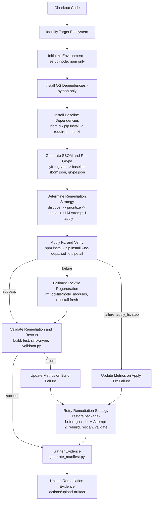

# PHASE 3 — WORKFLOW VALIDATION

## Workflow Diagram (`generic-remediation.yml`, current `main`, verified stage order matches actual YAML)

**Stage order verification: matches the documented sequence in `docs/06-reproducibility.md` Steps 1-10, in order.** No stage found out of sequence. **FACT.**

---

## Missing Steps

1. **No programmatic baseline-vs-remediated comparison step or script exists anywhere in `scripts/`** (confirmed: `grep` for "percentage change", "total scanner findings", "def compare" across all of `scripts/` returns nothing). `docs/06-reproducibility.md` Step 11 explicitly requires this ("total scanner findings, ecosystem-specific findings, removed findings, remaining findings, target CVE verification, percentage change"). What's actually implemented (`validator.py`) only checks whether the one target CVE is present or absent — it does not produce the broader comparison the methodology document describes. **This is a genuine, checkable gap between documented methodology and implementation.**
2. **No `grype db import` / DB-pinning step** in either workflow, despite `docs/06-reproducibility.md`'s "Cold Start Database Clause" explicitly requiring one and calling it necessary for "exact reproducibility of the scanner findings." Already noted in Phase 2; repeated here because it's also a workflow-level gap, not just a documentation one.
3. **No dependency-graph verification artifact is preserved.** `npm list --depth=0 || true` (line 91) runs but is not written to any surviving evidence file. `docs/06-reproducibility.md` Step 8 calls this out as an artifact-worthy step ("Dependency graph verification provides independent evidence").

## Duplicated Steps

- The Syft/Grype/validator sequence appears twice, near-verbatim, once in "Validate Remediation & Rescan" (lines 158-162) and once inside "Retry Remediation Strategy" (lines 202-206). This is not a bug — a retry genuinely needs to redo validation — but it is literal code duplication that could drift out of sync if one copy is edited and the other isn't (this already happened once: the three-commit iteration on the retry-reset line earlier today shows exactly this kind of drift risk in practice).

## Dead Code / Unused Scripts

Cross-referenced every file in `scripts/` against both workflow YAMLs. Only `scripts/remediation/{discover,prioritize,context_builder,llm_reasoner,manifest_editor,generate_manifest,retry_remediation,validator}.py` and `scripts/baseline/update_manifest.py` are actually invoked by CI. **11 files are never called by either workflow:** `fetch_nvd_data.py`, `fix_all_scenarios.py`, `fix_scenarios_runner.py`, `generate_final_cves.py`, `parse_vulnerabilities.py`, `rebuild_manifests.py` (updated today, so actively maintained — not abandoned, just not CI-invoked), `run_deterministic_baseline.py`, `run_final_gates.py`, `select_scenarios.py`, `trigger_all_gh.py`, `validate_consistency.py`, `scripts/baseline/trigger_grype_baseline.py`. **Classification: OBSERVATION, not automatically "dead code"** — several of these (`rebuild_manifests.py`, `trigger_grype_baseline.py`, `run_deterministic_baseline.py`) are evidently manual/local orchestration tools meant to be run by the researcher directly, not by CI. That is a legitimate design choice, not a defect by itself — but it does mean these scripts' correctness is not exercised by any automated check.

## Broken References / Incorrect Paths

1. **`scripts/baseline/trigger_grype_baseline.py:8`**: `SCENARIOS_FILE = "experiment/archive/final_18_scenarios.json"` — this path does not exist anywhere in the current repository (verified: no `experiment/` directory with this content exists). Running this script today would fail immediately at its own existence check. **FACT.**
2. Already fixed in the prior remediation pass: `scripts/run_deterministic_baseline.py`'s equivalent paths — noting here only that this is the *second* script found with the identical `experiment/`-path pattern, suggesting this was a repository-wide rename (`experiment/` → `results/`) that was not propagated to every script referencing the old layout.

## Race Conditions

**None found at the CI level.** Each `workflow_dispatch` run gets an isolated, fresh `actions/checkout` on its own runner (`ubuntu-latest`) — there is no shared, persistent filesystem between concurrent runs, so two scenarios dispatched at the same time cannot corrupt each other's `applications/juice-shop`/`applications/airflow` checkout. **This is a genuine strength, verified by reading the checkout mechanism, not assumed.**

One related but distinct risk, already covered in Phase 2/prior audit turns: within a *single* run, the retry step previously operated on a manifest already modified by attempt 1 (not a race condition between runs, but a sequencing defect within one run) — this is the bug fixed by today's commits.

## Anything else that could reduce reproducibility

- `llm-response-full.json` (containing the authoritative `modelVersion` field from Google's own API response) is generated but never gathered into evidence or uploaded — already noted in Phase 2.
- The vendored `tools/syft_bin/syft.exe` and `tools/grype_bin/grype.exe` are Windows binaries that **CI never actually uses** (CI downloads fresh Linux binaries every run via `curl`). A researcher trying to reproduce results by running the vendored tools locally on Windows would be using the same versions, but not the same binaries CI used — a minor but real distinction worth documenting.
