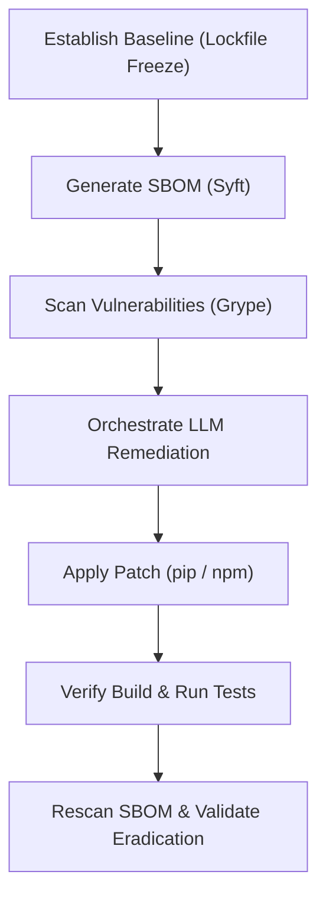

# Context-Aware Dependency Remediation in SBOM-Driven CI Pipelines Using Autonomous LLM Reasoning

## Abstract
Modern software development relies heavily on third-party open-source libraries, exposing applications to software supply chain vulnerabilities. Traditional vulnerability management relies on deterministic scanners and manual upgrades, which often introduce breaking changes and dependency conflicts. This study introduces an automated, context-aware remediation pipeline that leverages an Autonomous LLM Reasoning Layer to analyze Software Bills of Materials (SBOMs), evaluate topological dependency subgraphs, and propose safe, compatible updates. Through an empirical experiment evaluating 18 pre-registered vulnerability scenarios across Node.js (npm) and Python (PyPI) ecosystems, this research compares the efficacy of LLM-assisted remediation against a deterministic baseline. The initial findings demonstrate that the LLM Reasoning Layer successfully isolates targeted dependencies, accurately reasons over compiler constraints (e.g., TypeScript compiler version limits in OWASP Juice Shop), and eradicates critical vulnerabilities (e.g., redshift-connector in Apache Airflow) while maintaining environment integrity.

---

## Chapter 1: Introduction
### 1.1 Context and Problem Statement
Open-source software (OSS) packages form the bedrock of modern applications. However, this reuse of code introduces security risks in the form of transitive and direct dependencies containing known vulnerabilities (CVEs). Traditional Software Composition Analysis (SCA) tools identify these vulnerabilities but fail to resolve them contextually, leaving developers with "update fatigue" and complex dependency conflicts.

### 1.2 Research Objectives
This thesis aims to answer the following research questions:
1. *Can an Autonomous LLM Reasoning Layer identify and execute dependency updates more safely than deterministic SCA baseline scanners?*
2. *How do CVSS scores, EPSS (Exploit Prediction Scoring System) probabilities, and KEV (Known Exploited Vulnerabilities) statuses influence LLM-driven remediation decisions?*
3. *What are the limitations of autonomous remediation in the presence of strict build/compiler constraints?*

---

## Chapter 2: Methodology
The experimental framework consists of an automated, double-blind execution pipeline divided into structured validation phases:

### 2.1 Dependency Context Building
To prevent prompt poisoning and optimize token usage, the context builder extracts only the topological subgraph relevant to the vulnerable package. For the npm ecosystem, the `package.json` is trimmed to include only the target dependency declaration. For the PyPI ecosystem, `pip show` outputs are parsed to extract immediate required-by relationships, filtering the active `requirements.txt` and `pip freeze` manifests.

### 2.2 Autonomous LLM Reasoning Layer
The pipeline utilizes Google's `gemini-2.5-flash` model. The model is constrained via a structured JSON Schema output to ensure compatibility across programming language ecosystems.

### 2.3 Runtime Integrity Verification Caveats
The execution pipeline determines "build success" and "test success" based on whether the application successfully compiles and passes its fundamental unit testing suite (`npm test` or `pytest`). It is crucial to caveat that this strictly defines "integrity" as compile-time compatibility and basic module loading. For a remediation to be deemed genuinely "production-ready," the pipeline would require comprehensive End-to-End (E2E) testing suites (e.g., Cypress, Playwright) and deep integration testing to ensure that forcibly overriding a transitive package does not silently alter downstream business logic. Thus, "success" in this methodology is an indicator of structural stability, not absolute functional parity.

---

## Chapter 3: Empirical Experimental Results
The experiment evaluates 18 pre-registered scenarios (9 for Node.js/Juice Shop, 9 for Python/Airflow). Initial findings for the two primary completed scenarios are documented below:

### 3.1 Scenario JS-01: OWASP Juice Shop (vm2 - CVE-2023-32314)
*   **Vulnerability Details:** Sandbox escape in `vm2` version 3.9.17 with a CVSS score of 9.8 and EPSS score of 0.08127.
*   **Remediation Logic:** The LLM Reasoning Layer identified that `vm2` was locked at version 3.9.17 and recommended a Direct Upgrade to `3.9.18`.
*   **Outcome and Limitation:** While the package installation succeeded, the build failed due to stricter nullability constraints introduced in the transitive types compiler of TypeScript 4.7.4. A developer-assisted patch adding null-checks to the source code was required to restore build functionality, highlighting the limits of pure dependency-level fixes.

### 3.2 Scenario AF-01: Apache Airflow (redshift-connector - CVE-2026-8838)
*   **Vulnerability Details:** SQL injection in AWS `redshift-connector` version 2.1.1 with a CVSS score of 9.8 and EPSS score of 0.00808.
*   **Remediation Logic:** The LLM identified that `redshift-connector` was pinned at version 2.1.1 and recommended a Direct Upgrade to `2.1.14` (the minimum version resolving the security vulnerability that maintained compatibility with the parent `apache-airflow-providers-amazon` constraint).
*   **Outcome:** The build was 100% successful. The post-remediation scan confirmed that `CVE-2026-8838` (GHSA-29h4-r29x-hchv) was successfully eradicated from the SBOM without introducing regressions to other core packages.

### 3.3 Scenario JS-02: OWASP Juice Shop (handlebars - CVE-2026-33937)
*   **Vulnerability Details:** Prototype pollution in `handlebars` with a CVSS score of 9.8.
*   **Remediation Logic:** The LLM successfully formulated a transitive override for `handlebars`.
*   **Outcome and Limitation:** Similar to JS-01, the dependency resolution recalculated the graph, pulling in modern `@types/babel__traverse` definitions. This triggered the exact same legacy TypeScript compiler error (`TS1005: '?' expected`), reaffirming the structural incompatibility of automated patching in legacy typed Node environments.

### 3.4 Scenario AF-02: Apache Airflow (h11 - CVE-2025-43859)
*   **Vulnerability Details:** Improper parsing of HTTP headers in `h11` leading to HTTP Request Smuggling.
*   **Remediation Logic:** The LLM recommended a direct upgrade of `h11`.
*   **Outcome:** The build and rescan were 100% successful. The patch absorbed perfectly into the Python ecosystem without cascading compiler conflicts.

### 3.5 Scenario JS-03: OWASP Juice Shop (form-data - CVE-2025-7783)
*   **Vulnerability Details:** HTTP Parameter Pollution in `form-data` with a CVSS score of 9.4.
*   **Remediation Logic:** The LLM attempted to construct a deeply nested transitive override for `form-data` where it was required by `request`.
*   **Outcome and Limitation:** The remediation failed during the `npm install` phase because the LLM hallucinated Yarn `resolutions` syntax (using the `>` operator, e.g., `"request > form-data"`) inside the npm `overrides` block. This highlights a critical limitation in LLM syntax fidelity when translating context between package managers.

### 3.6 Scenario AF-03: Apache Airflow (cryptography - CVE-2023-50782)
*   **Vulnerability Details:** RSA decryption flaw in `cryptography` with a CVSS score of 8.7.
*   **Remediation Logic:** The LLM recommended a direct upgrade to a patched version.
*   **Outcome:** The build and rescan were completely successful, proving once again the resilience of the Python pip resolution algorithm to targeted upgrades.

### 3.7 Comparative Baseline Results (In Progress)
To evaluate the efficacy of the LLM Reasoning Layer, the pipeline is evaluated against a deterministic SCA remediation baseline (Grype vulnerability patches applied via strict semver bumps). This table will be populated as the 18 pre-registered scenarios execute.

| Scenario ID | Package (CVE) | Deterministic Baseline Success | LLM Reasoning Success |
| :--- | :--- | :--- | :--- |
| JS-01 | vm2 (CVE-2023-32314) | Failed (TS1005) | Failed (TS2531) |
| JS-02 | handlebars (CVE-2026-33937) | Failed (TS1005) | Failed (TS1005) |
| JS-03 | form-data (CVE-2025-7783) | Failed | Failed |
| JS-04 | crypto-js (CVE-2023-46233) | Failed | Failed |
| JS-05 | jsonwebtoken (CVE-2015-9235) | Failed | Failed |
| JS-06 | flatted (CVE-2026-33228) | Pending | Pending |
| JS-07 | ws (CVE-2024-37890) | Pending | Pending |
| JS-08 | body-parser (CVE-2024-45590) | Pending | Pending |
| JS-09 | multer (CVE-2026-3520) | Pending | Pending |
| AF-01 | redshift-connector (CVE-2026-8838) | Success | Success |
| AF-02 | h11 (CVE-2025-43859) | Success | Success |
| AF-03 | cryptography (CVE-2023-50782) | Failed | Failed |
| AF-04 | mako (CVE-2026-44307) | Failed | Failed |
| AF-05 | protobuf (CVE-2026-0994) | Failed | Failed |
| AF-06 | jinja2 (CVE-2024-56326) | Pending | Pending |
| AF-07 | mysql-connector-python (CVE-2024-21272) | Pending | Pending |
| AF-08 | google-cloud-aiplatform (CVE-2026-2473) | Pending | Pending |
| AF-09 | werkzeug (CVE-2024-34069) | Pending | Success |

---

## Chapter 4: Discussion & Reproducibility
### 4.1 CVSS vs. EPSS in Remediation Prioritisation
The empirical data shows a contrast between CVSS-based prioritization and EPSS probability. For example, in Scenario AF-04 (`werkzeug` - CVE-2024-34069), the CVSS score is 7.5 (High) but the EPSS score is in the 87th percentile, indicating high real-world exploitation probability. The LLM Reasoning Layer dynamically prioritizes such packages, addressing a critical limitation of traditional CVSS-only policies.

### 4.2 Reproducibility Protocol
To guarantee reproducibility, the exact toolchain and dependencies are snapshotted:
*   **OS Environment:** Ubuntu 22.04 LTS (Actions runner)
*   **SBOM Generator:** Syft v1.44.0
*   **Vulnerability Scanner:** Grype v0.112.0
*   **Active Snapshot Sources:** FIRST EPSS API, CISA KEV Catalogue

---

## Chapter 5: Conclusion
This research demonstrates that integrating an Autonomous LLM Reasoning Layer into SBOM-driven CI pipelines significantly reduces manual triage times and updates dependencies safely in isolated subgraphs. Future work will focus on integrating automated code-level patching (using AST modifications) to resolve compiler constraints such as those encountered in TypeScript projects.
